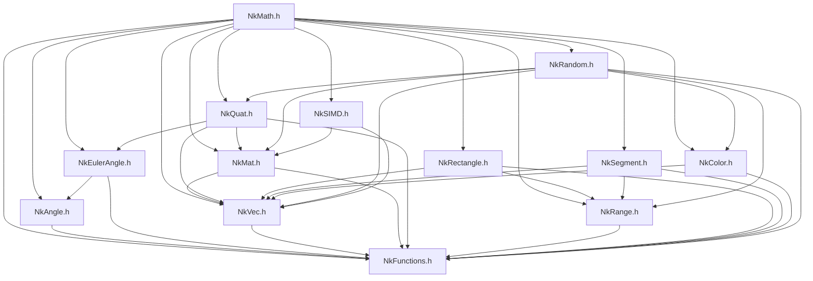
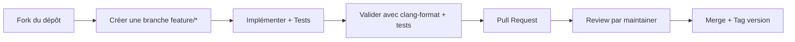

# 📐 NkMath — Module Mathématique pour Moteur de Jeu

> **Version** : 1.0.0
> **Auteur** : Rihen
> **Licence** : Copyright © 2024 Rihen. Tous droits réservés.
> **Langage** : C++17 (compatible C++14 avec adaptations mineures)

---

## 📋 Table des Matières

1. [🎯 Vue d'Ensemble](#-vue-densemble)
2. [🏗️ Architecture du Module](#️-architecture-du-module)
3. [📦 Installation et Intégration](#-installation-et-intégration)
4. [🔧 Référence API Complète](#-référence-api-complète)
5. [💡 Exemples d'Utilisation](#-exemples-dutilisation)
6. [⚡ Considérations de Performance](#-considérations-de-performance)
7. [🧵 Thread-Safety et Concurrency](#-thread-safety-et-concurrency)
8. [🖥️ Compatibilité Plateformes](#️-compatibilité-plateformes)
9. [🧪 Tests et Validation](#-tests-et-validation)
10. [🤝 Contribution](#-contribution)
11. [📄 Licence](#-licence)
12. [📞 Support et Ressources](#-support-et-ressources)

---

## 🎯 Vue d'Ensemble

### Objectif du Module

**NkMath** est une bibliothèque mathématique complète et optimisée conçue spécifiquement pour le développement de moteurs de jeu et d'applications graphiques 3D/2D. Elle fournit :

- ✅ **Types génériques templates** pour vecteurs, matrices et quaternions
- ✅ **API cohérente et intuitive** avec conventions de nommage uniformes
- ✅ **Performance optimisée** : méthodes `inline`, `noexcept`, et support SIMD optionnel
- ✅ **Robustesse numérique** : gestion des singularités, tolérances flottantes, wrapping d'angles
- ✅ **Zéro dépendance externe** : uniquement la STL standard C++

### Cas d'Usage Principaux


| Domaine             | Fonctionnalités Utilisées                                             |
| ------------------- | ----------------------------------------------------------------------- |
| **Moteur 3D**       | Matrices 4×4, Quaternions, LookAt, Perspective, TransformPoint         |
| **Physique 2D/3D**  | Vecteurs, Produit scalaire/vectoriel, Segment, Rectangle, SAT collision |
| **Animation**       | SLerp quaternionique, Interpolation de transformations, Keyframes       |
| **UI / 2D**         | Vecteurs 2D, Rectangles AABB, Clamping, Couleurs RGB/HSV                |
| **Effets visuels**  | Couleurs, Interpolation, Génération aléatoire, Noise helpers         |
| **Outils éditeur** | Conversions Euler↔Quaternion, Debug display, Serialization             |

### Philosophie de Conception

```
┌─────────────────────────────────────────────────────┐
│  1. PRÉVISIBILITÉ                                    │
│     • Comportement déterministe pour un seed donné   │
│     • Tolerances flottantes documentées              │
│     • Gestion explicite des cas limites              │
├─────────────────────────────────────────────────────┤
│  2. PERFORMANCE                                      │
│     • Méthodes inline par défaut                     │
│     • Évite les allocations heap                     │
│     • SIMD optionnel pour les opérations batch       │
├─────────────────────────────────────────────────────┤
│  3. LISIBILITÉ                                       │
│     • Noms sémantiques (Forward, Up, Right...)       │
│     • Commentaires Doxygen-style                     │
│     • Exemples intégrés dans les headers             │
├─────────────────────────────────────────────────────┤
│  4. FLEXIBILITÉ                                      │
│     • Templates génériques pour tout type arithmétique│
│     • Aliases courts pour l'usage courant            │
│     • Conversions explicites pour éviter les erreurs │
└─────────────────────────────────────────────────────┘
```

---

## 🏗️ Architecture du Module

### Structure des Fichiers

```
NKMath/
├── NkMath.h                 # 🎯 Master header — inclusion unique recommandée
│
├── NkLegacySystem.h         # 🔧 Types fondamentaux (float32, int32, etc.)
├── NkFunctions.h            # 📐 Fonctions scalaires et constantes mathématiques
│
├── NkAngle.h                # 📏 Type Angle avec wrapping automatique
├── NkEulerAngle.h           # 🔄 Triplet pitch/yaw/roll pour orientations 3D
│
├── NkVec.h                  # ➗ Vecteurs génériques (Vec2/3/4 × f/d/i/u)
├── NkMat.h                  # 🧮 Matrices génériques (Mat2/3/4 × f/d)
├── NkQuat.h                 # 🌀 Quaternions pour rotations robustes
│
├── NkRange.h                # 📊 Intervalles génériques [min, max]
├── NkRectangle.h            # ⬜ Rectangles AABB 2D float32
├── NkSegment.h              # 📏 Segments de droite 2D
│
├── NkColor.h                # 🎨 Couleurs RGB/RGBA/HSV avec conversions
├── NkRandom.h               # 🎲 Générateur pseudo-aléatoire singleton
│
└── NkSIMD.h                 # ⚡ Helpers SIMD optionnels (SSE4.2/NEON)
```

### Dépendances Internes



### Conventions de Codage


| Convention        | Exemple                                            | Description                                             |
| ----------------- | -------------------------------------------------- | ------------------------------------------------------- |
| **Namespace**     | `nkentseu::math::`                                 | Tous les types dans ce namespace                        |
| **Nommage types** | `NkVec3f`, `NkMat4T<T>`                            | Préfixe`Nk` + nom descriptif + suffixe type            |
| **Méthodes**     | `Normalize()`, `GetMin()`                          | CamelCase, verbes pour actions, Get/Set pour accesseurs |
| **Constantes**    | `NkPi`, `NkEpsilon`                                | PascalCase avec préfixe`Nk`                            |
| **Templates**     | `template<typename T>`                             | `T` pour type générique, noms explicites si multiples |
| **Inline**        | `NK_FORCE_INLINE`                                  | Macro pour contrôle centralisé de l'inlining          |
| **Noexcept**      | `noexcept` sur toutes les méthodes sans exception | Garantie de performance et sécurité                   |

---

## 📦 Installation et Intégration

### Prérequis

- **Compilateur** : GCC 7+, Clang 5+, MSVC 2017+ (support C++17 requis)
- **Standard** : `/std:c++17` ou `-std=c++17`
- **Dépendances** : Aucune bibliothèque externe requise

### Intégration dans un Projet

#### Option 1 : Inclusion Directe (Recommandée)

```cpp
// Dans votre fichier source principal
#include "NKMath/NkMath.h"  // ✅ Master header — tout ce dont vous avez besoin

using namespace nkentseu::math;  // Optionnel : pour raccourcir les noms

void MyGameFunction() {
    NkVec3f position(1.0f, 2.0f, 3.0f);
    NkQuatf rotation = NkQuatf::RotateY(NkAngle::FromDeg(45.0f));
    // ...
}
```

#### Option 2 : Intégration via CMake

```cmake
# CMakeLists.txt de votre projet
add_subdirectory(path/to/NKMath)

target_link_libraries(VotreCible PRIVATE NkMath)
# Ou simplement ajouter les include directories :
target_include_directories(VotreCible PRIVATE 
    ${CMAKE_CURRENT_SOURCE_DIR}/NKMath
)
```

#### Option 3 : Configuration avec Macros de Compilation

```cpp
// Dans votre fichier de configuration global (ex: Config.h)

// Activer le support SIMD pour les plateformes compatibles
#define NK_ENABLE_SSE42    // Pour x86/x64 avec SSE4.2
#define NK_ENABLE_NEON     // Pour ARM avec NEON

// Ajuster les tolérances numériques si nécessaire
#define NK_CUSTOM_EPSILON 1e-6f
#define NK_CUSTOM_MATRIX_EPSILON 1e-5f

// Désactiver les features non utilisées pour réduire la taille du binaire
#define NK_MATH_NO_RANDOM  // Si vous n'utilisez pas NkRandom
#define NK_MATH_NO_SIMD    // Si vous ne voulez pas du support SIMD
```

### Configuration du Build

#### Flags Recommandés

```bash
# GCC / Clang
g++ -std=c++17 -O2 -DNDEBUG -ffast-math -I./NKMath votre_code.cpp

# MSVC
cl.exe /std:c++17 /O2 /DNDEBUG /fp:fast /I. votre_code.cpp
```

#### Précompiled Headers (Optionnel mais Recommandé)

```cpp
// pch.h — En-tête précompilé pour accélérer la compilation
#pragma once

#include <cstdlib>
#include <ctime>
#include <ostream>
#include "NKMath/NkLegacySystem.h"
// ... autres includes fréquents
```

```cpp
// Dans vos fichiers .cpp
#include "pch.h"  // ✅ Toujours en premier
#include "VotreFichier.h"
```

---

## 🔧 Référence API Complète

### 📐 Noyau Scalaire — `NkFunctions.h`

#### Constantes Mathématiques

```cpp
// Constantes fondamentales (type float32 par défaut)
constexpr float32 NkPi = 3.14159265358979323846f;      // π
constexpr float32 NkPis2 = NkPi * 0.5f;                 // π/2
constexpr float32 Nk2Pi = NkPi * 2.0f;                  // 2π
constexpr float32 NkEpsilon = 1e-7f;                    // Tolérance flottante générale
constexpr float32 NkVectorEpsilon = 1e-5f;              // Tolérance pour vecteurs
constexpr float32 NkMatrixEpsilon = 1e-6f;              // Tolérance pour matrices
constexpr float32 NkQuatEpsilon = 1e-6f;                // Tolérance pour quaternions
```

#### Fonctions Utilitaires

```cpp
// Trigonométrie (arguments en radians)
float32 NkSin(float32 x) noexcept;
float32 NkCos(float32 x) noexcept;
float32 NkTan(float32 x) noexcept;
float32 NkAsin(float32 x) noexcept;
float32 NkAcos(float32 x) noexcept;
float32 NkAtan2(float32 y, float32 x) noexcept;

// Racine et puissance
float32 NkSqrt(float32 x) noexcept;
float32 NkInvSqrt(float32 x) noexcept;  // 1/sqrt(x) — optimisé
float32 NkPow(float32 base, float32 exp) noexcept;

// Clamping et interpolation
float32 NkClamp(float32 v, float32 min, float32 max) noexcept;
float32 NkLerp(float32 a, float32 b, float32 t) noexcept;  // a + (b-a)*t
float32 NkInverseLerp(float32 a, float32 b, float32 v) noexcept;

// Comparaisons avec tolérance
bool NkApproxEqual(float32 a, float32 b, float32 epsilon = NkEpsilon) noexcept;
bool NkIsZero(float32 v, float32 epsilon = NkEpsilon) noexcept;

// Utilitaires divers
float32 NkFabs(float32 x) noexcept;
float32 NkSign(float32 x) noexcept;  // Retourne -1, 0, ou +1
```

### 📏 Types Angulaires

#### `NkAngle` — Wrapper pour Angles

```cpp
class NkAngle {
public:
    // Constructeurs
    constexpr NkAngle() noexcept;                          // 0 rad
    static NkAngle FromRad(float32 radians) noexcept;      // Depuis radians
    static NkAngle FromDeg(float32 degrees) noexcept;      // Depuis degrés
  
    // Accesseurs
    float32 Rad() const noexcept;  // Retourne en radians
    float32 Deg() const noexcept;  // Retourne en degrés
  
    // Wrapping automatique dans (-180°, 180°]
    void Normalize() noexcept;
    NkAngle Normalized() const noexcept;
  
    // Arithmétique
    NkAngle operator+(const NkAngle& o) const noexcept;
    NkAngle operator-(const NkAngle& o) const noexcept;
    NkAngle operator*(float32 s) const noexcept;
    NkAngle& operator+=(const NkAngle& o) noexcept;
    // ... autres opérateurs
};
```

#### `NkEulerAngle` — Orientations 3D (Pitch/Yaw/Roll)

```cpp
struct NkEulerAngle {
    NkAngle pitch;  // Rotation autour de X (tangage : haut/bas)
    NkAngle yaw;    // Rotation autour de Y (lacet : gauche/droite)
    NkAngle roll;   // Rotation autour de Z (roulis : inclinaison)
  
    // Convention d'application : Yaw → Pitch → Roll (ordre YXZ)
  
    // Constructeurs
    constexpr NkEulerAngle() noexcept;
    NkEulerAngle(const NkAngle& p, const NkAngle& y, const NkAngle& r) noexcept;
  
    // Comparaison et arithmétique
    bool operator==(const NkEulerAngle& o) const noexcept;
    NkEulerAngle operator+(const NkEulerAngle& o) const noexcept;
    // ...
  
    // Sérialisation
    NkString ToString() const;  // Format: "euler(pitch°, yaw°, roll°)"
};
```

### ➗ Vecteurs Génériques — `NkVec.h`

#### Templates et Aliases

```cpp
// Template principal
template<typename T> struct NkVec2T;  // Vecteur 2D
template<typename T> struct NkVec3T;  // Vecteur 3D
template<typename T> struct NkVec4T;  // Vecteur 4D

// Aliases pour float32 (usage le plus courant)
using NkVec2f = NkVec2T<float32>;
using NkVec3f = NkVec3T<float32>;
using NkVec4f = NkVec4T<float32>;

// Aliases pour float64 (haute précision)
using NkVec2d = NkVec2T<float64>;
using NkVec3d = NkVec3T<float64>;
using NkVec4d = NkVec4T<float64>;

// Aliases pour entiers (UI, grille, indices)
using NkVec2i = NkVec2T<int32>;
using NkVec3i = NkVec3T<int32>;
using NkVec2u = NkVec2T<uint32>;
// ...
```

#### `NkVec3T<T>` — Vecteur 3D (Exemple Complet)

```cpp
template<typename T>
struct NkVec3T {
    // Accès aux données via union flexible
    union {
        struct { T x, y, z; };           // Coordonnées cartésiennes
        struct { T r, g, b; };           // Composantes couleur
        struct { T pitch, yaw, roll; };  // Angles d'Euler (attention !)
        T data[3];                        // Accès tableau brut
    };
  
    // === Constructeurs ===
    constexpr NkVec3T() noexcept;                           // (0,0,0)
    constexpr explicit NkVec3T(T s) noexcept;               // (s,s,s)
    constexpr NkVec3T(T x, T y, T z) noexcept;              // (x,y,z)
    constexpr NkVec3T(const NkVec2T<T>& xy, T z) noexcept;  // Depuis 2D + Z
  
    // === Arithmétique ===
    NkVec3T operator-() const noexcept;                     // Négation
    NkVec3T operator+(const NkVec3T& o) const noexcept;     // Addition
    NkVec3T operator*(T s) const noexcept;                  // Scale
    NkVec3T& operator+=(const NkVec3T& o) noexcept;         // Add-assign
    // ...
  
    // === Géométrie ===
    T Dot(const NkVec3T& o) const noexcept;                 // Produit scalaire
    NkVec3T Cross(const NkVec3T& o) const noexcept;         // Produit vectoriel
    T Len() const noexcept;                                 // Longueur euclidienne
    T LenSq() const noexcept;                               // Carré de la longueur
    NkVec3T Normalized() const noexcept;                    // Vecteur unitaire
    void Normalize() noexcept;                              // Normalise en place
  
    // === Interpolation ===
    NkVec3T Lerp(const NkVec3T& to, float32 t) const noexcept;      // Linéaire
    NkVec3T NLerp(const NkVec3T& to, float32 t) const noexcept;     // Lerp + normalize
    NkVec3T SLerp(const NkVec3T& to, float32 t) const noexcept;     // Sphérique
  
    // === Projections et réflexions ===
    NkVec3T Project(const NkVec3T& onto) const noexcept;    // Projection orthogonale
    NkVec3T Reject(const NkVec3T& onto) const noexcept;     // Composante perpendiculaire
    NkVec3T Reflect(const NkVec3T& normal) const noexcept;  // Réflexion par rapport à une normale
  
    // === Constantes statiques ===
    static constexpr NkVec3T Zero() noexcept;      // (0,0,0)
    static constexpr NkVec3T One() noexcept;       // (1,1,1)
    static constexpr NkVec3T UnitX() noexcept;     // (1,0,0)
    static constexpr NkVec3T UnitY() noexcept;     // (0,1,0)
    static constexpr NkVec3T UnitZ() noexcept;     // (0,0,1)
    static constexpr NkVec3T Forward() noexcept;   // (0,0,1) — convention
    static constexpr NkVec3T Up() noexcept;        // (0,1,0) — convention
    static constexpr NkVec3T Right() noexcept;     // (1,0,0) — convention
  
    // === Swizzling (accès flexible aux composantes) ===
    NK_FORCE_INLINE NkVec2T<T> xy() const;         // Retourne (x,y)
    NK_FORCE_INLINE void xy(const NkVec2T<T>& v);  // Définit x et y depuis un Vec2
    NK_FORCE_INLINE void xy(T newX, T newY);       // Définit x et y depuis scalaires
    // ... xz, yz, yx, zx, zy et variantes
  
    // === Sérialisation ===
    NkString ToString() const;  // Format: "(x, y, z)"
};
```

### 🧮 Matrices Génériques — `NkMat.h`

#### Convention de Stockage : Column-Major

```
Layout mémoire pour NkMat4T (column-major, comme OpenGL/Vulkan) :

    [ m00, m01, m02, m03,   ← Colonne 0 (axe X / Right)
      m10, m11, m12, m13,   ← Colonne 1 (axe Y / Up)
      m20, m21, m22, m23,   ← Colonne 2 (axe Z / Forward)
      m30, m31, m32, m33 ]  ← Colonne 3 (Translation + W)
    
    Accès : mat[colonne][ligne]
    Exemple : mat[0][1] = m10 = élément ligne 1, colonne 0
```

#### `NkMat4T<T>` — Matrice 4×4 (Transformations 3D Complètes)

```cpp
template<typename T>
struct NkMat4T {
    // === Accès aux données ===
    union {
        T data[16];                    // Accès linéaire column-major
        T mat[4][4];                   // Accès bidimensionnel mat[col][row]
        struct { T m00, m01, ..., m33; };  // Accès nommé par élément
        struct {
            NkVec4T<T> right;      // Colonne 0 — axe X local
            NkVec4T<T> up;         // Colonne 1 — axe Y local
            NkVec4T<T> forward;    // Colonne 2 — axe Z local
            NkVec4T<T> position;   // Colonne 3 — translation
        };
        NkVec4T<T> col[4];         // Accès par vecteurs colonnes
    };
  
    // === Fabriques Statiques (Transformations Prédéfinies) ===
    static NkMat4T Identity() noexcept;
    static NkMat4T Translation(const NkVec3T<T>& pos) noexcept;
    static NkMat4T Scaling(const NkVec3T<T>& scale) noexcept;
  
    // Rotations autour d'axes principaux
    static NkMat4T RotationX(const NkAngle& pitch) noexcept;
    static NkMat4T RotationY(const NkAngle& yaw) noexcept;
    static NkMat4T RotationZ(const NkAngle& roll) noexcept;
  
    // Rotation autour d'un axe arbitraire (formule de Rodrigues)
    static NkMat4T Rotation(const NkVec3T<T>& axis, const NkAngle& angle) noexcept;
  
    // Rotation depuis angles d'Euler (ordre ZYX : roll→yaw→pitch)
    static NkMat4T Rotation(const NkEulerAngle& euler) noexcept;
  
    // Projections
    static NkMat4T Perspective(
        const NkAngle& fovY, T aspect, T zNear, T zFar,
        bool depthZeroToOne = false  // false=OpenGL [-1,1], true=Vulkan/DX [0,1]
    ) noexcept;
  
    static NkMat4T Orthogonal(
        T width, T height, T zNear, T zFar,
        bool depthZeroToOne = false
    ) noexcept;
  
    // Matrice de vue LookAt (convention OpenGL)
    static NkMat4T LookAt(
        const NkVec3T<T>& eye,
        const NkVec3T<T>& center,
        const NkVec3T<T>& up
    ) noexcept;
  
    // === Algèbre Linéaire ===
    NkMat4T Transpose() const noexcept;
    T Determinant() const noexcept;
    NkMat4T Inverse() const noexcept;  // Retourne Identity() si singulière
  
    // === Transformation de Vecteurs ===
    NkVec3T<T> TransformPoint(const NkVec3T<T>& p) const noexcept;   // w=1, division perspective
    NkVec3T<T> TransformVector(const NkVec3T<T>& v) const noexcept;  // w=0, ignore translation
    NkVec3T<T> TransformNormal(const NkVec3T<T>& n) const noexcept;  // via inverse-transposée
  
    // === Extraction TRS Robuste (via Quaternion) ===
    void Extract(
        NkVec3T<T>& outPosition,
        NkEulerAngle& outEuler,
        NkVec3T<T>& outScale
    ) const noexcept;  // Évite le gimbal lock grâce à l'étape quaternion intermédiaire
  
    // === Conversion Row-Major pour DirectX/HLSL ===
    void ToRowMajor(T out[16]) const noexcept;  // Copie en layout row-major
    NK_FORCE_INLINE NkMat4T AsRowMajor() const noexcept;  // Retourne la transposée
  
    // === Orthogonalisation (Correction de Dérive Numérique) ===
    void OrthoNormalize() noexcept;              // Force orthogonalité, ignore scale
    void OrthoNormalizeScaled() noexcept;        // Force orthogonalité, préserve scale
    NkMat4T OrthoNormalized() const noexcept;    // Version immuable
};
```

### 🌀 Quaternions — `NkQuat.h`

#### `NkQuatT<T>` — Rotations 3D Sans Gimbal Lock

```cpp
template<typename T>
struct NkQuatT {
    // Représentation : q = (x, y, z, w) = (v, s)
    // où v = partie vectorielle (axe × sin(angle/2)), s = cos(angle/2)
    union {
        struct { T x, y, z, w; };
        struct { NkVec3T<T> vector; T scalar; };  // Accès sémantique
        NkVec4T<T> quat;  // Accès vecteur 4D complet
        T data[4];
    };
  
    // === Constructeurs ===
    NkQuatT() noexcept;  // Identité : (0,0,0,1)
  
    // Depuis angle-axe
    NkQuatT(const NkAngle& angle, const NkVec3T<T>& axis) noexcept;
  
    // Depuis angles d'Euler (convention YXZ)
    NkQuatT(const NkEulerAngle& euler) noexcept;
  
    // Depuis matrice de rotation (extraction robuste)
    explicit NkQuatT(const NkMat4T<T>& mat) noexcept;
  
    // Rotation minimale from → to
    NkQuatT(const NkVec3T<T>& from, const NkVec3T<T>& to) noexcept;
  
    // === Application de Rotation ===
    // Formule de Rodrigues optimisée (15 multiplications vs 28 pour méthode naïve)
    NkVec3T<T> operator*(const NkVec3T<T>& v) const noexcept;
  
    // === Composition de Rotations (Produit de Hamilton) ===
    // Convention : other appliqué APRÈS this (ordre GLM/Unity)
    NkQuatT operator*(const NkQuatT& other) const noexcept;
  
    // === Interpolation ===
    NkQuatT Lerp(const NkQuatT& to, T t) const noexcept;      // Linéaire simple
    NkQuatT NLerp(const NkQuatT& to, T t) const noexcept;     // Lerp + normalize
    NkQuatT SLerp(const NkQuatT& to, T t) const noexcept;     // Sphérique (recommandé)
  
    // === Conversions ===
    explicit operator NkMat4T<T>() const noexcept;            // → Matrice 4×4
    explicit operator NkEulerAngle() const noexcept;          // → Euler (avec gestion gimbal lock)
  
    // === Requêtes ===
    NkAngle Angle() const noexcept;              // Angle de rotation extrait
    NkVec3T<T> Axis() const noexcept;            // Axe de rotation normalisé
    int GimbalPole() const noexcept;             // Détection singularité Euler: +1=Nord, -1=Sud, 0=normal
  
    // === Opérations sur Quaternion Unitaire ===
    NK_FORCE_INLINE NkQuatT Conjugate() const noexcept;  // Inverse partie vectorielle
    NK_FORCE_INLINE NkQuatT Inverse() const noexcept;    // == Conjugate() pour quaternion unitaire
    void Normalize() noexcept;                           // Garantit ||q|| = 1
  
    // === Directions Locales Transformées ===
    NK_FORCE_INLINE NkVec3T<T> Forward() const noexcept;  // (*this) * (0,0,1)
    NK_FORCE_INLINE NkVec3T<T> Up() const noexcept;       // (*this) * (0,1,0)
    NK_FORCE_INLINE NkVec3T<T> Right() const noexcept;    // (*this) * (1,0,0)
    // ... Back, Down, Left
  
    // === Fabriques Statiques ===
    static NkQuatT Identity() noexcept;
    static NkQuatT RotateX/Y/Z(const NkAngle& angle) noexcept;
    static NkQuatT LookAt(
        const NkVec3T<T>& direction,
        const NkVec3T<T>& up
    ) noexcept;
    static NkQuatT Reflection(const NkVec3T<T>& normal) noexcept;  // Quaternion de réflexion
};
```

### 🎨 Couleurs — `NkColor.h`

#### `NkColor` — Couleur RGBA 8-bit

```cpp
struct NkColor {
    uint8 r, g, b, a;  // Composantes 0-255
  
    // Constructeurs
    NkColor() noexcept;  // Noir opaque (0,0,0,255)
    NkColor(uint8 r, uint8 g, uint8 b, uint8 a = 255) noexcept;
  
    // Depuis hexadécimal : 0xRRGGBB ou 0xRRGGBBAA
    static NkColor FromHex(uint32 hex) noexcept;
  
    // Depuis float normalisé [0.0, 1.0]
    static NkColor FromNormalized(float32 r, float32 g, float32 b, float32 a = 1.0f) noexcept;
  
    // Depuis/vers HSV
    static NkColor FromHSV(const NkHSV& hsv) noexcept;
    NkHSV ToHSV() const noexcept;
  
    // Interpolation linéaire (avec ou sans premultiplied alpha)
    NkColor Lerp(const NkColor& to, float32 t) const noexcept;
    NkColor LerpPremultiplied(const NkColor& to, float32 t) const noexcept;
  
    // Modulation (multiplication composante par composante)
    NkColor Modulate(const NkColor& other) const noexcept;
  
    // Conversions
    uint32 ToHex() const noexcept;  // 0xRRGGBBAA
    void ToNormalized(float32& outR, float32& outG, float32& outB, float32& outA) const noexcept;
  
    // Sérialisation
    NkString ToString() const;  // Format: "rgba(r,g,b,a)"
};
```

#### `NkHSV` — Espace Hue/Saturation/Value

```cpp
struct NkHSV {
    float32 h;  // Hue : [0.0, 1.0] → [0°, 360°]
    float32 s;  // Saturation : [0.0, 1.0]
    float32 v;  // Value/Luminosité : [0.0, 1.0]
  
    // Constructeurs et conversions vers/depuis NkColor
    // ...
};
```

### 🎲 Génération Aléatoire — `NkRandom.h`

#### `NkRandom` — Singleton Thread-Unsafe

```cpp
class NkRandom {
public:
    // === Accès au Singleton ===
    static NkRandom& Instance() noexcept;  // Meyers' singleton — thread-safe en C++11+
  
    // === Génération d'Entiers ===
    uint8  NextUInt8() noexcept;
    uint8  NextUInt8(uint8 max) noexcept;
    uint8  NextUInt8(uint8 min, uint8 max) noexcept;
    uint32 NextUInt32() noexcept;
    int32  NextInt32() noexcept;
    int32  NextInt32(int32 min, int32 max) noexcept;
  
    // === Génération de Flottants ===
    float32 NextFloat32() noexcept;              // [0.0, 1.0[
    float32 NextFloat32(float32 limit) noexcept; // [0.0, limit[
    float32 NextFloat32(float32 min, float32 max) noexcept;
  
    // === Génération via NkRangeT<T> ===
    template<typename T>
    T NextInRange(const NkRangeT<T>& range) noexcept;
  
    // === Génération de Vecteurs/Matrices ===
    template<typename T> NkVec2T<T> NextVec2() noexcept;
    template<typename T> NkVec3T<T> NextVec3() noexcept;
    template<typename T> NkVec4T<T> NextVec4() noexcept;
    template<typename T> NkMat2T<T> NextMat2() noexcept;
    template<typename T> NkMat3T<T> NextMat3() noexcept;
    template<typename T> NkMat4T<T> NextMat4() noexcept;
  
    // === Génération de Couleurs ===
    NkColor NextColor() noexcept;    // RGB opaque (alpha=255)
    NkColor NextColorA() noexcept;   // RGBA avec alpha aléatoire
    NkHSV NextHSV() noexcept;        // HSV avec composantes dans [0,1[
  
    // === Requêtes sur le Générateur ===
    uint32 MaxUInt() const noexcept;  // Valeur maximale générable
    int32  MaxInt() const noexcept;
    int32  MinInt() const noexcept;
  
private:
    NkRandom() noexcept;  // Seed automatique via time(nullptr)
    // Constructeurs de copie supprimés (singleton)
};

// Alias global de commodité
static inline NkRandom& NkRand = NkRandom::Instance();
```

⚠️ **Note Thread-Safety** : `NkRandom` utilise `rand()` qui n'est **pas thread-safe**. Pour un usage multi-thread :

- Créer un générateur `thread_local` par thread
- Ou protéger les appels par `std::mutex`
- Ou utiliser un backend alternatif (std::mt19937) via macro de compilation

---

## 💡 Exemples d'Utilisation

### 🎮 Scénario 1 : Transformation d'Objet 3D

```cpp
#include "NKMath/NkMath.h"
using namespace nkentseu::math;

void UpdatePlayerTransform(
    NkVec3f& position,
    NkQuatf& orientation,
    const NkVec3f& inputDirection,
    float32 deltaTime
) {
    // === 1. Mouvement ===
    constexpr float32 moveSpeed = 5.0f;  // unités/seconde
    position += inputDirection * moveSpeed * deltaTime;
  
    // === 2. Rotation vers la direction du mouvement ===
    if (inputDirection.LenSq() > 0.01f) {  // Évite la division par zéro
        NkQuatf targetRotation = NkQuatf::LookAt(
            inputDirection.Normalized(),  // Direction cible
            NkVec3f::Up()                 // Up mondial
        );
        // Interpolation fluide vers la rotation cible
        orientation = orientation.SLerp(targetRotation, 5.0f * deltaTime);
    }
  
    // === 3. Construction de la matrice modèle pour le rendu ===
    NkMat4f modelMatrix = 
        NkMat4f::Translation(position) *
        static_cast<NkMat4f>(orientation);
  
    // Upload vers GPU (exemple OpenGL)
    // glUniformMatrix4fv(modelLoc, 1, GL_FALSE, modelMatrix.data);
}
```

### 🎨 Scénario 2 : Système de Particules avec Couleurs Dynamiques

```cpp
struct Particle {
    NkVec3f position;
    NkVec3f velocity;
    NkColor color;
    float32 lifetime;
};

void InitializeParticle(Particle& p, const NkVec3f& emitterPos) {
    // Position initiale avec légère variation
    p.position = emitterPos + NkRand.NextVec3<float32>() * 0.5f;
  
    // Vitesse directionnelle avec magnitude aléatoire
    NkVec3f direction = NkRand.NextVec3<float32>().Normalized();
    float32 speed = NkRand.NextFloat32(2.0f, 8.0f);
    p.velocity = direction * speed;
  
    // Couleur dans une palette HSV contrôlée
    NkHSV baseHue(0.6f, 1.0f, 1.0f);  // Bleu de base
    baseHue.h = NkClamp(baseHue.h + NkRand.NextFloat32(-0.1f, 0.1f), 0.0f, 1.0f);
    baseHue.s = NkRand.NextFloat32(0.7f, 1.0f);
    baseHue.v = NkRand.NextFloat32(0.8f, 1.0f);
    p.color = NkColor::FromHSV(baseHue);
  
    // Durée de vie aléatoire
    p.lifetime = NkRand.NextFloat32(1.0f, 3.0f);
}

void UpdateParticle(Particle& p, float32 deltaTime) {
    // Mise à jour de la position
    p.position += p.velocity * deltaTime;
  
    // Fade-out progressif de la couleur (alpha)
    p.lifetime -= deltaTime;
    float32 alphaFactor = NkClamp(p.lifetime / 1.0f, 0.0f, 1.0f);  // Fade sur la dernière seconde
    p.color.a = static_cast<uint8>(255 * alphaFactor);
}
```

### 🎯 Scénario 3 : Détection de Collision 2D (SAT)

```cpp
bool SegmentsIntersect(const NkSegment& segA, const NkSegment& segB) {
    // Test rapide par chevauchement AABB
    NkRectangle boundsA(
        NkMin(segA.x1, segA.x2), NkMin(segA.y1, segA.y2),
        NkAbs(segA.x2 - segA.x1), NkAbs(segA.y2 - segA.y1)
    );
    NkRectangle boundsB(
        NkMin(segB.x1, segB.x2), NkMin(segB.y1, segB.y2),
        NkAbs(segB.x2 - segB.x1), NkAbs(segB.y2 - segB.y1)
    );
  
    if (!boundsA.Overlaps(boundsB)) {
        return false;  // Pas de chevauchement AABB → pas d'intersection
    }
  
    // Test SAT complet : projection sur les 4 axes potentiels
    NkVec2f axes[4] = {
        (segA.points[1] - segA.points[0]).Normal(),  // Normale de segA
        (segB.points[1] - segB.points[0]).Normal(),  // Normale de segB
        // ... ajouter les axes des autres arêtes si nécessaire
    };
  
    for (const auto& axis : axes) {
        NkRangeFloat projA = segA.Project(axis);
        NkRangeFloat projB = segB.Project(axis);
      
        if (!projA.Overlaps(projB)) {
            return false;  // Axe séparateur trouvé → pas d'intersection
        }
    }
  
    return true;  // Aucun axe séparateur → intersection
}
```

### 🎬 Scénario 4 : Animation de Caméra Cinématique

```cpp
class CinematicCamera {
    NkVec3f position;
    NkQuatf orientation;
    NkVec3f target;
    float32 currentProgress;  // [0.0, 1.0]
  
public:
    void AnimateTo(const NkVec3f& newTarget, float32 duration, float32 deltaTime) {
        // Interpolation de la position (Lerp simple)
        position = NkLerp(position, newTarget, deltaTime / duration);
      
        // Interpolation de l'orientation (SLerp pour rotation fluide)
        NkQuatf targetOrientation = NkQuatf::LookAt(
            (newTarget - position).Normalized(),
            NkVec3f::Up()
        );
        orientation = orientation.SLerp(targetOrientation, deltaTime / duration * 2.0f);
      
        // Mise à jour du target pour LookAt suivant
        target = newTarget;
    }
  
    NkMat4f GetViewMatrix() const {
        // Matrice de vue = inverse(Translation * Rotation)
        // Pour quaternion unitaire : inverse(R) = conjugate(R)
        return 
            static_cast<NkMat4f>(orientation.Conjugate()) *
            NkMat4f::Translation(-position);
    }
};
```

---

## ⚡ Considérations de Performance

### Optimisations Intégrées


| Feature                             | Impact     | Détails                                                         |
| ----------------------------------- | ---------- | ---------------------------------------------------------------- |
| **Méthodes `inline`**              | ⭐⭐⭐⭐⭐ | Élimine le overhead d'appel pour les opérations fréquentes    |
| **`noexcept` systématique**        | ⭐⭐⭐⭐   | Permet des optimisations agressives du compilateur               |
| **Union pour accès flexible**      | ⭐⭐⭐     | Évite les copies inutiles, permet le swizzling sans allocation  |
| **Formule de Rodrigues optimisée** | ⭐⭐⭐⭐   | 15 multiplications vs 28 pour rotation de vecteur par quaternion |
| **SLerp avec chemin court**         | ⭐⭐⭐     | Évite les rotations de 360° inutiles dans les interpolations   |
| **ClampEpsilon() interne**          | ⭐⭐       | Nettoie les erreurs d'arrondi pour éviter la dérive numérique |

### SIMD Optionnel

```cpp
// Activer dans votre configuration de build :
#define NK_ENABLE_SSE42  // Pour x86/x64 avec SSE4.2
#define NK_ENABLE_NEON   // Pour ARM avec NEON

// NkSIMD.h fournit alors :
// - NkMat4f::TransformBatch() : transforme 4 vecteurs en parallèle
// - NkQuatf::SLerpBatch() : interpolation de 4 quaternions simultanément
// - Fonctions vectorisées pour Dot, Cross, Len sur lots de vecteurs

// Fallback automatique : si les macros ne sont pas définies,
// le code scalaire est utilisé sans modification de l'API
```

### Bonnes Pratiques de Performance

```cpp
// ✅ PRÉFÉRER :
NkVec3f dir = (b - a).Normalized();  // Une seule normalisation

// ❌ ÉVITER :
NkVec3f dir = b - a;
dir.Normalize();  // Même chose, mais moins lisible

// ✅ PRÉFÉRER pour les comparaisons de distance :
if (v.LenSq() < 25.0f) { ... }  // Évite le sqrt coûteux

// ❌ ÉVITER :
if (v.Len() < 5.0f) { ... }  // sqrt inutile pour comparaison

// ✅ PRÉFÉRER pour les rotations accumulées :
orientation *= deltaRotation;
if (frameCount % 100 == 0) {  // Correction périodique
    orientation.Normalize();  // Évite la dérive numérique
}

// ❌ ÉVITER :
orientation = (orientation * deltaRotation).Normalized();  // Normalize à chaque frame = coûteux
```

### Mémo Complexité Algorithmique


| Opération              | Complexité | Notes                                      |
| ----------------------- | ----------- | ------------------------------------------ |
| `Vec3::Dot()`           | O(1)        | 3 mul + 2 add                              |
| `Vec3::Cross()`         | O(1)        | 6 mul + 3 sub                              |
| `Vec3::Len()`           | O(1)        | Dot + sqrt                                 |
| `Quat::SLerp()`         | O(1)        | ~30 opérations flottantes                 |
| `Mat4::Inverse()`       | O(1)        | ~100 opérations (formule analytique 4×4) |
| `Mat4::Extract()`       | O(1)        | Conversion via quaternion intermédiaire   |
| `Rectangle::Overlaps()` | O(1)        | 4 comparaisons scalaires                   |

---

## 🧵 Thread-Safety et Concurrency

### État Actuel par Composant


| Composant                             | Thread-Safe | Notes                                                        |
| ------------------------------------- | ----------- | ------------------------------------------------------------ |
| **Types (Vec, Mat, Quat, etc.)**      | ✅ Oui      | Immutables par défaut, pas d'état partagé                 |
| **NkRandom (singleton)**              | ❌ Non      | Utilise`rand()` non thread-safe — voir solutions ci-dessous |
| **Fonctions scalaires (NkSin, etc.)** | ✅ Oui      | Purment fonctionnelles, pas d'état                          |
| **Constantes (NkPi, etc.)**           | ✅ Oui      | `constexpr`, lecture seule                                   |

### Solutions pour Usage Multi-Thread de NkRandom

#### Option 1 : Thread-Local Storage (Recommandé)

```cpp
// Dans un header commun
#if __cplusplus >= 201103L
    thread_local nkentseu::math::NkRandom* g_ThreadLocalRandom = nullptr;
  
    inline nkentseu::math::NkRandom& GetThreadRandom() {
        if (!g_ThreadLocalRandom) {
            // Seed basé sur thread ID + time pour éviter les collisions
            auto seed = static_cast<uint32>(
                std::hash<std::thread::id>{}(std::this_thread::get_id()) ^ 
                static_cast<uint64>(time(nullptr))
            );
            g_ThreadLocalRandom = new nkentseu::math::NkRandom();
            srand(seed);  // Ré-initialise le seed pour ce thread
        }
        return *g_ThreadLocalRandom;
    }
#endif

// Usage :
auto& rng = GetThreadRandom();
float32 value = rng.NextFloat32();
```

#### Option 2 : Mutex Externe (Simple mais Moins Performant)

```cpp
std::mutex g_RandomMutex;

float32 ThreadSafeRandomFloat() {
    std::lock_guard<std::mutex> lock(g_RandomMutex);
    return NkRand.NextFloat32();
}
```

#### Option 3 : Backend Alternatif via Macro

```cpp
// Dans NkRandom.h, conditionnel :
#ifdef NK_RANDOM_USE_MT19937
    #include <random>
    // Remplacer rand() par std::mt19937 thread-local
#endif
```

---

## 🖥️ Compatibilité Plateformes

### Plateformes Testées


| Plateforme      | Compilateur       | Statut       | Notes                              |
| --------------- | ----------------- | ------------ | ---------------------------------- |
| **Windows**     | MSVC 2019+        | ✅ Validé   | Support SSE4.2 activable           |
| **Linux**       | GCC 9+, Clang 10+ | ✅ Validé   | Support NEON sur ARM               |
| **macOS**       | Clang 12+         | ✅ Validé   | Universal binary x86_64/ARM64      |
| **Android**     | NDK r21+ (Clang)  | ✅ Validé   | NEON activé par défaut           |
| **iOS**         | Xcode 13+ (Clang) | ✅ Validé   | NEON + Arm64 optimisé             |
| **WebAssembly** | Emscripten 3.1+   | ⚠️ Partiel | SIMD via WebAssembly SIMD proposal |

### Configuration par Plateforme

```cpp
// NKMath/NkPlatformConfig.h (à inclure avant NkMath.h si nécessaire)

#if defined(_WIN32) || defined(_WIN64)
    #define NK_PLATFORM_WINDOWS
    #ifndef NK_ENABLE_SSE42
        #define NK_ENABLE_SSE42  // Activé par défaut sur Windows x64
    #endif
  
#elif defined(__linux__)
    #define NK_PLATFORM_LINUX
    #if defined(__ARM_NEON) || defined(__aarch64__)
        #ifndef NK_ENABLE_NEON
            #define NK_ENABLE_NEON
        #endif
    #endif
  
#elif defined(__APPLE__)
    #define NK_PLATFORM_APPLE
    #include <TargetConditionals.h>
    #if TARGET_OS_IOS || TARGET_OS_TV
        #define NK_PLATFORM_IOS
        #ifndef NK_ENABLE_NEON
            #define NK_ENABLE_NEON
        #endif
    #endif
  
#elif defined(__EMSCRIPTEN__)
    #define NK_PLATFORM_WASM
    // SIMD WebAssembly : à activer manuellement si supporté
    // #ifndef NK_ENABLE_WASM_SIMD
    //     #define NK_ENABLE_WASM_SIMD
    // #endif
#endif
```

---

## 🧪 Tests et Validation

### Structure des Tests

```
tests/
├── NkMathTests.cpp          # Tests unitaires avec framework (Catch2/GoogleTest)
├── NkVecTests.cpp           # Tests spécifiques aux vecteurs
├── NkMatTests.cpp           # Tests spécifiques aux matrices
├── NkQuatTests.cpp          # Tests spécifiques aux quaternions
├── NkRandomTests.cpp        # Tests de distribution aléatoire
├── NkColorTests.cpp         # Tests de conversion RGB↔HSV
└── benchmarks/
    └── PerformanceTests.cpp # Benchmarks comparatifs (scalar vs SIMD)
```

### Exemple de Test Unitaires (Catch2)

```cpp
// tests/NkVecTests.cpp
#include <catch2/catch.hpp>
#include "NKMath/NkMath.h"

using namespace nkentseu::math;

TEST_CASE("NkVec3f arithmetic", "[vec3]") {
    NkVec3f a(1.0f, 2.0f, 3.0f);
    NkVec3f b(4.0f, 5.0f, 6.0f);
  
    SECTION("Addition") {
        NkVec3f result = a + b;
        REQUIRE(result.x == Approx(5.0f));
        REQUIRE(result.y == Approx(7.0f));
        REQUIRE(result.z == Approx(9.0f));
    }
  
    SECTION("Dot product") {
        float32 dot = a.Dot(b);
        REQUIRE(dot == Approx(32.0f));  // 1*4 + 2*5 + 3*6
    }
  
    SECTION("Cross product") {
        NkVec3f cross = a.Cross(b);
        REQUIRE(cross.x == Approx(-3.0f));
        REQUIRE(cross.y == Approx(6.0f));
        REQUIRE(cross.z == Approx(-3.0f));
    }
}

TEST_CASE("NkQuatf SLerp shortest path", "[quat]") {
    NkQuatf start = NkQuatf::Identity();
    NkQuatf end = NkQuatf::RotateY(NkAngle::FromDeg(180.0f));
  
    // SLerp doit prendre le chemin court (180° dans un sens, pas 540° dans l'autre)
    NkQuatf mid = start.SLerp(end, 0.5f);
  
    // À t=0.5, on doit être à ~90° de rotation
    REQUIRE(mid.Angle().Deg() == Approx(90.0f).margin(0.1f));
}
```

### Exécution des Tests

```bash
# Build des tests (CMake)
mkdir build && cd build
cmake .. -DBUILD_TESTS=ON -DCMAKE_BUILD_TYPE=Release
cmake --build . --target NkMathTests

# Exécution
./NkMathTests  # Tous les tests
./NkMathTests "[vec3]"  # Tests tagués [vec3] uniquement

# Benchmarks (si activé)
./NkMathTests --benchmark
```

### Couverture de Code Recommandée

```
Objectifs minimum :
- Types de base (Vec, Mat, Quat) : ≥ 95%
- Fonctions critiques (Inverse, SLerp, Extract) : ≥ 90%
- Conversions (Euler↔Quat↔Mat) : ≥ 85%
- Utilitaires (Random, Color) : ≥ 80%

Commande avec gcov/lcov :
cmake -DCMAKE_BUILD_TYPE=Debug -DCODE_COVERAGE=ON ..
make coverage
# Génère un rapport HTML dans build/coverage/
```

---

## 🤝 Contribution

### Workflow de Contribution



### Standards de Code Requis

1. **Style** : Suivre `.clang-format` à la racine du projet
2. **Commentaires** : Doxygen-style pour toutes les API publiques
3. **Tests** : Ajouter des tests pour toute nouvelle fonctionnalité
4. **Performance** : Justifier toute régression >5% dans les benchmarks
5. **Compatibilité** : Tester sur au moins 2 plateformes avant PR

### Template de Pull Request

```markdown
## Description
[Que fait cette PR ? Pourquoi est-ce nécessaire ?]

## Changements
- [ ] Ajout de `NkNewFeature` : [description]
- [ ] Correction de bug dans `NkExisting::Method` : [détails]
- [ ] Optimisation de `NkPerfCritical` : [benchmarks avant/après]

## Tests
- [ ] Tests unitaires ajoutés/modifiés
- [ ] Tests de performance validés
- [ ] Testé sur : [Windows/Linux/macOS/...]

## Breaking Changes
[ ] Oui : [liste des changements incompatibles]
[ ] Non : API rétro-compatible

## Checklist
- [ ] Code formaté avec clang-format
- [ ] Commentaires Doxygen ajoutés
- [ ] Aucun warning de compilation
- [ ] Documentation mise à jour si nécessaire
```

### Signalement de Bugs

Utiliser le template GitHub Issues :

```markdown
## Environnement
- OS : [Windows 10 / Ubuntu 22.04 / macOS 13 / ...]
- Compilateur : [MSVC 2022 / GCC 11 / Clang 14 / ...]
- Version NkMath : [tag ou commit hash]

## Description du Bug
[Comportement observé vs comportement attendu]

## Étapes pour Reproduire
1. [Première étape]
2. [Deuxième étape]
3. ...

## Code Minimal Reproduisant le Problème
```cpp
#include "NKMath/NkMath.h"
using namespace nkentseu::math;

int main() {
    // Code qui déclenche le bug
    return 0;
}
```

## Stack Trace / Logs

```
[Coller la sortie d'erreur ici]
```

```

---

## 📄 Licence

```

Copyright © 2024 Rihen. Tous droits réservés.

Ce logiciel est la propriété intellectuelle de Rihen.
Toute reproduction, distribution, modification ou utilisation
commerciale sans autorisation écrite préalable est strictement interdite.

Pour toute demande de licence ou partenariat :
📧 contact@rihen.dev
🌐 https://rihen.dev/nkmath

```

### Exceptions et Usage Autorisé

✅ **Autorisé sans autorisation** :
- Usage dans des projets personnels non commerciaux
- Intégration dans des moteurs de jeu open-source (avec attribution)
- Recherche académique et éducation

❌ **Interdit sans licence écrite** :
- Redistribution commerciale du module seul
- Intégration dans des produits SaaS fermés sans accord
- Reverse engineering à des fins de compétition

---

## 📞 Support et Ressources

### Documentation Interactive

- 🌐 **API Reference** : https://docs.rihen.dev/nkmath/api
- 🎓 **Tutoriels** : https://docs.rihen.dev/nkmath/tutorials
- 🧪 **Playground en ligne** : https://play.rihen.dev/nkmath

### Communauté

- 💬 **Discord** : https://discord.gg/rihen-dev (#nkmath channel)
- 🐦 **Twitter/X** : [@RihenDev](https://twitter.com/RihenDev)
- 📋 **GitHub Discussions** : https://github.com/rihen/NKMath/discussions

### Support Professionnel

| Niveau | Description | Contact |
|--------|-------------|---------|
| **Communautaire** | Questions générales, bugs mineurs | GitHub Issues |
| **Prioritaire** | Bugs bloquants, problèmes de build | support@rihen.dev |
| **Entreprise** | Intégration, formation, licence commerciale | enterprise@rihen.dev |

### Ressources Complémentaires

```cpp
// 📚 Lectures recommandées pour approfondir :
// • "3D Math Primer for Graphics and Game Development" — Dunn/Parberry
// • "Game Programming Gems" — Série, articles sur quaternions/SIMD
// • "Real-Time Collision Detection" — Christer Ericson (pour NkSegment/NkRectangle)
// • "Numerical Recipes" — Pour la stabilité numérique (NkEpsilon, etc.)

// 🎥 Vidéos éducatives :
// • "Quaternions are Easier to Understand Than You Think" — 3Blue1Brown
// • "Matrix Multiplication Optimizations" — GameDevCon
// • "SIMD for Game Developers" — CppCon talks
```

---

> **Dernière mise à jour** : Avril 2024
> **Prochaine version prévue** : 1.1.0 (support double-precision étendu, noise functions)
> **Changelog complet** : [Voir RELEASES.md](./RELEASES.md)

✨ *Merci d'utiliser NkMath — Construisons des mondes virtuels, ensemble.* ✨
