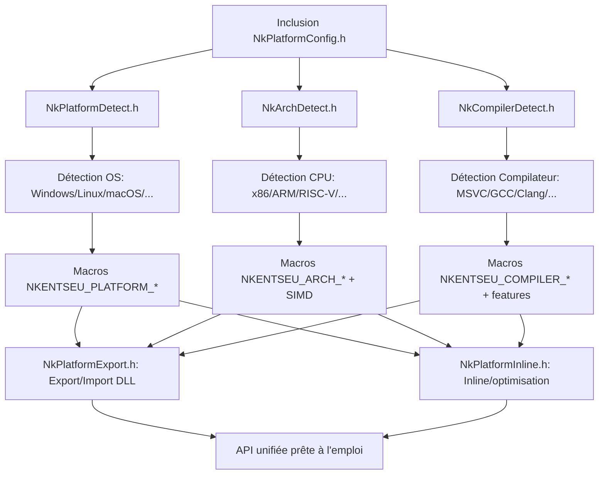

# 📦 Module NKPlatform — Documentation Complète

```
╔════════════════════════════════════════════════════════════════════════╗
║                     NKPlatform — Couche d'Abstraction                  ║
║                     Multiplateforme pour NKentseu                      ║
╚════════════════════════════════════════════════════════════════════════╝
```

> **Version** : 1.0.0
> **Auteur** : Rihen
> **Date** : 2024-2026
> **License** : Proprietary - Free to use and modify
> **Compatibilité** : C++11+, C99+, Windows/Linux/macOS/Android/iOS/Consoles

---

## 📋 Table des Matières

```
1. 🎯 Vue d'Ensemble
2. 🏗️ Architecture du Module
3. 📁 Structure des Fichiers
4. ⚙️ Configuration et Build
5. 📚 API Référence Rapide
6. 💻 Exemples d'Utilisation
7. 🔧 Intégration avec CMake
8. 🧪 Tests et Validation
9. 🚀 Bonnes Pratiques
10. ❓ FAQ & Dépannage
11. 🤝 Contribution
12. 📄 License
```

---

## 1. 🎯 Vue d'Ensemble

### Qu'est-ce que NKPlatform ?

**NKPlatform** est la couche d'abstraction fondamentale du framework NKentseu. Il fournit une interface unifiée et portable pour :


| Catégorie          | Fonctionnalités                                           |
| ------------------- | ---------------------------------------------------------- |
| 🔍**Détection**    | OS, architecture CPU, compilateur, features SIMD           |
| 🔧**Configuration** | Export/import de symboles, inline, alignement, endianness  |
| 🌐**Système**      | Variables d'environnement, logging, configuration hardware |
| ⚡**Optimisation**  | Hints de branche, intrinsèques, allocation alignée       |

### Philosophie de Design

```cpp
// ✅ ZÉRO duplication : réutilisation des macros NKPlatform dans NKCore
#define NKENTSEU_CORE_API NKENTSEU_PLATFORM_API_EXPORT  // Pas de redéfinition

// ✅ Header-only quand possible : pas de linkage complexe
#include "NKPlatform/NkEndianness.h"  // Tout est inline/constexpr

// ✅ Détection compile-time + fallback runtime
if constexpr (NkIsLittleEndian()) {
    // Code optimisé éliminé si non pertinent
}
```

### Objectifs

- ✅ **Portabilité maximale** : un seul code source pour 10+ plateformes
- ✅ **Performance** : zéro overhead runtime pour les détections compile-time
- ✅ **Maintenabilité** : documentation Doxygen, exemples, tests
- ✅ **Flexibilité** : modes static/shared/header-only configurables

---

## 2. 🏗️ Architecture du Module

### Diagramme de Dépendances

```
                    ┌─────────────────────┐
                    │   Application       │
                    └─────────┬───────────┘
                              │
              ┌───────────────▼───────────────┐
              │         NKCore                │
              │  (Types, Traits, Optional)    │
              └───────────────┬───────────────┘
                              │
              ┌───────────────▼───────────────┐
              │      ★ NKPlatform ★           │
              │  (Couche d'abstraction base)  │
              └───────────────┬───────────────┘
                              │
        ┌─────────┬─────────┬─┴─┬─────────┬─────────┐
        ▼         ▼         ▼   ▼         ▼         ▼
   ┌────────┐ ┌────────┐ ┌────────┐ ┌────────┐ ┌────────┐
   │ Windows│ │ Linux  │ │ macOS  │ │ Android│ │Consoles│
   │ MSVC   │ │ GCC    │ │ Clang  │ │ NDK    │ │SDKs    │
   └────────┘ └────────┘ └────────┘ └────────┘ └────────┘
```

### Flux de Détection



---

## 3. 📁 Structure des Fichiers

```
NKPlatform/
├── 📄 NkPlatformConfig.h        # Point d'entrée unifié (RECOMMANDÉ)
│
├── 🔍 Détection Compile-Time
│   ├── 📄 NkPlatformDetect.h    # OS, consoles, embarqué, windowing
│   ├── 📄 NkArchDetect.h        # Architecture CPU, SIMD, endianness
│   └── 📄 NkCompilerDetect.h    # Compilateur, standards C++, features
│
├── ⚙️ Configuration & Export
│   ├── 📄 NkPlatformExport.h    # Export/import DLL, visibilité symboles
│   ├── 📄 NkPlatformInline.h    # Inline, force_inline, no_inline, hints
│   └── 📄 NkEndianness.h        # Détection/conversion byte order
│
├── 🌐 Runtime & Système
│   ├── 📄 NkPlatformConfig.cpp  # Singleton config/capabilities hardware
│   ├── 📄 NkEnv.h / NkEnv.cpp   # Variables d'environnement portable
│   └── 📄 NkFoundationLog.h     # Logging ultra-léger multi-backend
│
├── 🧩 Implémentations Internes
│   └── impl/
│       ├── 📄 NkCPUFeatures.h   # Détection runtime CPUID/sysctl [optionnel]
│       └── 📄 NkPlatformRuntime.c # Helpers runtime communs
│
└── 🧪 Tests & Documentation
    ├── 📄 README.md             # Ce fichier
    ├── 📁 tests/                # Tests unitaires multi-plateforme
    └── 📁 examples/             # Exemples d'intégration
```

### Fichiers Clés — Résumé


| Fichier                | Responsabilité                     | Header-Only          | Dépendances                               |
| ---------------------- | ----------------------------------- | -------------------- | ------------------------------------------ |
| `NkPlatformConfig.h`   | Point d'entrée, ordre d'inclusion  | ✅                   | Tous les autres                            |
| `NkPlatformDetect.h`   | Détection OS/plateforme            | ✅                   | `<cstddef>`, `<cstdint>`                   |
| `NkArchDetect.h`       | Détection CPU/SIMD/endianness      | ✅                   | `<cstddef>`, `<cstdint>`                   |
| `NkCompilerDetect.h`   | Détection compilateur/C++          | ✅                   | Aucun                                      |
| `NkPlatformExport.h`   | Export/import DLL/shared            | ✅                   | NkPlatformDetect, NkArchDetect             |
| `NkPlatformInline.h`   | Spécificateurs inline/optimisation | ✅                   | NkCompilerDetect                           |
| `NkEndianness.h`       | Conversion byte order               | ✅                   | NkPlatformDetect, NkCompilerDetect         |
| `NkPlatformConfig.cpp` | Singleton config hardware           | ❌                   | En-têtes système                         |
| `NkEnv.h/.cpp`         | Variables d'environnement           | ❌ (templates en .h) | `<cstring>`, `<cstdlib>`                   |
| `NkFoundationLog.h`    | Logging minimaliste                 | ✅                   | `<stdio.h>`, `<android/log.h>` (optionnel) |

---

## 4. ⚙️ Configuration et Build

### Modes de Build Supportés

NKPlatform supporte trois modes de build, configurables indépendamment de NKCore :

```cmake
# Option 1 : Bibliothèque partagée (DLL/.so/.dylib)
target_compile_definitions(nkplatform PRIVATE NKENTSEU_BUILD_SHARED_LIB)

# Option 2 : Bibliothèque statique (.lib/.a)
target_compile_definitions(nkplatform PRIVATE NKENTSEU_STATIC_LIB)

# Option 3 : Header-only (aucun linkage, tout inline)
target_compile_definitions(nkplatform PRIVATE NKENTSEU_HEADER_ONLY)
```

> ⚠️ **Important** : Ces macros sont **mutuellement exclusives**. Définir plusieurs génère une erreur.

### Configuration Utilisateur — Macros Disponibles

Définissez ces macros **AVANT** d'inclure `NkPlatformConfig.h` :

```cpp
// ============================================================================
// MODES DE BUILD (choisir UN SEUL)
// ============================================================================
#define NKENTSEU_BUILD_SHARED_LIB    // Compiler en DLL/shared library
#define NKENTSEU_STATIC_LIB          // Compiler en bibliothèque statique
#define NKENTSEU_HEADER_ONLY         // Mode header-only (tout inline)

// ============================================================================
// OPTIONS DE FONCTIONNALITÉ
// ============================================================================
#define NKENTSEU_ENABLE_PLATFORM_LOG    // Activer les logs de détection compile-time
#define NKENTSEU_ARCH_DEBUG             // Afficher l'architecture détectée
#define NKENTSEU_COMPILER_DEBUG         // Afficher le compilateur détecté
#define NKENTSEU_EXPORT_DEBUG           // Afficher la config d'export

// ============================================================================
// OVERRIDES ET FORÇAGES
// ============================================================================
#define NKENTSEU_FORCE_WINDOWING_WAYLAND_ONLY  // Forcer Wayland sur Linux
#define NKENTSEU_FORCE_WINDOWING_XCB_ONLY      // Forcer XCB sur Linux
#define NKENTSEU_OVERRIDE_PAGE_SIZE 16384      // Forcer taille de page mémoire
#define NKENTSEU_DETECT_RASPBERRY_PI           // Activer détection Raspberry Pi

// ============================================================================
// COMPATIBILITÉ
// ============================================================================
#define NKENTSEU_ENABLE_LEGACY_PLATFORM_API    // Activer aliases legacy (Nk* sans préfixe)
```

### Exemple CMake Complet

```cmake
# CMakeLists.txt — Configuration NKPlatform
cmake_minimum_required(VERSION 3.15)
project(NKPlatform VERSION 1.0.0 LANGUAGES CXX C)

# ============================================================================
# OPTIONS DE BUILD
# ============================================================================
option(NKPLATFORM_BUILD_SHARED "Build as shared library" ON)
option(NKPLATFORM_HEADER_ONLY "Header-only mode (no compilation)" OFF)
option(NKPLATFORM_ENABLE_LOGS "Enable compile-time detection logs" OFF)
option(NKPLATFORM_ENABLE_TESTS "Build unit tests" ON)

# ============================================================================
# CONFIGURATION DES DEFINES
# ============================================================================
if(NKPLATFORM_HEADER_ONLY)
    target_compile_definitions(nkplatform INTERFACE
        NKENTSEU_HEADER_ONLY
        NKENTSEU_STATIC_LIB  # Fallback pour les dépendances
    )
elseif(NKPLATFORM_BUILD_SHARED)
    target_compile_definitions(nkplatform PRIVATE
        NKENTSEU_BUILD_SHARED_LIB
    )
    set(NKPLATFORM_LIBRARY_TYPE SHARED)
else()
    target_compile_definitions(nkplatform PRIVATE
        NKENTSEU_STATIC_LIB
    )
    set(NKPLATFORM_LIBRARY_TYPE STATIC)
endif()

if(NKPLATFORM_ENABLE_LOGS)
    target_compile_definitions(nkplatform PRIVATE
        NKENTSEU_ENABLE_PLATFORM_LOG
        NKENTSEU_ARCH_DEBUG
        NKENTSEU_COMPILER_DEBUG
    )
endif()

# ============================================================================
# CRÉATION DE LA BIBLIOTHÈQUE
# ============================================================================
add_library(nkplatform ${NKPLATFORM_LIBRARY_TYPE}
    # Headers publics (installés)
    src/NkPlatformConfig.h
    src/NkPlatformDetect.h
    src/NkArchDetect.h
    src/NkCompilerDetect.h
    src/NkPlatformExport.h
    src/NkPlatformInline.h
    src/NkEndianness.h
    src/NkEnv.h
    src/NkFoundationLog.h
  
    # Sources compilés (si non header-only)
    $<$<NOT:$<BOOL:${NKPLATFORM_HEADER_ONLY}>>:
        src/NkPlatformConfig.cpp
        src/NkEnv.cpp
    >
)

# ============================================================================
# CONFIGURATION DE LA CIBLE
# ============================================================================
target_include_directories(nkplatform
    PUBLIC
        $<BUILD_INTERFACE:${CMAKE_CURRENT_SOURCE_DIR}/include>
        $<INSTALL_INTERFACE:include>
    PRIVATE
        ${CMAKE_CURRENT_SOURCE_DIR}/src
)

target_compile_features(nkplatform PUBLIC cxx_std_11)

# Options de compilation par plateforme
if(MSVC)
    target_compile_options(nkplatform PRIVATE /W4 /permissive-)
else()
    target_compile_options(nkplatform PRIVATE -Wall -Wextra -Wpedantic)
endif()

# ============================================================================
# INSTALLATION
# ============================================================================
install(TARGETS nkplatform
    EXPORT NKPlatformTargets
    LIBRARY DESTINATION lib
    ARCHIVE DESTINATION lib
    RUNTIME DESTINATION bin
    INCLUDES DESTINATION include
)

install(DIRECTORY include/NKPlatform
    DESTINATION include
    FILES_MATCHING PATTERN "*.h"
)

# ============================================================================
# TESTS (optionnel)
# ============================================================================
if(NKPLATFORM_ENABLE_TESTS)
    enable_testing()
    add_subdirectory(tests)
endif()
```

---

## 5. 📚 API Référence Rapide

### Macros de Détection — OS/Plateforme

```cpp
// Après inclusion de NkPlatformConfig.h :

// ✅ Détection OS principale
#ifdef NKENTSEU_PLATFORM_WINDOWS      // Windows (Desktop/UWP)
#ifdef NKENTSEU_PLATFORM_LINUX        // Linux (exclut Android)
#ifdef NKENTSEU_PLATFORM_MACOS        // macOS (exclut iOS/tvOS)
#ifdef NKENTSEU_PLATFORM_IOS          // iOS/iPadOS
#ifdef NKENTSEU_PLATFORM_ANDROID      // Android
#ifdef NKENTSEU_PLATFORM_EMSCRIPTEN   // WebAssembly/Emscripten

// ✅ Catégories de plateforme
#ifdef NKENTSEU_PLATFORM_DESKTOP      // Windows/Linux/macOS (non-mobile)
#ifdef NKENTSEU_PLATFORM_MOBILE       // iOS/Android/watchOS
#ifdef NKENTSEU_PLATFORM_CONSOLE      // PlayStation/Xbox/Nintendo/Sega
#ifdef NKENTSEU_PLATFORM_EMBEDDED     // Arduino/ESP32/Raspberry Pi

// ✅ Macros conditionnelles d'exécution (élégantes !)
NKENTSEU_WINDOWS_ONLY({
    // Ce code ne compile QUE sur Windows
    MessageBox(nullptr, "Hello", "Info", MB_OK);
});

NKENTSEU_NOT_ANDROID({
    // Ce code compile PARTOUT SAUF sur Android
    EnableDesktopFeatures();
});
```

### Macros de Détection — Architecture CPU

```cpp
// ✅ Architecture principale
#ifdef NKENTSEU_ARCH_X86_64    // x86_64 / AMD64
#ifdef NKENTSEU_ARCH_ARM64     // ARM 64-bit (AArch64)
#ifdef NKENTSEU_ARCH_X86       // x86 32-bit
#ifdef NKENTSEU_ARCH_ARM       // ARM 32-bit
#ifdef NKENTSEU_ARCH_RISCV64   // RISC-V 64-bit

// ✅ Bitness et endianness
#ifdef NKENTSEU_ARCH_64BIT     // Architecture 64-bit
#ifdef NKENTSEU_ARCH_LITTLE_ENDIAN  // Little-endian (x86, ARM moderne)
#ifdef NKENTSEU_ARCH_BIG_ENDIAN     // Big-endian (réseau, certains embarqués)

// ✅ Extensions SIMD (compile-time)
#ifdef NKENTSEU_CPU_HAS_SSE2   // SSE2 disponible (x86)
#ifdef NKENTSEU_CPU_HAS_AVX2   // AVX2 disponible (x86)
#ifdef NKENTSEU_CPU_HAS_NEON   // NEON disponible (ARM)

// ✅ Conversions d'endianness (constexpr !)
uint32_t networkValue = nkentseu::platform::HostToNetwork32(hostValue);
uint32_t hostValue = nkentseu::platform::NetworkToHost32(networkValue);

// Templates génériques pour tout type 2/4/8 octets :
float swapped = nkentseu::platform::ByteSwap(myFloat);
```

### Macros d'Export et d'Inline

```cpp
// ✅ Export de symboles pour DLL/shared
class NKENTSEU_PLATFORM_API MyClass {
public:
    NKENTSEU_PLATFORM_API void PublicMethod();
  
    // Fonction inline exportée (performance + linkage)
    NKENTSEU_API_INLINE int GetVersion() const { return 0x0100; }
  
    // Fonction force_inline pour hot paths critiques
    NKENTSEU_API_FORCE_INLINE float FastCalc(float x) {
        return x * 2.0f + 1.0f;
    }
};

// ✅ Spécificateurs d'inline portables
NKENTSEU_INLINE void StandardInline();           // inline standard
NKENTSEU_FORCE_INLINE void AggressiveInline();   // __forceinline / always_inline
NKENTSEU_NO_INLINE void DebugFunction();         // __declspec(noinline) / noinline

// ✅ Hints d'optimisation de branche
if (NKENTSEU_LIKELY(ptr != nullptr)) {
    // Hot path : code fréquemment exécuté
    ProcessData(ptr);
} else {
    // Cold path : gestion d'erreur rare
    HandleError();
}
```

### Logging — NkFoundationLog.h

```cpp
// ✅ Niveaux de log configurables à la compilation
#define NK_FOUNDATION_LOG_LEVEL NK_FOUNDATION_LOG_LEVEL_DEBUG  // Avant inclusion

#include "NKPlatform/NkFoundationLog.h"

// Macros de log avec filtrage compile-time
NK_FOUNDATION_LOG_ERROR("Erreur critique: %s", errorMsg);
NK_FOUNDATION_LOG_WARN("Avertissement: code=%d", code);
NK_FOUNDATION_LOG_INFO("Initialisation terminée");
NK_FOUNDATION_LOG_DEBUG("Valeur intermédiaire: x=%f", x);
NK_FOUNDATION_LOG_TRACE("Trace détaillée: iteration=%d", i);

// ✅ Logging de valeurs avec formatage automatique (ADL)
NK_FOUNDATION_LOG_INFO_VALUE("userId", userId);      // int → "userId=12345"
NK_FOUNDATION_LOG_DEBUG_VALUE("position", vector3);  // Type custom via extension

// ✅ Extension du formatage pour vos types (ADL)
namespace myapp {
    struct Vector3 { float x, y, z; };
  
    // Définir dans le même namespace que le type
    int NKFoundationToString(const Vector3& v, char* out, size_t outSize) {
        return snprintf(out, outSize, "(%.2f,%.2f,%.2f)", v.x, v.y, v.z);
    }
}
// → NK_FOUNDATION_LOG_INFO_VALUE("pos", myVector) fonctionne automatiquement !

// ✅ Sink personnalisé pour rediriger les logs
void MyFileSink(const char* level, const char* file, int line, const char* msg) {
    fprintf(logFile, "[%s] %s:%d %s\n", level, file, line, msg);
}
nkentseu::platform::NkFoundationSetLogSink(MyFileSink);
```

### Variables d'Environnement — NkEnv.h

```cpp
#include "NKPlatform/NkEnv.h"
using namespace nkentseu::env;

// ✅ Lecture/écriture portable
NkEnvString path;
NkGet(NkEnvString("PATH"), path);  // Lit la variable PATH

NkSet(NkEnvString("MY_VAR"), NkEnvString("value"));  // Définit une variable
NkUnset(NkEnvString("MY_VAR"));                       // Supprime une variable

if (NkExists(NkEnvString("DEBUG_MODE"))) {
    EnableDebugMode();
}

// ✅ Manipulation du PATH (multiplateforme)
NkPrependToPath(NkEnvString("/opt/myapp/bin"));  // Ajoute au début
NkAppendToPath(NkEnvString("/usr/local/tools")); // Ajoute à la fin

// ✅ Conteneurs génériques sans STL
NkEnvVector<NkEnvString> searchPaths;
searchPaths.PushBack(NkEnvString("/usr/bin"));
searchPaths.PushBack(NkEnvString("/usr/local/bin"));

for (NkSize i = 0; i < searchPaths.Size(); ++i) {
    printf("Path[%d] = %s\n", i, searchPaths[i].CStr());
}

// ✅ Map associative simple (recherche linéaire)
NkEnvUMap<NkEnvString, NkEnvString> config;
config.Set(NkEnvString("timeout"), NkEnvString("30"));

if (const NkEnvString* val = config.Find(NkEnvString("timeout"))) {
    printf("Timeout: %s\n", val->CStr());
}
```

### Configuration Hardware — NkPlatformConfig.cpp

```cpp
#include "NKPlatform/NkPlatformConfig.h"
using namespace nkentseu::platform;

// ✅ Singleton thread-safe de configuration compile-time
const PlatformConfig& config = GetPlatformConfig();
printf("OS: %s\n", config.platformName);
printf("Arch: %s (%d-bit)\n", config.archName, config.is64Bit ? 64 : 32);
printf("Compiler: %s v%d\n", config.compilerName, config.compilerVersion);

// ✅ Singleton de détection hardware runtime
const PlatformCapabilities& caps = GetPlatformCapabilities();
printf("RAM: %zu MB total, %zu MB available\n",
       caps.totalPhysicalMemory / (1024*1024),
       caps.availablePhysicalMemory / (1024*1024));
printf("CPU: %d physical cores, %d logical threads\n",
       caps.processorCount, caps.logicalProcessorCount);
printf("SIMD: SSE2=%d, AVX2=%d, NEON=%d\n",
       caps.hasSSE2, caps.hasAVX2, caps.hasNEON);
```

---

## 6. 💻 Exemples d'Utilisation

### Exemple 1 : Application Multiplateforme Basique

```cpp
// main.cpp
#define NKENTSEU_STATIC_LIB  // Mode static pour cet exemple
#include "NKPlatform/NkPlatformConfig.h"
#include "NKPlatform/NkFoundationLog.h"

int main() {
    using namespace nkentseu::platform;
  
    // Logging d'information de plateforme
    NK_FOUNDATION_LOG_INFO("=== Démarrage sur %s ===", 
                          NKENTSEU_PLATFORM_NAME);
  
    // Code conditionnel par plateforme
    NKENTSEU_WINDOWS_ONLY({
        NK_FOUNDATION_LOG_DEBUG("Initialisation Windows-specific");
        InitializeWindowsSubsystem();
    });
  
    NKENTSEU_PLATFORM_LINUX({
        NK_FOUNDATION_LOG_DEBUG("Initialisation Linux-specific");
        InitializeLinuxSubsystem();
    });
  
    // Optimisation basée sur l'architecture
    if constexpr (nkentseu::platform::NkIsLittleEndian()) {
        // Code optimisé pour little-endian (éliminé si big-endian)
        ProcessDataLittleEndian();
    }
  
    // Utilisation de l'API d'environnement
    NkEnvString configPath;
    NkGet(NkEnvString("MYAPP_CONFIG"), configPath);
  
    if (configPath.Empty()) {
        NK_FOUNDATION_LOG_WARN("Variable MYAPP_CONFIG non définie, "
                              "utilisation du chemin par défaut");
        configPath = NkEnvString("/etc/myapp/config.ini");
    }
  
    LoadConfiguration(configPath.CStr());
  
    NK_FOUNDATION_LOG_INFO("Application terminée avec succès");
    return 0;
}
```

### Exemple 2 : Bibliothèque avec Export de Symboles

```cpp
// mylib_public.h — Header public de votre bibliothèque
#pragma once
#include "NKPlatform/NkPlatformConfig.h"

// Export des symboles selon le mode de build
class NKENTSEU_PLATFORM_API MyProcessor {
public:
    NKENTSEU_PLATFORM_API MyProcessor();
    NKENTSEU_PLATFORM_API ~MyProcessor();
  
    // Méthode publique avec inline pour performance
    NKENTSEU_API_INLINE int GetVersion() const {
        return 0x010203;  // Version 1.2.3 encodée
    }
  
    // Méthode critique avec force_inline
    NKENTSEU_API_FORCE_INLINE float ProcessSample(float input) {
        // Hot path : inlining forcé pour éviter l'appel de fonction
        return input * gain_ + offset_;
    }
  
    NKENTSEU_PLATFORM_API void SetParameters(float gain, float offset);
  
private:
    // Méthode privée : pas d'export nécessaire
    void InternalCalibrate();
  
    float gain_ = 1.0f;
    float offset_ = 0.0f;
};

// API C pour interop avec d'autres langages
NKENTSEU_EXTERN_C_BEGIN

NKENTSEU_PLATFORM_API MyProcessor* MyProcessor_Create(void);
NKENTSEU_PLATFORM_API void MyProcessor_Destroy(MyProcessor* proc);
NKENTSEU_PLATFORM_API float MyProcessor_Process(MyProcessor* proc, float input);

NKENTSEU_EXTERN_C_END
```

```cpp
// mylib.cpp — Implémentation
#include "mylib_public.h"
#include "NKPlatform/NkFoundationLog.h"

MyProcessor::MyProcessor() {
    NK_FOUNDATION_LOG_DEBUG("MyProcessor::MyProcessor()");
    InternalCalibrate();
}

MyProcessor::~MyProcessor() {
    NK_FOUNDATION_LOG_DEBUG("MyProcessor::~MyProcessor()");
}

void MyProcessor::SetParameters(float gain, float offset) {
    gain_ = gain;
    offset_ = offset;
    NK_FOUNDATION_LOG_DEBUG("Paramètres mis à jour: gain=%.2f, offset=%.2f",
                           gain_, offset_);
}

void MyProcessor::InternalCalibrate() {
    // Calibration spécifique à la plateforme
    #ifdef NKENTSEU_CPU_HAS_AVX2
        CalibrateWithAVX2();
    #elif defined(NKENTSEU_CPU_HAS_NEON)
        CalibrateWithNEON();
    #else
        CalibrateScalar();
    #endif
}

// Implémentation de l'API C
NKENTSEU_EXTERN_C_BEGIN

MyProcessor* MyProcessor_Create(void) {
    return new(std::nothrow) MyProcessor();
}

void MyProcessor_Destroy(MyProcessor* proc) {
    delete proc;
}

float MyProcessor_Process(MyProcessor* proc, float input) {
    return proc ? proc->ProcessSample(input) : 0.0f;
}

NKENTSEU_EXTERN_C_END
```

### Exemple 3 : Parsing de Format Binaire Réseau

```cpp
// network_parser.h
#include "NKPlatform/NkPlatformConfig.h"
#include "NKPlatform/NkEndianness.h"

struct NetworkPacket {
    uint16_t magic;      // 0xABCD en big-endian
    uint16_t length;     // Longueur du payload
    uint32_t timestamp;  // Timestamp UNIX en big-endian
    // ... autres champs
};

// Lecture sécurisée depuis un buffer réseau (potentiellement non-aligné)
inline bool ParseNetworkPacket(const uint8_t* buffer, size_t bufferSize,
                              NetworkPacket& out) {
    using namespace nkentseu::platform;
  
    if (bufferSize < sizeof(NetworkPacket)) {
        return false;
    }
  
    // Lecture avec conversion depuis big-endian (ordre réseau)
    // Les fonctions ReadBE* gèrent automatiquement l'endianness host
    out.magic = ReadBE16(buffer);
    out.length = ReadBE16(buffer + 2);
    out.timestamp = ReadBE32(buffer + 4);
  
    // Validation
    if (out.magic != 0xABCD) {
        return false;  // Mauvais magic number
    }
  
    return true;
}

// Sérialisation vers buffer réseau
inline size_t SerializeNetworkPacket(const NetworkPacket& packet,
                                    uint8_t* buffer, size_t bufferSize) {
    using namespace nkentseu::platform;
  
    if (bufferSize < sizeof(NetworkPacket)) {
        return 0;
    }
  
    // Écriture avec conversion vers big-endian
    WriteBE16(buffer, packet.magic);
    WriteBE16(buffer + 2, packet.length);
    WriteBE32(buffer + 4, packet.timestamp);
  
    return sizeof(NetworkPacket);
}
```

---

## 7. 🔧 Intégration avec CMake

### Option A : NKPlatform comme Submodule CMake

```cmake
# Dans le CMakeLists.txt de votre projet principal

# Ajouter NKPlatform comme sous-répertoire
add_subdirectory(external/NKPlatform)

# Lier votre cible contre NKPlatform
add_executable(myapp src/main.cpp)
target_link_libraries(myapp PRIVATE nkplatform)

# Si NKPlatform est en mode shared, les defines d'import sont gérés automatiquement
# Sinon, définir manuellement si nécessaire :
# target_compile_definitions(myapp PRIVATE NKENTSEU_STATIC_LIB)
```

### Option B : NKPlatform comme Package Installé

```cmake
# Après installation de NKPlatform via 'cmake --install'

# Trouver le package
find_package(NKPlatform 1.0 REQUIRED)

# Lier contre la cible importée
add_executable(myapp src/main.cpp)
target_link_libraries(myapp PRIVATE NKPlatform::NKPlatform)

# Les includes et defines sont automatiquement configurés
```

### Option C : Mode Header-Only (Aucun Build)

```cmake
# Aucun add_subdirectory ni find_package nécessaire

# Ajouter simplement le chemin des headers
target_include_directories(myapp PRIVATE 
    /chemin/vers/NKPlatform/include
)

# Définir le mode header-only
target_compile_definitions(myapp PRIVATE
    NKENTSEU_HEADER_ONLY
)

# Votre code inclut directement :
// #include "NKPlatform/NkPlatformConfig.h"
```

### Variables CMake Exportées

Après installation, NKPlatform exporte ces variables :

```cmake
NKPlatform_VERSION        # Version du package (ex: "1.0.0")
NKPlatform_INCLUDE_DIRS   # Chemin vers les headers publics
NKPlatform_LIBRARIES      # Nom de la cible à linker
NKPlatform_DEFINITIONS    # Defines requis pour l'import (si shared)
NKPlatform_IS_SHARED      # TRUE si build en shared library
```

---

## 8. 🧪 Tests et Validation

### Matrice de Tests Recommandée

```yaml
# .github/workflows/test-nkplatform.yml (exemple GitHub Actions)

name: Test NKPlatform

on: [push, pull_request]

jobs:
  test:
    strategy:
      matrix:
        os: [ubuntu-latest, windows-latest, macos-latest]
        compiler: [gcc-11, clang-14, msvc-2022]
        build_type: [Debug, Release]
        mode: [static, shared, header-only]
      
    runs-on: ${{ matrix.os }}
  
    steps:
      - uses: actions/checkout@v3
    
      - name: Configure CMake
        run: >
          cmake -B build
          -DCMAKE_BUILD_TYPE=${{ matrix.build_type }}
          -DNKPLATFORM_BUILD_SHARED=${{ matrix.mode == 'shared' }}
          -DNKPLATFORM_HEADER_ONLY=${{ matrix.mode == 'header-only' }}
          -DNKPLATFORM_ENABLE_TESTS=ON
        
      - name: Build
        run: cmake --build build --config ${{ matrix.build_type }}
      
      - name: Test
        run: ctest --test-dir build --output-on-failure
```

### Tests Unitaires — Exemple

```cpp
// tests/test_endianness.cpp
#include "NKPlatform/NkPlatformConfig.h"
#include <cassert>
#include <cstring>

void TestByteSwap() {
    using namespace nkentseu::platform;
  
    // Test 16-bit
    assert(ByteSwap16(0x1234) == 0x3412);
  
    // Test 32-bit
    assert(ByteSwap32(0x12345678) == 0x78563412);
  
    // Test 64-bit
    assert(ByteSwap64(0x0123456789ABCDEFULL) == 0xEFCDAB8967452301ULL);
  
    // Test générique template
    uint32_t val = 0xAABBCCDD;
    uint32_t swapped = ByteSwap(val);
    assert(swapped == 0xDDCCBBAA);
}

void TestNetworkConversion() {
    using namespace nkentseu::platform;
  
    // Sur little-endian : conversion nécessaire
    // Sur big-endian : no-op (optimisé par le compilateur)
    uint32_t hostValue = 0x12345678;
    uint32_t networkValue = HostToNetwork32(hostValue);
    uint32_t backToHost = NetworkToHost32(networkValue);
  
    assert(backToHost == hostValue);  // Round-trip doit être identité
}

void TestCompileTimeDetection() {
    // Ces assertions sont évaluées à la compilation grâce à constexpr
    static_assert(NkGetCompileTimeEndianness() == NkGetRuntimeEndianness(),
                  "Compile-time et runtime endianness doivent correspondre");
  
    #if NK_LITTLE_ENDIAN
        static_assert(nkentseu::platform::NkIsLittleEndian(), 
                      "NK_LITTLE_ENDIAN doit impliquer NkIsLittleEndian()");
    #endif
}

int main() {
    TestByteSwap();
    TestNetworkConversion();
    TestCompileTimeDetection();
    return 0;
}
```

### Validation de Portabilité

```bash
# Script de validation multi-compilateur (Linux)

#!/bin/bash
set -e

echo "=== Validation NKPlatform ==="

# GCC 11
echo "[GCC 11] Configuration..."
cmake -B build-gcc11 -DCMAKE_CXX_COMPILER=g++-11 -DCMAKE_BUILD_TYPE=Release
cmake --build build-gcc11 -j$(nproc)
ctest --test-dir build-gcc11

# Clang 14
echo "[Clang 14] Configuration..."
cmake -B build-clang14 -DCMAKE_CXX_COMPILER=clang++-14 -DCMAKE_BUILD_TYPE=Release
cmake --build build-clang14 -j$(nproc)
ctest --test-dir build-clang14

# Mode header-only
echo "[Header-only] Validation..."
cmake -B build-header-only -DNKPLATFORM_HEADER_ONLY=ON
cmake --build build-header-only
ctest --test-dir build-header-only

echo "✅ Tous les tests ont réussi !"
```

---

## 9. 🚀 Bonnes Pratiques

### ✅ À Faire

```cpp
// 1. Toujours inclure NkPlatformConfig.h en premier
#include "NKPlatform/NkPlatformConfig.h"  // Point d'entrée unifié

// 2. Utiliser les macros conditionnelles pour la portabilité
void InitSubsystem() {
    NKENTSEU_WINDOWS_ONLY({ InitWindows(); });
    NKENTSEU_PLATFORM_LINUX({ InitLinux(); });
    // Pas de #ifdef imbriqués complexes
}

// 3. Privilégier les constexpr pour l'optimisation compile-time
constexpr bool NeedsByteSwap() {
    return nkentseu::platform::NkIsLittleEndian();
}

// 4. Utiliser NKENTSEU_LIKELY/UNLIKELY pour les branches fréquentes
if (NKENTSEU_LIKELY(ptr != nullptr)) {
    ProcessData(ptr);  // Hot path
} else {
    HandleError();     // Cold path
}

// 5. Documenter les dépendances de configuration
/**
 * @note Requiert NKENTSEU_BUILD_SHARED_LIB défini pour l'export DLL
 */
NKENTSEU_PLATFORM_API void ExportedFunction();
```

### ❌ À Éviter

```cpp
// 1. Ne pas redéfinir les macros NKPlatform dans NKCore
// ❌ MAUVAIS :
#define NKENTSEU_CORE_DEPRECATED __declspec(deprecated)  // Duplication !

// ✅ BON :
#define NKENTSEU_CORE_DEPRECATED NKENTSEU_DEPRECATED  // Réutilisation

// 2. Éviter les évaluations multiples dans les macros math
// ❌ RISQUÉ :
#define MAX(a, b) ((a) > (b) ? (a) : (b))  // Évalue a et b deux fois !

// ✅ PRÉFÉRER :
inline int Max(int a, int b) { return (a > b) ? a : b; }

// 3. Ne pas utiliser NKENTSEU_FORCE_INLINE sans profilage
// ❌ POTENTIELLEMENT CONTRE-PRODUCTIF :
NKENTSEU_FORCE_INLINE void RarelyCalledFunction() { ... }  // Code bloat !

// ✅ PRÉFÉRER :
NKENTSEU_INLINE void RarelyCalledFunction() { ... }  // Laisser le compilateur décider

// 4. Éviter les dépendances circulaires entre headers
// ❌ BOUCLE INFINIE :
// NkPlatformExport.h inclut NkArchDetect.h
// NkArchDetect.h inclut NkPlatformExport.h  ← Problème !

// ✅ SOLUTION : Documenter l'ordre d'inclusion ou utiliser des forward declarations
```

### Checklist de Review de Code

- [ ]  Les macros de détection sont-elles guardées par `#ifdef` ?
- [ ]  Les fonctions inline exportées utilisent-elles `NKENTSEU_API_INLINE` ?
- [ ]  Les constantes sont-elles `constexpr` quand possible ?
- [ ]  La documentation Doxygen est-elle à jour pour les nouvelles APIs ?
- [ ]  Les exemples d'utilisation illustrent-ils les cas d'usage réels ?
- [ ]  Les tests couvrent-ils les chemins conditionnels par plateforme ?

---

## 10. ❓ FAQ & Dépannage

### Questions Fréquentes

**Q : Comment savoir quelle plateforme a été détectée à la compilation ?**
R : Définissez `NKENTSEU_ENABLE_PLATFORM_LOG` avant d'inclure `NkPlatformConfig.h`. Des messages `#pragma message` afficheront les détections dans la sortie du compilateur.

**Q : Pourquoi mes symboles ne sont-ils pas exportés dans ma DLL ?**R : Vérifiez que :

1. `NKENTSEU_BUILD_SHARED_LIB` est défini **lors de la compilation de NKPlatform**
2. Les classes/fonctions utilisent `NKENTSEU_PLATFORM_API`
3. Le linker exporte correctement les symboles (vérifier le fichier .def sur Windows si nécessaire)

**Q : Comment désactiver les logs en production sans recompiler ?**
R : Utilisez le niveau de log compile-time dans `NkFoundationLog.h` :

```cpp
#define NK_FOUNDATION_LOG_LEVEL NK_FOUNDATION_LOG_LEVEL_ERROR  // Avant inclusion
```

Seuls les logs ERROR seront compilés ; les autres sont éliminés par le préprocesseur.

**Q : NKENTSEU_STATIC_LIB et NKENTSEU_BUILD_SHARED_LIB peuvent-ils être définis ensemble ?**
R : Non, c'est une erreur de configuration. Le fichier `NkPlatformExport.h` émettra un `#error` pour vous alerter.

### Problèmes Courants et Solutions


| Symptôme                                          | Cause Probable                         | Solution                                                          |
| -------------------------------------------------- | -------------------------------------- | ----------------------------------------------------------------- |
| `undefined reference to NKENTSEU_PLATFORM_API`     | Mode shared sans defines d'import      | Définir`NKENTSEU_STATIC_LIB` côté client ou vérifier l'export |
| `warning: unused macro NKENTSEU_PLATFORM_WINDOWS`  | Code conditionnel jamais atteint       | Vérifier la plateforme cible ou supprimer le code mort           |
| `error: union member with non-trivial constructor` | `constexpr` union avec types complexes | Utiliser`NkGetRuntimeEndianness()` uniquement en C++20+           |
| `warning: __builtin_expect not supported`          | Compilation sur MSVC sans guard        | Utiliser`NKENTSEU_LIKELY()` qui gère le fallback automatiquement |
| `error: 'environ' undeclared`                      | POSIX sans déclaration explicite      | Inclure`<unistd.h>` et vérifier la conformité POSIX             |

### Debugging Avancé

```cpp
// Activer tous les logs de détection
#define NKENTSEU_ENABLE_PLATFORM_LOG
#define NKENTSEU_ARCH_DEBUG
#define NKENTSEU_COMPILER_DEBUG
#define NKENTSEU_EXPORT_DEBUG
#include "NKPlatform/NkPlatformConfig.h"

// Sortie typique du compilateur :
// NKPlatform Export Config:
//   Mode: Shared library (export)
//   Export method: __declspec
// NKentseu: Architecture détectée: x86_64
// NKentseu: Compilateur détecté: MSVC 1930

// Inspecter les macros définies (GCC/Clang)
#ifdef __cplusplus
    #pragma message("__cplusplus = " NKENTSEU_STRINGIZE(__cplusplus))
#endif
#pragma message("NKENTSEU_PLATFORM_NAME = " NKENTSEU_PLATFORM_NAME)
```

---

## 11. 🤝 Contribution

### Guide de Contribution

1. **Fork** le dépôt et créez votre branche : `git checkout -b feature/ma-nouvelle-fonctionnalite`
2. **Codez** en respectant le style existant (indentation, commentaires Doxygen)
3. **Testez** sur au moins 2 plateformes (ex: Linux + Windows)
4. **Documentez** les nouvelles APIs avec des exemples dans la section "Exemples d'Utilisation"
5. **Soumettez** une Pull Request avec une description détaillée des changements

### Standards de Code

```cpp
// ✅ Style recommandé
namespace nkentseu {
    namespace platform {
      
        /**
         * @brief Description concise de la fonction
         * @param param Description du paramètre
         * @return Description de la valeur de retour
         * @ingroup NomDuGroupeDoxygen
         */
        NKENTSEU_API_INLINE ReturnType MaFonction(ParamType param) {
            // Une instruction par ligne
            // Commentaires pour les logiques complexes
            return result;
        }
      
    } // namespace platform
} // namespace nkentseu
```

### Checklist de Soumission

- [ ]  Le code compile sans warnings avec `-Wall -Wextra -Wpedantic` (GCC/Clang) ou `/W4` (MSVC)
- [ ]  La documentation Doxygen est générée sans erreurs
- [ ]  Les tests existants passent sur toutes les plateformes cibles
- [ ]  Les nouveaux tests couvrent les cas d'usage ajoutés
- [ ]  Le README est mis à jour si l'API publique change
- [ ]  Aucune régression de performance n'est introduite (profilage si nécessaire)

---

## 12. 📄 License

```
Copyright © 2024-2026 Rihen. All rights reserved.

Proprietary License - Free to use and modify

Permission is hereby granted, free of charge, to any person obtaining a copy
of this software and associated documentation files (the "Software"), to deal
in the Software without restriction, including without limitation the rights
to use, copy, modify, merge, publish, distribute, sublicense, and/or sell
copies of the Software, and to permit persons to whom the Software is
furnished to do so, subject to the following conditions:

- The above copyright notice and this permission notice shall be included 
  in all copies or substantial portions of the Software.
- Modifications must be clearly marked as such and must not misrepresent 
  the original software.
- This Software is provided "as is", without warranty of any kind.

THE SOFTWARE IS PROVIDED "AS IS", WITHOUT WARRANTY OF ANY KIND, EXPRESS OR
IMPLIED, INCLUDING BUT NOT LIMITED TO THE WARRANTIES OF MERCHANTABILITY,
FITNESS FOR A PARTICULAR PURPOSE AND NONINFRINGEMENT. IN NO EVENT SHALL THE
AUTHORS OR COPYRIGHT HOLDERS BE LIABLE FOR ANY CLAIM, DAMAGES OR OTHER
LIABILITY, WHETHER IN AN ACTION OF CONTRACT, TORT OR OTHERWISE, ARISING FROM,
OUT OF OR IN CONNECTION WITH THE SOFTWARE OR THE USE OR OTHER DEALINGS IN
THE SOFTWARE.
```

---

## 📞 Support & Contact

- 🐛 **Signaler un bug** : Ouvrez une issue sur le dépôt avec le tag `[NKPlatform]`
- 💡 **Proposer une amélioration** : Discussion GitHub ou email à l'auteur
- 📚 **Documentation additionnelle** : Consultez les exemples dans `examples/` et les commentaires Doxygen dans les headers
- 🔄 **Mises à jour** : Suivez le fichier `CHANGELOG.md` pour l'historique des versions

---

```
╔════════════════════════════════════════════════════════════════════════╗
║                    Merci d'utiliser NKPlatform ! 🚀                    ║
║     Une couche d'abstraction robuste pour des applications portables   ║
╚════════════════════════════════════════════════════════════════════════╝
```
