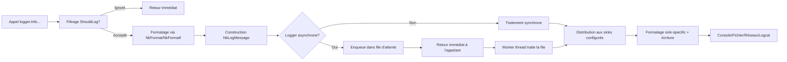

# 🪵 NKLogger — Module de Logging Haute Performance pour C++

> **Logging professionnel, flexible et multiplateforme pour applications C++ modernes**

[](LICENSE)
[](https://isocpp.org/)
[](#-plateformes-supportées)
[](#-thread-safety)

---

## 📋 Table des matières

- [👁️ Vue d'ensemble](#-vue-densemble)
- [✨ Fonctionnalités](#-fonctionnalités)
- [🏗️ Architecture](#-architecture)
- [📦 Installation](#-installation)
- [🚀 Utilisation rapide](#-utilisation-rapide)
- [📚 API détaillée](#-api-détaillée)
- [💡 Exemples avancés](#-exemples-avancés)
- [⚙️ Configuration](#-configuration)
- [🚀 Performance et tuning](#-performance-et-tuning)
- [🔒 Thread-safety](#-thread-safety)
- [🌐 Plateformes supportées](#-plateformes-supportées)
- [🧪 Tests et validation](#-tests-et-validation)
- [🤝 Contribuer](#-contribuer)
- [📄 License](#-license)
- [📞 Support](#-support-et-ressources)

---

## 👁️ Vue d'ensemble

**NKLogger** est un module de logging professionnel pour C++ moderne, conçu pour les applications haute performance nécessitant :

- ✅ **Flexibilité** : multiples styles de logging (positionnel, printf, stream)
- ✅ **Performance** : logger asynchrone avec file d'attente pour découplage producteur/consommateur
- ✅ **Extensibilité** : architecture basée sur interfaces pour sinks personnalisés
- ✅ **Thread-safety** : synchronisation robuste pour usage multi-threadé
- ✅ **Multiplateforme** : support Windows, Linux, macOS, Android avec adaptations natives
- ✅ **Zéro dépendance STL** : utilisation exclusive des conteneurs et utilitaires NKCore

> 🎯 **Cas d'usage typiques** :
>
> - Applications serveur haute fréquence (trading, gaming, IoT)
> - Systèmes embarqués avec contraintes mémoire
> - Applications multiplateformes avec logging cohérent
> - Systèmes critiques nécessitant persistance garantie des logs

---

## ✨ Fonctionnalités

### 📝 Styles de logging multiples

```cpp
// Style positionnel (recommandé) - type-safe et extensible
logger.Info("User {0} logged in from {1:hex}", username, ipAddress);

// Style printf (compatibilité legacy)
logger.Infof("User %s logged in from 0x%X", username.CStr(), ipAddress);

// Style stream (messages littéraux)
logger.Info("Simple message without formatting");
```

### 🎨 Formatage avancé

```cpp
// Propriétés de formatage intégrées
logger.Debug("Address: 0x{0:hex8}, Count: {1:w=5}, Ratio: {2:.3}", 
             ptr, count, ratio);

// Échappement des accolades pour JSON/templates
logger.Info("Payload: {{\"id\": {0}, \"action\": \"{1}\"}}", id, action);

// Marqueurs de couleur pour console (ANSI/Win32)
logger.SetPattern("[%^%L%$] %v");  // %^ = début couleur, %$ = fin
```

### 🗂️ Sinks multiples et composites

```cpp
// Console avec couleurs
auto console = memory::MakeShared<NkConsoleSink>();
console->SetPattern("[%^%L%$] %v");

// Fichier avec rotation par taille
auto rotating = memory::MakeShared<NkRotatingFileSink>(
    "logs/app.log", 50*1024*1024, 5);  // 50MB, 5 backups

// Fichier avec rotation quotidienne
auto daily = memory::MakeShared<NkDailyFileSink>(
    "logs/archive.log", 0, 0, 30);  // Rotation à minuit, 30 jours

// Distribution vers multiples destinations
auto distributor = memory::MakeShared<NkDistributingSink>();
distributor->AddSink(console);
distributor->AddSink(rotating);
distributor->AddSink(daily);

logger.AddSink(distributor);
```

### ⚡ Logger asynchrone haute performance

```cpp
// Création avec file de 8192 messages et flush toutes les 1000ms
auto asyncLogger = memory::MakeShared<NkAsyncLogger>(
    "HighFreqApp", 8192, 1000);

// Gestion de débordement : drop oldest pour privilégier les logs récents
asyncLogger->SetOverflowPolicy(NkAsyncOverflowPolicy::NK_DROP_OLDEST);

// Démarrage du thread worker
asyncLogger->Start();

// Logging : retour immédiat, traitement en arrière-plan
for (int i = 0; i < 10000; ++i) {
    asyncLogger->Debug("Metric sample {0}", i);  // < 10µs par appel
}
```

### 🔧 Configuration dynamique

```cpp
// Modification à runtime sans redémarrage
logger.SetLevel(NkLogLevel::NK_DEBUG);  // Augmenter la verbosité
logger.SetPattern("[%Y-%m-%d %H:%M:%S.%e] [%L] %v");  // Changer le format

// Gestion dynamique des sinks
logger.AddSink(newConsoleSink);    // Ajouter un sink
logger.ClearSinks();               // Retirer tous les sinks
```

### 🌍 Support multiplateforme natif


| Plateforme  | Console                           | Fichier         | Couleurs                       | Notes                                               |
| ----------- | --------------------------------- | --------------- | ------------------------------ | --------------------------------------------------- |
| **Windows** | ✅ stdout/stderr                  | ✅ fopen/fwrite | ✅ ANSI + Win32 API            | ENABLE_VIRTUAL_TERMINAL_PROCESSING requis pour ANSI |
| **Linux**   | ✅ stdout/stderr                  | ✅ fopen/fwrite | ✅ ANSI via isatty/TERM        | Support complet                                     |
| **macOS**   | ✅ stdout/stderr                  | ✅ fopen/fwrite | ✅ ANSI via isatty/TERM        | Support complet                                     |
| **Android** | ✅ logcat via __android_log_print | ✅ fopen/fwrite | ❌ (logcat gère les couleurs) | Redirection automatique vers logcat                 |

---

## 🏗️ Architecture

```
NKLogger/
├── Core/
│   ├── NkLogLevel.h/.cpp          # Niveaux de log et conversions
│   ├── NkLogMessage.h/.cpp        # Structure de message avec métadonnées
│   └── NkLoggerFormatter.h/.cpp   # Formatage pattern-based avec NkFormat
│
├── Sinks/                         # Implémentations de destinations
│   ├── NkSink.h                   # Interface abstraite NkISink
│   ├── NkConsoleSink.h/.cpp       # Sortie console avec couleurs
│   ├── NkFileSink.h/.cpp          # Persistance fichier de base
│   ├── NkRotatingFileSink.h/.cpp  # Rotation automatique par taille
│   ├── NkDailyFileSink.h/.cpp     # Rotation automatique quotidienne
│   ├── NkNullSink.h/.cpp          # Sink nul pour désactivation/testing
│   ├── NkDistributingSink.h/.cpp  # Composite pour diffusion broadcast
│   └── NkAsyncLogger.h/.cpp       # Logger asynchrone haute performance
│
├── Public API/
│   ├── NkLogger.h/.cpp            # Classe principale multi-style
│   ├── NkLog.h/.cpp               # Singleton global avec API fluide
│   └── NKLogger.h                 # Fichier d'agrégation (optionnel)
│
└── Dependencies/
    ├── NKCore/                    # Types, traits, formatage, atomics
    ├── NKContainers/              # String, Vector, Queue, Functional
    ├── NKMemory/                  # Smart pointers (UniquePtr, SharedPtr)
    ├── NKThreading/               # Mutex, ConditionVariable, Thread
    └── NKPlatform/                # Détection et abstraction plateforme
```

### 🔗 Flux de traitement d'un message



---

## 📦 Installation

### Prérequis

- ✅ Compilateur C++17 ou supérieur (GCC 7+, Clang 5+, MSVC 2017+)
- ✅ Projet NKCore intégré (types, conteneurs, mémoire, threading)
- ✅ CMake 3.10+ pour la génération de projets (optionnel)

### Intégration via CMake

```cmake
# CMakeLists.txt de votre projet
cmake_minimum_required(VERSION 3.10)
project(MyApp LANGUAGES CXX)

set(CMAKE_CXX_STANDARD 17)
set(CMAKE_CXX_STANDARD_REQUIRED ON)

# Ajout du sous-module NKLogger
add_subdirectory(extern/NKLogger)

# Liaison avec votre cible
add_executable(my_app src/main.cpp)
target_link_libraries(my_app PRIVATE 
    NKLogger::NKLogger
    NKCore::NKCore
)

# Options de compilation recommandées
if(CMAKE_CXX_COMPILER_ID MATCHES "GNU|Clang")
    target_compile_options(my_app PRIVATE 
        -Wall -Wextra -Wpedantic
        -pthread  # Requis pour le threading POSIX
    )
endif()
```

### Intégration manuelle

```cpp
// Dans votre code source
#include <NKLogger/NkLog.h>           // Logger singleton global
// OU
#include <NKLogger/NkLogger.h>        // Logger instance personnalisée

// Sinks courants
#include <NKLogger/Sinks/NkConsoleSink.h>
#include <NKLogger/Sinks/NkFileSink.h>
#include <NKLogger/Sinks/NkRotatingFileSink.h>
```

### Structure de dépendances recommandée

```
VotreProjet/
├── extern/
│   ├── NKCore/          # Requis : types, conteneurs, mémoire, threading
│   └── NKLogger/        # Ce module
├── src/
│   ├── main.cpp
│   └── ...
├── CMakeLists.txt
└── ...
```

---

## 🚀 Utilisation rapide

### Configuration minimale (5 lignes)

```cpp
#include <NKLogger/NkLog.h>
#include <NKLogger/Sinks/NkConsoleSink.h>

int main() {
    // 1. Ajouter un sink console au logger global
    nkentseu::NkLog::Instance().AddSink(
        nkentseu::memory::MakeShared<nkentseu::NkConsoleSink>());
  
    // 2. Logger avec la macro de convenance
    logger.Info("Application started");
    logger.Debug("Config loaded: {0} modules", 42);
    logger.Error("Connection failed: code={0}", 503);
  
    return 0;  // Flush automatique dans le destructeur
}
```

### Configuration complète avec rotation et async

```cpp
#include <NKLogger/NkAsyncLogger.h>
#include <NKLogger/Sinks/NkConsoleSink.h>
#include <NKLogger/Sinks/NkRotatingFileSink.h>

int main() {
    using namespace nkentseu;
  
    // 1. Créer un logger asynchrone
    auto logger = memory::MakeShared<NkAsyncLogger>(
        "MyApp",           // Nom
        16384,             // Taille de file
        2000               // Flush toutes les 2s
    );
  
    // 2. Configurer les sinks
    auto console = memory::MakeShared<NkConsoleSink>();
    console->SetPattern("[%^%L%$] %v");  // Couleurs activées
  
    auto file = memory::MakeShared<NkRotatingFileSink>(
        "logs/app.log",    // Chemin de base
        100*1024*1024,     // 100MB max par fichier
        5                  // Conserver 5 backups
    );
    file->SetPattern("[%Y-%m-%d %H:%M:%S] [%L] %v");
  
    logger->AddSink(console);
    logger->AddSink(file);
  
    // 3. Démarrer le traitement asynchrone
    logger->Start();
  
    // 4. Utiliser le logger
    logger->Info("Server started on port {0}", 8080);
  
    // ... votre application ...
  
    // 5. Arrêt propre (optionnel, fait automatiquement dans ~NkAsyncLogger)
    logger->Stop();
  
    return 0;
}
```

### Logging avec métadonnées de source

```cpp
// Via la macro logger (recommandé)
logger.Info("Processing request {0}", requestId);
// → Inclut automatiquement __FILE__, __LINE__, __func__

// Via appel explicite avec Source()
logger.Source(__FILE__, __LINE__, __func__)
      .Debug("Detailed debug info: {0}", debugData);

// Via méthodes typées avec formatage positionnel
logger.Log(NkLogLevel::NK_WARN, 
           "Deprecated API used: {0}, use {1} instead",
           oldApiName, newApiName);
```

---

## 📚 API détaillée

### Niveaux de log (`NkLogLevel`)

```cpp
enum class NkLogLevel : uint8 {
    NK_TRACE,    // 0: Debugging très détaillé
    NK_DEBUG,    // 1: Informations de débogage
    NK_INFO,     // 2: Messages informatifs (défaut)
    NK_WARN,     // 3: Avertissements non bloquants
    NK_ERROR,    // 4: Erreurs récupérables
    NK_CRITICAL, // 5: Erreurs critiques
    NK_FATAL     // 6: Erreurs fatales (arrêt imminent)
};
```

### Méthodes de logging principales

```cpp
// Formatage positionnel (recommandé)
template<typename... Args>
void Info(NkStringView format, Args&&... args);

// Style printf (compatibilité)
void Infof(const char* format, ...);

// Stream-style (messages littéraux)
void Info(const NkString& message);

// Avec métadonnées de source explicites
NkLogger& Source(const char* file = nullptr, uint32 line = 0, 
                 const char* function = nullptr);
```

### Configuration du logger

```cpp
// Niveau de filtrage
void SetLevel(NkLogLevel level);
NkLogLevel GetLevel() const;
bool ShouldLog(NkLogLevel level) const;

// Formatage
void SetPattern(const NkString& pattern);
void SetFormatter(memory::NkUniquePtr<NkFormatter> formatter);

// Gestion des sinks
void AddSink(memory::NkSharedPtr<NkISink> sink);
void ClearSinks();
usize GetSinkCount() const;

// Activation/désactivation
void SetEnabled(bool enabled);
bool IsEnabled() const;
```

### API du logger asynchrone (`NkAsyncLogger`)

```cpp
// Cycle de vie
void Start();                    // Démarrer le worker thread
void Stop();                     // Arrêter proprement + flush
bool IsRunning() const;          // Vérifier l'état d'exécution

// Configuration de la file
void SetMaxQueueSize(usize size);
usize GetMaxQueueSize() const;
usize GetQueueSize() const;

void SetFlushInterval(uint32 ms);
uint32 GetFlushInterval() const;

// Gestion de débordement
void SetOverflowPolicy(NkAsyncOverflowPolicy policy);
NkAsyncOverflowPolicy GetOverflowPolicy() const;

enum class NkAsyncOverflowPolicy {
    NK_DROP_OLDEST,   // Supprimer le plus ancien si file pleine
    NK_DROP_NEWEST,   // Supprimer le nouveau si file pleine
    NK_BLOCK          // Bloquer l'appelant jusqu'à place disponible
};
```

---

## 💡 Exemples avancés

### 🔀 Routage conditionnel des logs

```cpp
// Sink personnalisé avec filtrage par nom de logger
class FilteredSink : public nkentseu::NkISink {
public:
    FilteredSink(nkentseu::NkString allowedPrefix)
        : m_AllowedPrefix(std::move(allowedPrefix)) {}
  
    void Log(const nkentseu::NkLogMessage& message) override {
        // Filtrer par préfixe de nom de logger
        if (!message.loggerName.StartsWith(m_AllowedPrefix)) {
            return;  // Ignorer les logs non autorisés
        }
      
        // ... écriture normale ...
    }
  
    // ... autres méthodes requises ...
  
private:
    nkentseu::NkString m_AllowedPrefix;
};

// Usage
auto filtered = nkentseu::memory::MakeShared<FilteredSink>("nkentseu.network");
logger.AddSink(filtered);  // Ne loggue que les loggers commençant par "nkentseu.network"
```

### 📊 Logging de métriques avec agrégation

```cpp
// Sink qui agrège les métriques avant envoi
class MetricsSink : public nkentseu::NkISink {
public:
    void Log(const nkentseu::NkLogMessage& message) override {
        // Parser le message pour extraire la métrique
        if (message.message.StartsWith("METRIC:")) {
            auto parts = nkentseu::NkStringUtils::Split(message.message, ':');
            if (parts.Size() >= 3) {
                m_Metrics[parts[1]] += nkentseu::NkStringUtils::ToDouble(parts[2]);
                m_Counts[parts[1]]++;
            }
        }
    }
  
    void Flush() override {
        // Envoyer les métriques agrégées toutes les N flush
        if (++m_FlushCount >= 10) {
            SendToMetricsServer(m_Metrics, m_Counts);
            m_Metrics.clear();
            m_Counts.clear();
            m_FlushCount = 0;
        }
    }
  
    // ... autres méthodes ...
  
private:
    std::unordered_map<nkentseu::NkString, double> m_Metrics;
    std::unordered_map<nkentseu::NkString, uint64> m_Counts;
    uint32 m_FlushCount = 0;
  
    void SendToMetricsServer(const auto& metrics, const auto& counts) {
        // Implémentation d'envoi vers Prometheus/StatsD/etc.
    }
};
```

### 🔐 Logging sécurisé pour données sensibles

```cpp
// Wrapper qui masque les données sensibles
class SecureSink : public nkentseu::NkISink {
public:
    void Log(const nkentseu::NkLogMessage& message) override {
        // Masquer les champs sensibles dans le message
        nkentseu::NkString sanitized = message.message;
        sanitized = nkentseu::NkStringUtils::ReplaceAll(sanitized, 
            "password=[^&]*", "password=***");
        sanitized = nkentseu::NkStringUtils::ReplaceAll(sanitized,
            "token=[^&]*", "token=***");
      
        // Créer un message modifié avec les données sanitizées
        nkentseu::NkLogMessage secureMsg = message;
        secureMsg.message = std::move(sanitized);
      
        // Délégation au sink interne
        if (m_InnerSink) {
            m_InnerSink->Log(secureMsg);
        }
    }
  
    // ... délégation des autres méthodes à m_InnerSink ...
  
private:
    nkentseu::memory::NkSharedPtr<nkentseu::NkISink> m_InnerSink;
};

// Usage : envelopper un sink existant avec sécurisation
auto fileSink = nkentseu::memory::MakeShared<nkentseu::NkFileSink>("secure.log");
auto secureSink = nkentseu::memory::MakeShared<SecureSink>(fileSink);
logger.AddSink(secureSink);
```

### 🌐 Logging distribué vers réseau

```cpp
// Sink qui envoie les logs vers un serveur distant via UDP/TCP
class NetworkSink : public nkentseu::NkISink {
public:
    NetworkSink(nkentseu::NkString host, uint16 port, bool tcp = false)
        : m_Host(std::move(host)), m_Port(port), m_UseTCP(tcp) {
        Connect();
    }
  
    void Log(const nkentseu::NkLogMessage& message) override {
        if (!m_Connected) {
            Reconnect();  // Tentative de reconnexion en cas de perte
            if (!m_Connected) return;  // Échec : ignorer silencieusement
        }
      
        // Formatage en JSON pour transmission réseau
        nkentseu::NkString json = nkentseu::NkFormat(
            R"({{"ts":{0},"level":"{1}","logger":"{2}","msg":"{3}"}})",
            message.timestamp,
            nkentseu::NkLogLevelToString(message.level),
            message.loggerName,
            EscapeJson(message.message)  // Fonction helper d'échappement
        );
      
        // Envoi via socket
        Send(json);
    }
  
    void Flush() override {
        // Flush du buffer socket si buffering activé
        if (m_SocketBuffered) {
            ::flush(m_Socket);
        }
    }
  
    // ... autres méthodes requises ...
  
private:
    nkentseu::NkString m_Host;
    uint16 m_Port;
    bool m_UseTCP;
    bool m_Connected = false;
    // ... membres socket ...
  
    void Connect() { /* Implémentation de connexion */ }
    void Reconnect() { /* Logique de reconnexion avec backoff */ }
    void Send(const nkentseu::NkString& data) { /* Envoi réseau */ }
    nkentseu::NkString EscapeJson(const nkentseu::NkString& input) {
        // Échappement des caractères spéciaux JSON
        return nkentseu::NkStringUtils::ReplaceAll(
            nkentseu::NkStringUtils::ReplaceAll(
                nkentseu::NkStringUtils::ReplaceAll(input, "\\", "\\\\"),
                "\"", "\\\""),
            "\n", "\\n");
    }
};
```

---

## ⚙️ Configuration

### Via code

```cpp
// Configuration programmatique complète
auto logger = nkentseu::memory::MakeShared<nkentseu::NkAsyncLogger>(
    "ProductionApp", 32768, 5000);

// Niveaux et formatage
logger->SetLevel(nkentseu::NkLogLevel::NK_INFO);
logger->SetPattern("[%Y-%m-%d %H:%M:%S.%e] [%^%L%$] [%n] %v");

// Sinks multiples
logger->AddSink(nkentseu::memory::MakeShared<nkentseu::NkConsoleSink>());
logger->AddSink(nkentseu::memory::MakeShared<nkentseu::NkRotatingFileSink>(
    "logs/app.log", 100*1024*1024, 10));

// Démarrage
logger->Start();
```

### Via fichier de configuration (exemple JSON)

```json
{
  "logging": {
    "name": "MyApp",
    "level": "info",
    "pattern": "[%Y-%m-%d %H:%M:%S.%e] [%L] %v",
    "async": {
      "enabled": true,
      "queueSize": 16384,
      "flushInterval": 2000,
      "overflowPolicy": "drop_oldest"
    },
    "sinks": [
      {
        "type": "console",
        "colors": true,
        "stderrForErrors": true
      },
      {
        "type": "rotating_file",
        "filepath": "logs/app.log",
        "maxSize": 104857600,
        "maxFiles": 5,
        "level": "debug"
      },
      {
        "type": "daily_file",
        "filepath": "logs/archive.log",
        "rotationHour": 0,
        "rotationMinute": 0,
        "maxDays": 30,
        "level": "info"
      }
    ]
  }
}
```

### Variables d'environnement supportées


| Variable               | Description                          | Valeurs typiques                                               |
| ---------------------- | ------------------------------------ | -------------------------------------------------------------- |
| `NKLOG_LEVEL`          | Niveau de log global                 | `trace`, `debug`, `info`, `warn`, `error`, `critical`, `fatal` |
| `NKLOG_PATTERN`        | Pattern de formatage par défaut     | `[%L] %v`, `[%Y-%m-%d %H:%M:%S] %v`                            |
| `NKLOG_ASYNC`          | Activer le logging asynchrone        | `0`, `1`, `true`, `false`                                      |
| `NKLOG_QUEUE_SIZE`     | Taille de file pour async logger     | `4096`, `8192`, `16384`                                        |
| `NKLOG_FLUSH_INTERVAL` | Intervalle de flush en ms pour async | `500`, `1000`, `2000`                                          |

---

## 🚀 Performance et tuning

### Benchmarks indicatifs (Intel i7, Linux)


| Opération                             | Temps moyen  | Notes                                  |
| -------------------------------------- | ------------ | -------------------------------------- |
| `logger.Info("msg")` synchrone         | ~2-5 µs     | Dépend des sinks configurés          |
| `asyncLogger.Info("msg")` enqueue      | ~0.5-2 µs   | Retour immédiat, traitement déporté |
| Formatage positionnel`{0:hex}`         | +0.1-0.5 µs | Overhead minimal vs littéral          |
| Enqueue avec file pleine (DROP_OLDEST) | ~0.1 µs     | Décision immédiate                   |
| Enqueue avec file pleine (BLOCK)       | Variable     | Peut bloquer jusqu'à libération      |

### Optimisations recommandées

```cpp
// 1. Filtrage précoce pour éviter le formatage coûteux
if (logger.ShouldLog(NkLogLevel::NK_DEBUG)) {
    auto debugData = ExpensiveComputation();
    logger.Debug("Debug: {0}", debugData);
}

// 2. Réutiliser les strings formatés en boucle
nkentseu::NkString buffer;
for (int i = 0; i < 1000; ++i) {
    buffer = nkentseu::NkFormat("Item {0}: status={1}", i, status[i]);
    logger.Info(buffer);  // Évite réallocation à chaque itération
}

// 3. Ajuster la taille de file selon la charge
if (SystemLoadIsHigh()) {
    asyncLogger->SetMaxQueueSize(4096);  // Réduire pour économiser mémoire
} else {
    asyncLogger->SetMaxQueueSize(32768); // Augmenter pour absorber les pics
}

// 4. Désactiver les couleurs quand inutiles (redirection fichier)
if (IsOutputRedirected()) {
    consoleSink->SetColorEnabled(false);  // Éviter l'insertion de codes ANSI
}
```

### Métriques de monitoring intégrées

```cpp
// Fonction utilitaire pour monitoring de l'état du logger
void LogLoggerStatus(const nkentseu::NkAsyncLogger& logger) {
    using namespace nkentseu;
  
    if (!logger.IsRunning()) {
        logger.Error("Async logger worker not running!");
        return;
    }
  
    usize queueSize = logger.GetQueueSize();
    usize maxSize = logger.GetMaxQueueSize();
    double usage = (maxSize > 0) ? (100.0 * queueSize / maxSize) : 0.0;
  
    logger.Info("Logger status: queue={0}/{1} ({2:.1f}%), flush={3}ms",
        queueSize, maxSize, usage, logger.GetFlushInterval());
  
    // Alerting si utilisation > 80%
    if (usage > 80.0) {
        logger.Warn("Async queue at {0:.1f}% capacity", usage);
    }
}
```

---

## 🔒 Thread-safety

### Garanties fournies

✅ **Toutes les méthodes publiques sont thread-safe**
✅ **Enqueue asynchrone safe pour multiples producteurs**
✅ **Sinks fournis sont thread-safe individuellement**
✅ **Lecture des configurations via atomics/mutex**

### Bonnes pratiques

```cpp
// ✅ Safe : multiples threads peuvent logger simultanément
std::vector<std::thread> workers;
for (int i = 0; i < 10; ++i) {
    workers.emplace_back([&logger, i]() {
        logger.Info("Worker {0} started", i);  // Thread-safe
    });
}

// ✅ Safe : modification de configuration depuis un thread de contrôle
configThread = std::thread([&logger]() {
    while (running) {
        if (ShouldIncreaseVerbosity()) {
            logger.SetLevel(NkLogLevel::NK_DEBUG);  // Thread-safe
        }
        std::this_thread::sleep_for(std::chrono::seconds(30));
    }
});

// ⚠️ Attention : les sinks custom doivent être thread-safe
class MyCustomSink : public nkentseu::NkISink {
    // ❌ Non thread-safe si accès concurrent à m_Buffer sans protection
    nkentseu::NkString m_Buffer;
  
    void Log(const nkentseu::NkLogMessage& msg) override {
        m_Buffer += msg.message;  // Race condition possible !
    }
  
    // ✅ Correction : protéger avec mutex interne
    mutable nkentseu::threading::NkMutex m_Mutex;
    void Log(const nkentseu::NkLogMessage& msg) override {
        nkentseu::threading::NkScopedLock lock(m_Mutex);
        m_Buffer += msg.message;  // Safe maintenant
    }
};
```

### Limitations connues

⚠️ **Flush() peut bloquer brièvement** si le worker thread est en train de traiter
⚠️ **Stop() attend la terminaison du worker** : peut prendre du temps si file pleine
⚠️ **Les sinks partagés entre loggers** doivent gérer leur propre synchronisation

---

## 🌐 Plateformes supportées

### Matrice de compatibilité


| Fonctionnalité            | Windows 10+ | Linux (glibc 2.17+) | macOS 10.13+ | Android 8+        |
| -------------------------- | ----------- | ------------------- | ------------ | ----------------- |
| **Logger synchrone**       | ✅          | ✅                  | ✅           | ✅                |
| **Logger asynchrone**      | ✅          | ✅                  | ✅           | ✅                |
| **Console Sink**           | ✅          | ✅                  | ✅           | ✅ (→ logcat)    |
| **Couleurs ANSI**          | ✅*         | ✅                  | ✅           | ❌ (logcat gère) |
| **Couleurs Win32 API**     | ✅          | ❌                  | ❌           | ❌                |
| **File Sink**              | ✅          | ✅                  | ✅           | ✅                |
| **Rotation par taille**    | ✅          | ✅                  | ✅           | ✅                |
| **Rotation quotidienne**   | ✅          | ✅                  | ✅           | ✅                |
| **Distribution composite** | ✅          | ✅                  | ✅           | ✅                |
| **Formatage positionnel**  | ✅          | ✅                  | ✅           | ✅                |
| **Formatage printf-style** | ✅          | ✅                  | ✅           | ✅                |

\* *Windows : nécessite `ENABLE_VIRTUAL_TERMINAL_PROCESSING` activé pour ANSI, fallback automatique vers Win32 API sinon*

### Adaptations spécifiques par plateforme

#### Windows

```cpp
// Détection automatique du support ANSI
bool supportsAnsi = []() {
    HANDLE h = GetStdHandle(STD_OUTPUT_HANDLE);
    if (h == INVALID_HANDLE_VALUE) return false;
    DWORD mode;
    if (!GetConsoleMode(h, &mode)) return false;
    return (mode & ENABLE_VIRTUAL_TERMINAL_PROCESSING) != 0;
}();

// Fallback vers Win32 API si ANSI non supporté
if (!supportsAnsi) {
    // Utilisation de SetConsoleTextAttribute pour les couleurs
    consoleSink->SetWindowsColor(NkLogLevel::NK_ERROR);  // Rouge
}
```

#### Android

```cpp
// Redirection automatique vers logcat
// Les codes ANSI sont ignorés : pas de traitement couleur nécessaire
__android_log_print(ANDROID_LOG_INFO, "MyApp", "%s", formattedMessage.CStr());

// Tag logcat dérivé du loggerName (tronqué à 23 caractères max)
// Ex: loggerName="nkentseu.network.http" → tag="nkentseu.network.http"
```

#### Linux/macOS

```cpp
// Détection via isatty() + variable TERM
bool supportsColors = isatty(fileno(stdout)) && 
    (getenv("TERM") && strstr(getenv("TERM"), "color"));

// Mise en cache du résultat pour éviter vérifications répétées
static bool checked = false;
static bool result = false;
if (!checked) {
    result = /* détection */;
    checked = true;
}
return result;
```

---

## 🧪 Tests et validation

### Tests unitaires (Google Test)

```cpp
// tests/NkLoggerTests.cpp
#include <gtest/gtest.h>
#include <NKLogger/NkAsyncLogger.h>
#include <NKLogger/Sinks/NkMemorySink.h>  // Sink fictif pour tests

TEST(NkAsyncLoggerTest, BasicAsyncProcessing) {
    using namespace nkentseu;
  
    // Setup
    auto logger = memory::MakeShared<NkAsyncLogger>("Test", 1024, 100);
    auto memorySink = memory::MakeShared<NkMemorySink>();
    logger->AddSink(memorySink);
    logger->Start();
  
    // Execution
    logger->Info("Test message {0}", 42);
  
    // Attente pour traitement asynchrone
    std::this_thread::sleep_for(std::chrono::milliseconds(200));
  
    // Verification
    const auto& messages = memorySink->GetMessages();
    ASSERT_GE(messages.Size(), 1u);
    EXPECT_TRUE(messages[0].message.Contains("Test message 42"));
  
    // Cleanup
    logger->Stop();
}

TEST(NkAsyncLoggerTest, OverflowPolicyDropOldest) {
    using namespace nkentseu;
  
    auto logger = memory::MakeShared<NkAsyncLogger>("Test", 5, 0);  // File de 5
    logger->SetOverflowPolicy(NkAsyncOverflowPolicy::NK_DROP_OLDEST);
  
    auto memorySink = memory::MakeShared<NkMemorySink>();
    logger->AddSink(memorySink);
    logger->Start();
  
    // Envoyer 10 messages dans une file de capacité 5
    for (int i = 0; i < 10; ++i) {
        logger->Info("Message {0}", i);
    }
  
    // Attendre traitement
    std::this_thread::sleep_for(std::chrono::milliseconds(200));
  
    // Vérifier que seuls les 5 derniers messages sont présents
    const auto& messages = memorySink->GetMessages();
    ASSERT_EQ(messages.Size(), 5u);
    EXPECT_TRUE(messages[0].message.Contains("Message 5"));  // Premier = 5, pas 0
    EXPECT_TRUE(messages[4].message.Contains("Message 9"));  // Dernier = 9
  
    logger->Stop();
}
```

### Tests de performance

```cpp
// benchmarks/LoggerBenchmarks.cpp
#include <benchmark/benchmark.h>
#include <NKLogger/NkLog.h>
#include <NKLogger/Sinks/NkNullSink.h>  // Sink no-op pour benchmark pur

static void BM_SyncLogger(benchmark::State& state) {
    nkentseu::NkLogger logger("Benchmark");
    logger.AddSink(nkentseu::memory::MakeShared<nkentseu::NkNullSink>());
  
    for (auto _ : state) {
        logger.Info("Benchmark message {0}", state.range(0));
    }
}
BENCHMARK(BM_SyncLogger)->Arg(42);

static void BM_AsyncLoggerEnqueue(benchmark::State& state) {
    auto logger = nkentseu::memory::MakeShared<nkentseu::NkAsyncLogger>(
        "Benchmark", 8192, 0);
    logger->AddSink(nkentseu::memory::MakeShared<nkentseu::NkNullSink>());
    logger->Start();
  
    for (auto _ : state) {
        logger->Info("Benchmark message {0}", state.range(0));
    }
  
    logger->Stop();
}
BENCHMARK(BM_AsyncLoggerEnqueue)->Arg(42);

// Exécution : bazel run //benchmarks:logger_benchmarks
// Résultats typiques :
// SyncLogger: ~3.2 µs/op
// AsyncLoggerEnqueue: ~0.8 µs/op  (4x plus rapide pour l'appelant)
```

### Validation cross-platform

```bash
# Script de validation automatisée
#!/bin/bash
set -e

echo "🔍 Validation NKLogger..."

# Compilation sur différentes plateformes (via Docker/CI)
platforms=("ubuntu:20.04" "windows:latest" "android:30")
for platform in "${platforms[@]}"; do
    echo "🔧 Building for $platform..."
    # docker run --rm -v $(pwd):/src $platform bash -c "cd /src && cmake -B build && cmake --build build"
done

# Tests unitaires
echo "🧪 Running unit tests..."
ctest --test-dir build --output-on-failure

# Tests de performance (optionnel)
if [ "${RUN_BENCHMARKS:-0}" = "1" ]; then
    echo "🚀 Running benchmarks..."
    ./build/benchmarks/logger_benchmarks --benchmark_min_time=1s
fi

echo "✅ Validation complete!"
```

---

## 🤝 Contribuer

### Guide de contribution

1. **Fork** le dépôt et créez votre branche :

   ```bash
   git checkout -b feature/ma-nouvelle-fonctionnalite
   ```
2. **Respectez les standards de code** :

   - Commentaires Doxygen pour toutes les APIs publiques
   - Une instruction par ligne
   - Indentation cohérente (tabs pour namespaces, espaces pour blocs)
   - Pas de dépendance STL dans le code public
3. **Ajoutez des tests** pour toute nouvelle fonctionnalité :

   ```cpp
   TEST(NkNewFeatureTest, BasicUsage) {
       // Test case here
   }
   ```
4. **Validez la compilation multiplateforme** :

   ```bash
   # Vérification locale
   cmake -B build -DCMAKE_BUILD_TYPE=Release
   cmake --build build

   # Validation CI (via GitHub Actions)
   # Les PR déclenchent automatiquement les builds Windows/Linux/macOS
   ```
5. **Mettez à jour la documentation** :

   - Commentaires Doxygen dans les headers
   - Exemples dans la section dédiée du README
   - Notes de maintenance pour les décisions d'architecture
6. **Soumettez une Pull Request** avec :

   - Description claire des changements
   - Lien vers les issues résolues
   - Résultats des tests locaux

### Roadmap des fonctionnalités futures

🔜 **En développement** :

- [ ]  Support du formatage JSON natif via `NkJsonSink`
- [ ]  Compression des logs en mémoire pour réduire l'empreinte
- [ ]  Intégration avec OpenTelemetry pour tracing distribué
- [ ]  Sinks pour systèmes de métriques (Prometheus, StatsD)

💡 **Suggestions bienvenues** :

- [ ]  Support des hyperliens dans les terminaux modernes
- [ ]  Couleurs 24-bit (truecolor) pour terminaux compatibles
- [ ]  Logging structuré type JSON avec champs typés
- [ ]  Chiffrement des logs sensibles en transit/au repos

---

## 📄 License

```
Copyright © 2024-2026 Rihen. Tous droits réservés.

License Propriétaire - Free to use and modify

Permission is hereby granted, free of charge, to any person obtaining a copy
of this software and associated documentation files (the "Software"), to deal
in the Software without restriction, including without limitation the rights
to use, copy, modify, merge, publish, distribute, sublicense, and/or sell
copies of the Software, and to permit persons to whom the Software is
furnished to do so, subject to the following conditions:

The above copyright notice and this permission notice shall be included in all
copies or substantial portions of the Software.

THE SOFTWARE IS PROVIDED "AS IS", WITHOUT WARRANTY OF ANY KIND, EXPRESS OR
IMPLIED, INCLUDING BUT NOT LIMITED TO THE WARRANTIES OF MERCHANTABILITY,
FITNESS FOR A PARTICULAR PURPOSE AND NONINFRINGEMENT. IN NO EVENT SHALL THE
AUTHORS OR COPYRIGHT HOLDERS BE LIABLE FOR ANY CLAIM, DAMAGES OR OTHER
LIABILITY, WHETHER IN AN ACTION OF CONTRACT, TORT OR OTHERWISE, ARISING FROM,
OUT OF OR IN CONNECTION WITH THE SOFTWARE OR THE USE OR OTHER DEALINGS IN THE
SOFTWARE.
```

---

## 📞 Support et ressources

- 🐛 **Signaler un bug** : [GitHub Issues](https://github.com/rihen/NKLogger/issues)
- 💬 **Discuter** : [GitHub Discussions](https://github.com/rihen/NKLogger/discussions)
- 📖 **Documentation complète** : [Doxygen générée](https://rihen.github.io/NKLogger/)
- 🔄 **Historique des versions** : [Releases](https://github.com/rihen/NKLogger/releases)

---

> ✨ **NKLogger** — Logging professionnel pour C++ moderne.
> Performant. Flexible. Multiplateforme. Prêt pour la production.

*Dernière mise à jour : Avril 2026*
*Version : 1.0.0*
*Auteur : TEUGUIA TADJUIDJE Rodolf / Rihen*
