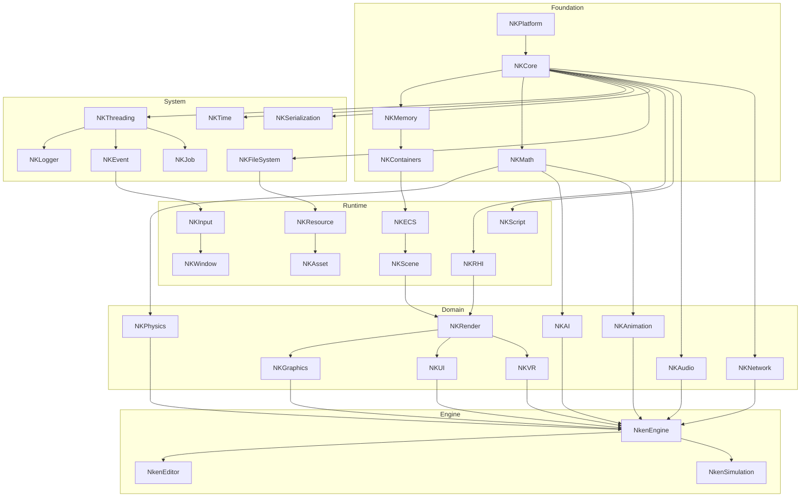
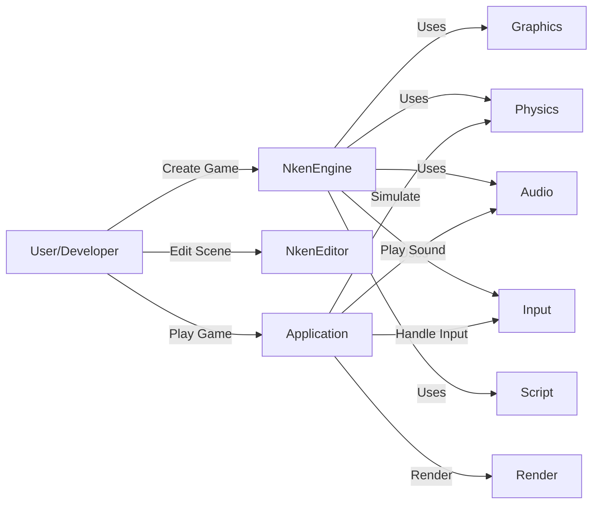
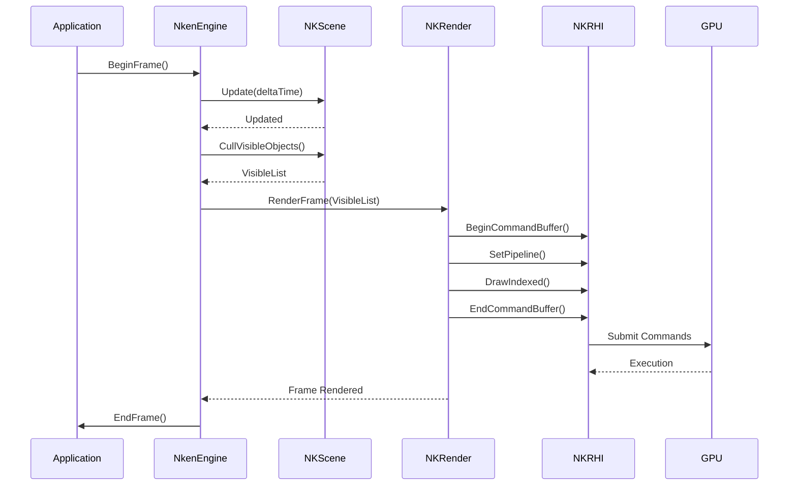
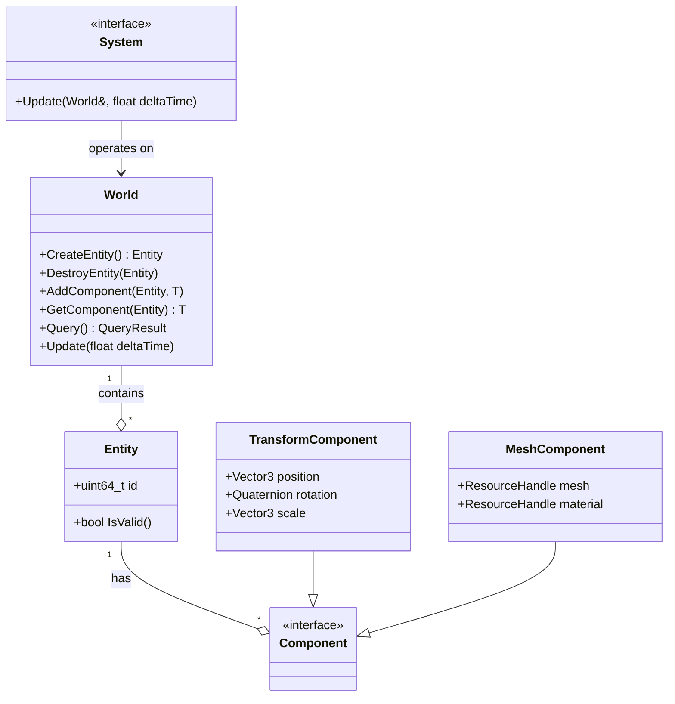

# 🏗️ ARCHITECTURE COMPLÈTE NKENTSEU ENGINE FRAMEWORK

**Version:** 1.0
**Date:** Février 2026
**Auteur:** Architecture Document

---

## 📋 TABLE DES MATIÈRES

1. [Vision et Objectifs](https://claude.ai/chat/b58a719c-6f2f-4253-b6c3-9be4974e56be#1-vision-et-objectifs)
2. [Architecture Globale](https://claude.ai/chat/b58a719c-6f2f-4253-b6c3-9be4974e56be#2-architecture-globale)
3. [Modules Foundation](https://claude.ai/chat/b58a719c-6f2f-4253-b6c3-9be4974e56be#3-modules-foundation)
4. [Modules System](https://claude.ai/chat/b58a719c-6f2f-4253-b6c3-9be4974e56be#4-modules-system)
5. [Modules Runtime](https://claude.ai/chat/b58a719c-6f2f-4253-b6c3-9be4974e56be#5-modules-runtime)
6. [Modules Domain](https://claude.ai/chat/b58a719c-6f2f-4253-b6c3-9be4974e56be#6-modules-domain)
7. [Modules Engine](https://claude.ai/chat/b58a719c-6f2f-4253-b6c3-9be4974e56be#7-modules-engine)
8. [Diagrammes](https://claude.ai/chat/b58a719c-6f2f-4253-b6c3-9be4974e56be#8-diagrammes)
9. [Besoins Fonctionnels et Non-Fonctionnels](https://claude.ai/chat/b58a719c-6f2f-4253-b6c3-9be4974e56be#9-besoins-fonctionnels-et-non-fonctionnels)
10. [Structure Fichiers](https://claude.ai/chat/b58a719c-6f2f-4253-b6c3-9be4974e56be#10-structure-fichiers)
11. [Stratégie Build](https://claude.ai/chat/b58a719c-6f2f-4253-b6c3-9be4974e56be#11-strategie-build)

---

## 1. VISION ET OBJECTIFS

### 1.1 Vision Produit

**Nkentseu** est un framework C++ modulaire haute performance conçu pour supporter la création d'applications multi-domaines :

* **Applications Desktop/Mobile** : Outils simples, utilitaires
* **CAO/Design** : Modélisation 2D/3D, ingénierie
* **Jeux Vidéo** : Moteurs 2D/3D temps réel
* **Simulation** : Physique, fluides, temps réel/offline
* **XR** : VR/AR/MR immersif
* **Industriel** : Systèmes embarqués, contrôle
* **Scientifique** : Visualisation, calcul parallèle

### 1.2 Principes Architecturaux

1. **Modularité** : Chaque module est indépendant, compilable séparément
2. **Zero-Cost Abstraction** : Performance native sans overhead
3. **Compile-Time Configuration** : Features activables/désactivables
4. **Thread-Safety First** : Primitives lock-free et thread-safe par défaut
5. **GPU-Centric** : Architecture pensée pour GPU moderne
6. **Platform Agnostic** : Windows/Linux/macOS/Android/iOS/Web

### 1.3 Objectifs Techniques


| Objectif                   | Métrique                |
| -------------------------- | ------------------------ |
| Frame Time (Jeux)          | < 16ms (60 FPS)          |
| Frame Time (VR)            | < 11ms (90 FPS)          |
| Compile Time (Clean)       | < 5 min                  |
| Compile Time (Incremental) | < 30s                    |
| Memory Overhead            | < 5% du total            |
| Thread Scalability         | Linear jusqu'à 16 cores |
| Platform Support           | 6+ plateformes           |

---

## 2. ARCHITECTURE GLOBALE

### 2.1 Vue d'Ensemble

```
┌─────────────────────────────────────────────────────────────┐
│                    APPLICATION LAYER                         │
│     Games | Tools | Simulators | XR Apps | Industrial       │
└─────────────────────────────────────────────────────────────┘
                            ▲
┌─────────────────────────────────────────────────────────────┐
│                      ENGINE LAYER                            │
│    NkenEngine | NkenEditor | NkenSimulation | NkenXR        │
└─────────────────────────────────────────────────────────────┘
                            ▲
┌─────────────────────────────────────────────────────────────┐
│                    DOMAIN MODULES                            │
│  NKGraphics | NKPhysics | NKAudio | NKNetwork | NKAI        │
│  NKAnimation | NKUI | NKVR                                   │
└─────────────────────────────────────────────────────────────┘
                            ▲
┌─────────────────────────────────────────────────────────────┐
│                     RUNTIME LAYER                            │
│  NKRHI | NKRender | NKECS | NKScene | NKResource | NKInput  │
│  NKWindow | NKAsset | NKScript                               │
└─────────────────────────────────────────────────────────────┘
                            ▲
┌─────────────────────────────────────────────────────────────┐
│                     SYSTEM LAYER                             │
│  NKThreading | NKFileSystem | NKTime | NKSerialization      │
│  NKLogger | NKEvent | NKJob                                  │
└─────────────────────────────────────────────────────────────┘
                            ▲
┌─────────────────────────────────────────────────────────────┐
│                   FOUNDATION LAYER                           │
│  NKCore | NKMemory | NKContainers | NKMath | NKPlatform     │
└─────────────────────────────────────────────────────────────┘
```

### 2.2 Graphe de Dépendances

```
NKPlatform ──────────────────────────────────┐
    ↑                                        │
NKCore ─────────────────────────────────────┤
    ↑                                        │
NKMemory ───────────────────────────────────┤
    ↑                                        │
NKContainers ───────────────────────────────┤
    ↑                                        │
NKMath ─────────────────────────────────────┤
    ↑                                        │
────────────────────────────────────────────┴─ FOUNDATION
    ↑
NKThreading                                  
NKTime                                       
NKFileSystem                                 
NKSerialization                             
NKLogger ──────────────────────────────────── SYSTEM
    ↑
NKEvent
NKJob
    ↑
NKWindow
NKInput
NKRHI
NKResource
NKECS ────────────────────────────────────── RUNTIME
    ↑
NKRender
NKScene
NKAsset
NKScript
    ↑
NKGraphics
NKPhysics
NKAudio
NKNetwork
NKAI ─────────────────────────────────────── DOMAIN
    ↑
NkenEngine
NkenEditor
NkenSimulation ──────────────────────────── ENGINE
```

---

## 3. MODULES FOUNDATION

### 3.1 NKPlatform

**Type:** STATIC Library
**Dépendances:** Aucune

#### Responsabilités

* Détection plateforme (Windows/Linux/macOS/Android/iOS/Web)
* Détection architecture (x86/x64/ARM/ARM64/WASM)
* Détection compilateur (MSVC/GCC/Clang)
* Configuration endianness
* Feature detection (SIMD, AVX, etc.)

#### Use Cases

* UC-P1: Compiler le code avec les bonnes optimisations selon la plateforme
* UC-P2: Activer/désactiver features selon le hardware
* UC-P3: Gérer les différences d'API OS

#### Besoins Fonctionnels

* **BF-P1:** Détecter la plateforme à compile-time
* **BF-P2:** Fournir des macros conditionnelles (NK\_PLATFORM\_WINDOWS, etc.)
* **BF-P3:** Détecter les capacités CPU (SSE, AVX, NEON)

#### Besoins Non-Fonctionnels

* **BNF-P1:** Zéro coût runtime
* **BNF-P2:** Header-only autant que possible
* **BNF-P3:** Compatible C++17 minimum

#### Fichiers

```
NKPlatform/
├── include/NKPlatform/
│   ├── NkPlatformDetect.h       # Macros plateforme
│   ├── NkArchDetect.h           # Détection architecture
│   ├── NkCompiler.h             # Détection compilateur
│   ├── NkCPUFeatures.h          # SIMD/AVX detection
│   ├── NkEndianness.h           # Little/Big endian
│   └── NkPlatformConfig.h       # Configuration globale
├── src/
│   └── NkPlatform.cpp           # Runtime detection si nécessaire
└── tests/
    └── test_platform.cpp
```

---

### 3.2 NKCore

**Type:** STATIC Library
**Dépendances:** NKPlatform

#### Responsabilités

* Types fondamentaux (int8, uint32, float32, etc.)
* Macros utilitaires (NK\_ASSERT, NK\_UNUSED, etc.)
* Export/Import DLL
* Inline forcée
* Traits C++ basiques
* Atomic operations de base

#### Use Cases

* UC-C1: Définir des types portables
* UC-C2: Asserter des conditions en debug
* UC-C3: Exporter des symboles DLL correctement

#### Besoins Fonctionnels

* **BF-C1:** Types portables (int8, uint32, float64, etc.)
* **BF-C2:** Système d'assertion configurable
* **BF-C3:** Macros export/import cross-platform

#### Besoins Non-Fonctionnels

* **BNF-C1:** Aucune allocation dynamique
* **BNF-C2:** Compilable en C++17
* **BNF-C3:** Header-only autant que possible

#### Fichiers

```
NKCore/
├── include/NKCore/
│   ├── NkTypes.h                # Types fondamentaux
│   ├── NkTraits.h               # Type traits
│   ├── NkLimits.h               # Numeric limits
│   ├── NkAtomic.h               # Atomic operations
│   ├── NkBits.h                 # Bit manipulation
│   ├── NkExport.h               # DLL export/import
│   ├── NkInline.h               # Force inline
│   ├── NkMacros.h               # Macros utilitaires
│   ├── NkConfig.h               # Configuration globale
│   └── Assert/
│       ├── NkAssert.h           # Assertions
│       ├── NkDebugBreak.h       # Debug breakpoint
│       └── NkAssertHandler.h    # Custom handler
├── src/
│   ├── NkLimits.cpp
│   └── Assert/NkAssert.cpp
└── tests/
    └── test_core.cpp
```

---

### 3.3 NKMemory

**Type:** STATIC Library
**Dépendances:** NKCore

#### Responsabilités

* Interface allocateur (IAllocator)
* Allocateurs spécialisés (Linear, Pool, Stack, TLSF, Frame)
* Smart pointers (Unique, Shared, Weak, Intrusive)
* Memory tracking et profiling
* Alignment helpers
* Memory pools

#### Use Cases

* UC-M1: Allouer mémoire avec allocateur custom
* UC-M2: Gérer lifetime avec smart pointers
* UC-M3: Tracker allocations en debug
* UC-M4: Optimiser allocations frame-based

#### Besoins Fonctionnels

* **BF-M1:** Interface IAllocator abstrait
* **BF-M2:** Allocateurs Linear, Pool, Stack, FreeList, TLSF
* **BF-M3:** Frame allocator pour reset par frame
* **BF-M4:** Smart pointers thread-safe
* **BF-M5:** Memory tracker avec callstacks

#### Besoins Non-Fonctionnels

* **BNF-M1:** Allocateurs lock-free quand possible
* **BNF-M2:** Alignement SIMD natif
* **BNF-M3:** Overhead < 5% vs malloc

#### Fichiers

```
NKMemory/
├── include/NKMemory/
│   ├── NkAllocator.h            # Interface IAllocator
│   ├── NkMemoryArena.h          # Memory arena
│   ├── NkMemoryUtils.h          # Helpers (align, etc.)
│   ├── NkMemoryTracker.h        # Debug tracking
│   ├── Allocators/
│   │   ├── NkLinearAllocator.h  # Linear bump allocator
│   │   ├── NkPoolAllocator.h    # Fixed-size pool
│   │   ├── NkStackAllocator.h   # Stack-based
│   │   ├── NkFreeListAllocator.h# Free list
│   │   ├── NkTLSFAllocator.h    # Two-Level Segregated Fit
│   │   ├── NkFrameAllocator.h   # Per-frame reset
│   │   └── NkProxyAllocator.h   # Forwarding allocator
│   └── SmartPointers/
│       ├── NkUniquePtr.h        # Unique ownership
│       ├── NkSharedPtr.h        # Shared ownership
│       ├── NkWeakPtr.h          # Weak reference
│       └── NkIntrusivePtr.h     # Intrusive refcount
├── src/
│   ├── NkMemoryArena.cpp
│   ├── NkMemoryTracker.cpp
│   └── Allocators/
│       ├── NkLinearAllocator.cpp
│       ├── NkPoolAllocator.cpp
│       ├── NkStackAllocator.cpp
│       ├── NkFreeListAllocator.cpp
│       ├── NkTLSFAllocator.cpp
│       ├── NkFrameAllocator.cpp
│       └── NkProxyAllocator.cpp
└── tests/
    ├── test_allocators.cpp
    └── test_smart_pointers.cpp
```

---

### 3.4 NKContainers

**Type:** STATIC Library
**Dépendances:** NKCore, NKMemory

#### Responsabilités

* Containers STL-like avec allocateurs custom
* Vector, Array, SmallVector
* List, DoubleList, Deque
* HashMap, UnorderedMap, Set
* BTree, Trie
* RingBuffer, Pool
* Span, View
* Functional (Function, Delegate)

#### Use Cases

* UC-CO1: Stocker des données avec allocateur custom
* UC-CO2: Itérer sur des collections
* UC-CO3: Associer clés/valeurs (hash map)
* UC-CO4: Gérer buffers circulaires

#### Besoins Fonctionnels

* **BF-CO1:** Support allocateurs custom
* **BF-CO2:** Iterators standards
* **BF-CO3:** Move semantics complet
* **BF-CO4:** Container adapters (Stack, Queue)

#### Besoins Non-Fonctionnels

* **BNF-CO1:** Performance équivalente STL
* **BNF-CO2:** Exception-safe
* **BNF-CO3:** Cache-friendly layout

#### Fichiers

```
NKContainers/
├── include/NKContainers/
│   ├── Sequential/
│   │   ├── NkVector.h           # Dynamic array
│   │   ├── NkArray.h            # Fixed-size array
│   │   ├── NkSmallVector.h      # SSO vector
│   │   ├── NkList.h             # Linked list
│   │   ├── NkDoubleList.h       # Double linked list
│   │   └── NkDeque.h            # Double-ended queue
│   ├── Associative/
│   │   ├── NkHashMap.h          # Hash table
│   │   ├── NkUnorderedMap.h     # Unordered hash map
│   │   ├── NkSet.h              # Ordered set
│   │   ├── NkUnorderedSet.h     # Hash set
│   │   ├── NkMap.h              # Ordered map (tree)
│   │   ├── NkBTree.h            # B-Tree
│   │   └── NkTrie.h             # Prefix tree
│   ├── CacheFriendly/
│   │   ├── NkPool.h             # Object pool
│   │   ├── NkRingBuffer.h       # Circular buffer
│   │   └── NkSparseSet.h        # Sparse set
│   ├── Adapters/
│   │   ├── NkStack.h            # Stack adapter
│   │   ├── NkQueue.h            # Queue adapter
│   │   └── NkPriorityQueue.h    # Heap-based
│   ├── Views/
│   │   ├── NkSpan.h             # Non-owning view
│   │   └── NkStringView.h       # String view
│   ├── Functional/
│   │   ├── NkFunction.h         # std::function-like
│   │   └── NkDelegate.h         # Multicast delegate
│   └── Specialized/
│       ├── NkGraph.h            # Graph structure
│       └── NkQuadTree.h         # Spatial partitioning
├── src/
│   └── [Implementations]
└── tests/
    └── test_containers.cpp
```

---

### 3.5 NKMath

**Type:** STATIC Library
**Dépendances:** NKCore

#### Responsabilités

* Vecteurs 2D/3D/4D (SIMD optimisé)
* Matrices 2x2, 3x3, 4x4
* Quaternions
* Transformations (rotation, scale, translate)
* Collision (AABB, OBB, Sphere, Ray)
* Interpolation (lerp, slerp, bezier)
* Random (PCG, Mersenne)
* Couleurs (RGB, HSV, conversions)

#### Use Cases

* UC-MA1: Calculs vectoriels pour physique/graphics
* UC-MA2: Transformations 3D
* UC-MA3: Tests de collision
* UC-MA4: Génération procédurale

#### Besoins Fonctionnels

* **BF-MA1:** Support SIMD (SSE/AVX/NEON)
* **BF-MA2:** Précision simple/double
* **BF-MA3:** Swizzling vectoriel
* **BF-MA4:** Fonctions mathématiques étendues

#### Besoins Non-Fonctionnels

* **BNF-MA1:** Optimisations SIMD automatiques
* **BNF-MA2:** Précision IEEE 754
* **BNF-MA3:** Performance max sur calculs vectoriels

#### Fichiers

```
NKMath/
├── include/NKMath/
│   ├── Vector/
│   │   ├── NkVector2.h          # 2D vector
│   │   ├── NkVector3.h          # 3D vector
│   │   └── NkVector4.h          # 4D vector
│   ├── Matrix/
│   │   ├── NkMatrix2.h          # 2x2 matrix
│   │   ├── NkMatrix3.h          # 3x3 matrix
│   │   └── NkMatrix4.h          # 4x4 matrix
│   ├── Quaternion/
│   │   └── NkQuaternion.h       # Rotation quaternion
│   ├── Transform/
│   │   ├── NkTransform.h        # 3D transform
│   │   └── NkEulerAngles.h      # Euler rotations
│   ├── Collision/
│   │   ├── NkAABB.h             # Axis-aligned box
│   │   ├── NkOBB.h              # Oriented box
│   │   ├── NkSphere.h           # Bounding sphere
│   │   ├── NkRay.h              # Ray casting
│   │   └── NkCollision.h        # Collision tests
│   ├── Shapes/
│   │   ├── NkRectangle.h        # 2D rectangle
│   │   ├── NkSegment.h          # Line segment
│   │   └── NkPlane.h            # 3D plane
│   ├── Color/
│   │   ├── NkColor.h            # RGBA color
│   │   └── NkColorSpace.h       # HSV/HSL conversions
│   ├── NkRandom.h               # RNG (PCG)
│   ├── NkRange.h                # Min/Max range
│   ├── NkAngle.h                # Degrees/Radians
│   └── NkMathUtils.h            # Lerp, clamp, etc.
├── src/
│   └── [SIMD implementations]
└── tests/
    └── test_math.cpp
```

---

## 4. MODULES SYSTEM

### 4.1 NKThreading

**Type:** STATIC Library
**Dépendances:** NKCore, NKPlatform

#### Responsabilités

* Thread abstraction
* Mutex, RWLock, SpinLock
* Condition variables
* Semaphores, Barriers
* Thread-local storage
* Thread pool
* Future/Promise
* Atomic operations avancées

#### Use Cases

* UC-T1: Créer threads portables
* UC-T2: Synchroniser threads (mutex)
* UC-T3: Paralléliser tâches (thread pool)
* UC-T4: Attendre résultats async (future)

#### Besoins Fonctionnels

* **BF-T1:** Threads natifs (std::thread-like)
* **BF-T2:** Primitives lock-free si possible
* **BF-T3:** Thread pool avec work stealing
* **BF-T4:** Support coroutines C++20

#### Besoins Non-Fonctionnels

* **BNF-T1:** Latence lock < 100ns
* **BNF-T2:** Scalabilité linéaire jusqu'à 16 cores
* **BNF-T3:** Pas de deadlock possible

#### Fichiers

```
NKThreading/
├── include/NKThreading/
│   ├── NkThread.h               # Thread wrapper
│   ├── NkThreadLocal.h          # TLS
│   ├── NkThreadPool.h           # Work queue + workers
│   ├── NkMutex.h                # Mutual exclusion
│   ├── NkRecursiveMutex.h       # Recursive lock
│   ├── NkSharedMutex.h          # Reader-writer lock
│   ├── NkSpinLock.h             # Busy-wait lock
│   ├── NkSemaphore.h            # Counting semaphore
│   ├── NkConditionVariable.h    # Wait/notify
│   ├── NkAtomic.h               # Advanced atomics
│   ├── NkFuture.h               # Async result
│   ├── NkPromise.h              # Set future value
│   └── Synchronization/
│       ├── NkBarrier.h          # Thread barrier
│       ├── NkLatch.h            # Countdown latch
│       ├── NkEvent.h            # Manual/Auto reset
│       └── NkReaderWriterLock.h # RW lock
├── src/
│   └── [Platform-specific impls]
└── tests/
    └── test_threading.cpp
```

---

### 4.2 NKTime

**Type:** STATIC Library
**Dépendances:** NKCore, NKPlatform

#### Responsabilités

* High-resolution clock
* Duration (ms, us, ns)
* Timestamp
* Timer
* Stopwatch
* Frame timing
* Profiling

#### Use Cases

* UC-TI1: Mesurer temps frame
* UC-TI2: Profiler code
* UC-TI3: Scheduler basé sur temps
* UC-TI4: Delta time pour animation

#### Besoins Fonctionnels

* **BF-TI1:** Précision microseconde
* **BF-TI2:** Clock monotonique
* **BF-TI3:** Conversion temps (s/ms/us)
* **BF-TI4:** Timers callback-based

#### Besoins Non-Fonctionnels

* **BNF-TI1:** Overhead mesure < 1us
* **BNF-TI2:** Thread-safe
* **BNF-TI3:** Compatible high-frequency timers

#### Fichiers

```
NKTime/
├── include/NKTime/
│   ├── NkClock.h                # High-res clock
│   ├── NkDuration.h             # Time duration
│   ├── NkTimestamp.h            # Point in time
│   ├── NkTimer.h                # Callback timer
│   ├── NkStopwatch.h            # Start/stop timer
│   ├── NkFrameTimer.h           # Frame rate limiter
│   └── NkProfiler.h             # Code profiler
├── src/
│   └── [Platform timers]
└── tests/
    └── test_time.cpp
```

---

### 4.3 NKFileSystem

**Type:** STATIC Library
**Dépendances:** NKCore, NKPlatform

#### Responsabilités

* Path manipulation (normalize, join, etc.)
* File read/write
* Directory iteration
* File watching
* Virtual file system (VFS)
* Archive support (zip)
* Async I/O

#### Use Cases

* UC-F1: Lire/écrire fichiers de config
* UC-F2: Charger assets
* UC-F3: Observer changements fichiers (hot reload)
* UC-F4: Monter archives comme dossiers

#### Besoins Fonctionnels

* **BF-F1:** Path portable (/, )
* **BF-F2:** Async file I/O
* **BF-F3:** File watcher (inotify/FSEvents/ReadDirectoryChanges)
* **BF-F4:** VFS avec mount points

#### Besoins Non-Fonctionnels

* **BNF-F1:** I/O async sans bloquer threads
* **BNF-F2:** Support unicode (UTF-8)
* **BNF-F3:** Pas de copies inutiles (mmap si possible)

#### Fichiers

```
NKFileSystem/
├── include/NKFileSystem/
│   ├── NkPath.h                 # Path manipulation
│   ├── NkFile.h                 # File handle
│   ├── NkDirectory.h            # Dir iteration
│   ├── NkFileSystem.h           # High-level API
│   ├── NkFileWatcher.h          # Change notification
│   ├── NkVFS.h                  # Virtual file system
│   └── NkArchive.h              # Zip/Archive support
├── src/
│   └── [Platform file APIs]
└── tests/
    └── test_filesystem.cpp
```

---

### 4.4 NKSerialization

**Type:** STATIC Library
**Dépendances:** NKCore, NKContainers, NKMemory

#### Responsabilités

* Serialization framework
* Binary serializer
* JSON reader/writer
* XML reader/writer
* YAML reader/writer
* Reflection-based serialization
* Archive format

#### Use Cases

* UC-S1: Sauvegarder state en JSON
* UC-S2: Charger config YAML
* UC-S3: Serializer objets avec reflection
* UC-S4: Compression data

#### Besoins Fonctionnels

* **BF-S1:** Support JSON/XML/YAML/Binary
* **BF-S2:** Streaming (pas tout en RAM)
* **BF-S3:** Versioning support
* **BF-S4:** Schema validation

#### Besoins Non-Fonctionnels

* **BNF-S1:** Performance > 100 MB/s
* **BNF-S2:** Memory efficient (streaming)
* **BNF-S3:** Error reporting détaillé

#### Fichiers

```
NKSerialization/
├── include/NKSerialization/
│   ├── NkSerializer.h           # Base interface
│   ├── NkArchive.h              # Archive abstraction
│   ├── Binary/
│   │   ├── NkBinaryReader.h
│   │   └── NkBinaryWriter.h
│   ├── JSON/
│   │   ├── NkJSONReader.h
│   │   ├── NkJSONWriter.h
│   │   └── NkJSONValue.h
│   ├── XML/
│   │   ├── NkXMLReader.h
│   │   └── NkXMLWriter.h
│   └── YAML/
│       ├── NkYAMLReader.h
│       └── NkYAMLWriter.h
├── src/
│   └── [Format implementations]
└── tests/
    └── test_serialization.cpp
```

---

### 4.5 NKLogger

**Type:** SHARED Library
**Dépendances:** NKCore, NKThreading, NKTime

#### Responsabilités

* Logging multi-niveau (Debug/Info/Warn/Error/Fatal)
* Sinks (Console, File, Network)
* Async logging
* Structured logging
* Filtering (level, pattern, thread)
* Formatting (timestamp, thread ID, etc.)

#### Use Cases

* UC-L1: Logger errors en fichier
* UC-L2: Logger temps réel dans console
* UC-L3: Filtrer logs par catégorie
* UC-L4: Envoyer logs sur réseau

#### Besoins Fonctionnels

* **BF-L1:** Multi-sink support
* **BF-L2:** Async logging (queue-based)
* **BF-L3:** Formatting patterns
* **BF-L4:** Runtime filtering

#### Besoins Non-Fonctionnels

* **BNF-L1:** Latence log < 10us (async)
* **BNF-L2:** Pas de perte de logs
* **BNF-L3:** Thread-safe

#### Fichiers

```
NKLogger/
├── include/NKLogger/
│   ├── NkLogger.h               # Main logger
│   ├── NkLog.h                  # Global log API
│   ├── NkLogLevel.h             # Severity levels
│   ├── NkLogMessage.h           # Log entry
│   ├── NkFormatter.h            # Formatting
│   ├── NkPattern.h              # Pattern syntax
│   ├── NkRegistry.h             # Logger registry
│   ├── NkAsyncLogger.h          # Async queue
│   ├── Sinks/
│   │   ├── NkSink.h             # Base sink
│   │   ├── NkConsoleSink.h      # stdout/stderr
│   │   ├── NkFileSink.h         # File output
│   │   ├── NkRotatingFileSink.h # Size-based rotation
│   │   ├── NkDailyFileSink.h    # Time-based rotation
│   │   ├── NkNullSink.h         # No-op
│   │   ├── NkDistributingSink.h # Multi-sink
│   │   └── NkAsyncSink.h        # Async wrapper
│   └── Filters/
│       ├── NkLevelFilter.h      # By level
│       ├── NkPatternFilter.h    # Regex-based
│       └── NkThreadFilter.h     # By thread ID
├── src/
│   └── [Sink implementations]
└── tests/
    └── test_logger.cpp
```

---

### 4.6 NKEvent

**Type:** STATIC Library
**Dépendances:** NKCore, NKContainers

#### Responsabilités

* Event system générique
* Event manager
* Event bus
* Event filtering
* Event queue
* Delegates/Signals

#### Use Cases

* UC-E1: Dispatcher events input
* UC-E2: Observer pattern
* UC-E3: Decoupling modules

#### Besoins Fonctionnels

* **BF-E1:** Type-safe events
* **BF-E2:** Priority-based dispatch
* **BF-E3:** Event cancellation
* **BF-E4:** Deferred events

#### Besoins Non-Fonctionnels

* **BNF-E1:** Latence dispatch < 1us
* **BNF-E2:** Thread-safe (lock-free si possible)
* **BNF-E3:** Zero allocation en hot path

#### Fichiers

```
NKEvent/
├── include/NKEvent/
│   ├── NkEvent.h                # Base event
│   ├── NkEventType.h            # Event IDs
│   ├── NkEventCategory.h        # Categorization
│   ├── NkEventManager.h         # Dispatch system
│   ├── NkEventBroker.h          # Pub/sub
│   ├── NkEventFilter.h          # Filtering
│   ├── NkEventQueue.h           # Queued dispatch
│   └── NkDelegate.h             # Callback abstraction
├── src/
│   └── [Event system impl]
└── tests/
    └── test_event.cpp
```

---

### 4.7 NKJob

**Type:** STATIC Library
**Dépendances:** NKCore, NKThreading

#### Responsabilités

* Job system (task graphs)
* Work stealing scheduler
* Dependencies entre jobs
* Parallel for/foreach
* Async execution

#### Use Cases

* UC-J1: Paralléliser boucles
* UC-J2: Exécuter tasks async avec dépendances
* UC-J3: Load balancing automatique

#### Besoins Fonctionnels

* **BF-J1:** Job graph avec dépendances
* **BF-J2:** Work stealing
* **BF-J3:** Parallel for
* **BF-J4:** Task continuation

#### Besoins Non-Fonctionnels

* **BNF-J1:** Overhead < 50ns par job
* **BNF-J2:** Scalabilité linéaire
* **BNF-J3:** Cache-friendly

#### Fichiers

```
NKJob/
├── include/NKJob/
│   ├── NkJob.h                  # Job handle
│   ├── NkJobSystem.h            # Scheduler
│   ├── NkJobGraph.h             # Dependency graph
│   ├── NkParallel.h             # Parallel for/foreach
│   └── NkWorkStealingQueue.h    # Lock-free queue
├── src/
│   └── [Job system impl]
└── tests/
    └── test_job.cpp
```

---

## 5. MODULES RUNTIME

### 5.1 NKInput

**Type:** STATIC Library
**Dépendances:** NKCore, NKEvent

#### Responsabilités

* Input abstraction (keyboard, mouse, gamepad)
* Input state tracking
* Input mapping (action/axis)
* Input events
* Touch input
* Gesture recognition

#### Use Cases

* UC-I1: Gérer input clavier
* UC-I2: Mapper touches à actions
* UC-I3: Support gamepad
* UC-I4: Touch/gesture mobile

#### Besoins Fonctionnels

* **BF-I1:** Keyboard/Mouse/Gamepad
* **BF-I2:** Input mapping configurable
* **BF-I3:** Multi-input support (local co-op)
* **BF-I4:** Input replay

#### Besoins Non-Fonctionnels

* **BNF-I1:** Latence < 1ms
* **BNF-I2:** Polling sans blocking
* **BNF-I3:** Support 4+ gamepads simultanés

#### Fichiers

```
NKInput/
├── include/NKInput/
│   ├── NkInputManager.h         # Central manager
│   ├── NkInputController.h      # Device abstraction
│   ├── NkInputCode.h            # Key/button codes
│   ├── Keyboard/
│   │   ├── NkKeyboard.h
│   │   └── NkKeyboardEvent.h
│   ├── Mouse/
│   │   ├── NkMouse.h
│   │   └── NkMouseEvent.h
│   └── Gamepad/
│       ├── NkGamepad.h
│       ├── NkGamepadEvent.h
│       └── NkGenericInput.h     # Touch/gesture
├── src/
│   └── [Input implementations]
└── tests/
    └── test_input.cpp
```

---

### 5.2 NKWindow

**Type:** SHARED Library
**Dépendances:** NKCore, NKPlatform, NKInput, NKEvent

#### Responsabilités

* Window creation
* Window events (resize, close, etc.)
* Multi-window support
* Fullscreen/Windowed mode
* DPI awareness
* Context creation (GL/Vulkan)

#### Use Cases

* UC-W1: Créer fenêtre desktop
* UC-W2: Gérer redimensionnement
* UC-W3: Basculer fullscreen
* UC-W4: Multi-monitor

#### Besoins Fonctionnels

* **BF-W1:** Multi-platform window
* **BF-W2:** Event pumping
* **BF-W3:** High DPI support
* **BF-W4:** Drag-drop support

#### Besoins Non-Fonctionnels

* **BNF-W1:** Création < 100ms
* **BNF-W2:** Thread-safe events
* **BNF-W3:** Support 4K+ résolutions

#### Fichiers

```
NKWindow/
├── include/NKWindow/
│   ├── NkWindow.h               # Window abstraction
│   ├── NkWindowManager.h        # Multi-window
│   └── Events/
│       └── NkWindowEvent.h      # Resize/Close/etc.
├── src/
│   └── Platform/
│       ├── Win32/
│       │   └── NkWindowWin32.cpp
│       ├── Linux/
│       │   └── NkWindowXCB.cpp
│       ├── macOS/
│       │   └── NkWindowMacOS.mm
│       ├── Android/
│       │   └── NkWindowAndroid.cpp
│       ├── iOS/
│       │   └── NkWindowIOS.mm
│       └── Emscripten/
│           └── NkWindowEmscripten.cpp
└── tests/
    └── test_window.cpp
```

---

### 5.3 NKRHI (Render Hardware Interface)

**Type:** SHARED Library
**Dépendances:** NKCore, NKMath, NKMemory

#### Responsabilités

* API abstraction (Vulkan/DX12/Metal/OpenGL)
* Device management
* Command buffers
* Pipelines (graphics/compute)
* Resources (buffers, textures)
* Synchronization (fences, semaphores)
* Descriptor sets

#### Use Cases

* UC-RHI1: Abstraire Vulkan/DX12
* UC-RHI2: Soumettre commandes GPU
* UC-RHI3: Créer pipelines
* UC-RHI4: Gérer resources

#### Besoins Fonctionnels

* **BF-RHI1:** Support Vulkan/DX12/Metal
* **BF-RHI2:** Command list recording
* **BF-RHI3:** Resource binding
* **BF-RHI4:** Compute shaders

#### Besoins Non-Fonctionnels

* **BNF-RHI1:** Overhead < 5% vs API native
* **BNF-RHI2:** Thread-safe command recording
* **BNF-RHI3:** Zero-copy quand possible

#### Fichiers

```
NKRHI/
├── include/NKRHI/
│   ├── NkRHIDevice.h            # GPU device
│   ├── NkRHIContext.h           # Render context
│   ├── NkRHICommandList.h       # Commands
│   ├── NkRHIBuffer.h            # Vertex/Index/Uniform
│   ├── NkRHITexture.h           # Textures
│   ├── NkRHIPipeline.h          # Graphics/Compute
│   ├── NkRHIShader.h            # Shader modules
│   ├── NkRHIDescriptor.h        # Descriptor sets
│   ├── NkRHISync.h              # Fence/Semaphore
│   └── NkRHIEnums.h             # Common enums
├── src/
│   ├── Vulkan/
│   │   └── [Vulkan backend]
│   ├── D3D12/
│   │   └── [DirectX 12 backend]
│   ├── Metal/
│   │   └── [Metal backend]
│   └── OpenGL/
│       └── [OpenGL backend]
└── tests/
    └── test_rhi.cpp
```

---

### 5.4 NKECS (Entity Component System)

**Type:** STATIC Library
**Dépendances:** NKCore, NKContainers, NKMemory

#### Responsabilités

* Entity management
* Component storage (SoA)
* System execution
* Queries (filtering)
* Archetypes
* Events ECS

#### Use Cases

* UC-ECS1: Créer entities avec components
* UC-ECS2: Itérer sur entities (query)
* UC-ECS3: Update systems
* UC-ECS4: Parallelization automatique

#### Besoins Fonctionnels

* **BF-ECS1:** Archetype-based storage
* **BF-ECS2:** Component queries
* **BF-ECS3:** System dependencies
* **BF-ECS4:** Entity relationships

#### Besoins Non-Fonctionnels

* **BNF-ECS1:** Itération > 1M entities/frame
* **BNF-ECS2:** Cache-friendly (SoA)
* **BNF-ECS3:** Thread-safe parallel iteration

#### Fichiers

```
NKECS/
├── include/NKECS/
│   ├── NkEntity.h               # Entity handle
│   ├── NkComponent.h            # Component base
│   ├── NkSystem.h               # System base
│   ├── NkWorld.h                # ECS world
│   ├── NkQuery.h                # Entity queries
│   ├── NkArchetype.h            # Component archetypes
│   └── NkRegistry.h             # Component registry
├── src/
│   └── [ECS implementation]
└── tests/
    └── test_ecs.cpp
```

---

### 5.5 NKScene

**Type:** SHARED Library
**Dépendances:** NKECS, NKMath

#### Responsabilités

* Scene graph
* Node hierarchy
* Transform propagation
* Spatial queries
* Visibility culling
* Level management

#### Use Cases

* UC-SC1: Organiser entities en hierarchy
* UC-SC2: Culling frustum
* UC-SC3: Queries spatiales
* UC-SC4: Load/unload levels

#### Besoins Fonctionnels

* **BF-SC1:** Transform hierarchy
* **BF-SC2:** Frustum/occlusion culling
* **BF-SC3:** Spatial partitioning (octree/BVH)
* **BF-SC4:** Streaming levels

#### Besoins Non-Fonctionnels

* **BNF-SC1:** Update transforms < 1ms
* **BNF-SC2:** Culling > 100k objects
* **BNF-SC3:** Multi-threaded culling

#### Fichiers

```
NKScene/
├── include/NKScene/
│   ├── NkScene.h                # Scene container
│   ├── NkNode.h                 # Scene node
│   ├── NkTransform.h            # 3D transform
│   ├── NkCamera.h               # Camera component
│   ├── NkLight.h                # Light component
│   ├── NkMesh.h                 # Mesh component
│   ├── NkCulling.h              # Frustum culling
│   ├── NkOctree.h               # Spatial partitioning
│   └── NkLevel.h                # Level/World
├── src/
│   └── [Scene implementation]
└── tests/
    └── test_scene.cpp
```

---

### 5.6 NKResource

**Type:** SHARED Library
**Dépendances:** NKCore, NKFileSystem, NKThreading

#### Responsabilités

* Resource loading async
* Resource caching
* Hot-reload
* Reference counting
* Asset registry
* Streaming

#### Use Cases

* UC-R1: Charger assets async
* UC-R2: Hot-reload textures/shaders
* UC-R3: Gérer lifetime resources
* UC-R4: Streaming progressive

#### Besoins Fonctionnels

* **BF-R1:** Async loading
* **BF-R2:** Resource versioning
* **BF-R3:** Dependency tracking
* **BF-R4:** Compression support

#### Besoins Non-Fonctionnels

* **BNF-R1:** Pas de stutter loading
* **BNF-R2:** Cache-aware
* **BNF-R3:** Bandwidth optimal

#### Fichiers

```
NKResource/
├── include/NKResource/
│   ├── NkResource.h             # Base resource
│   ├── NkResourceHandle.h       # Smart handle
│   ├── NkResourceManager.h      # Manager
│   ├── NkResourceLoader.h       # Loader interface
│   ├── NkResourceCache.h        # LRU cache
│   └── NkResourceRegistry.h     # Asset registry
├── src/
│   └── [Resource system]
└── tests/
    └── test_resource.cpp
```

---

### 5.7 NKAsset

**Type:** SHARED Library
**Dépendances:** NKResource, NKSerialization

#### Responsabilités

* Asset pipeline
* Import/export assets
* Metadata
* Asset thumbnails
* Asset dependencies

#### Use Cases

* UC-A1: Importer FBX/glTF
* UC-A2: Générer mipmaps
* UC-A3: Compresser textures
* UC-A4: Gérer versions assets

#### Besoins Fonctionnels

* **BF-A1:** Multi-format import
* **BF-A2:** Asset preprocessing
* **BF-A3:** Dependency graph
* **BF-A4:** Incremental builds

#### Besoins Non-Fonctionnels

* **BNF-A1:** Import rapide (< 1s par asset)
* **BNF-A2:** Pas de duplication data
* **BNF-A3:** Version control friendly

#### Fichiers

```
NKAsset/
├── include/NKAsset/
│   ├── NkAsset.h                # Base asset
│   ├── NkAssetImporter.h        # Import pipeline
│   ├── NkAssetMetadata.h        # Metadata
│   ├── Importers/
│   │   ├── NkTextureImporter.h
│   │   ├── NkMeshImporter.h
│   │   ├── NkModelImporter.h    # FBX/glTF
│   │   └── NkAudioImporter.h
│   └── NkAssetDatabase.h        # Asset DB
├── src/
│   └── [Asset pipeline]
└── tests/
    └── test_asset.cpp
```

---

### 5.8 NKScript

**Type:** SHARED Library
**Dépendances:** NKCore, NKECS

#### Responsabilités

* Scripting engine (Lua/Python/C#)
* Bindings auto-générés
* Hot-reload scripts
* Sandbox sécurisé

#### Use Cases

* UC-SCR1: Scripter gameplay
* UC-SCR2: Prototyping rapide
* UC-SCR3: Modding support

#### Besoins Fonctionnels

* **BF-SCR1:** Lua/Python support
* **BF-SCR2:** C++ bindings auto
* **BF-SCR3:** Hot-reload sans restart
* **BF-SCR4:** Sandbox sécurisé

#### Besoins Non-Fonctionnels

* **BNF-SCR1:** Call overhead < 100ns
* **BNF-SCR2:** Pas de memory leak
* **BNF-SCR3:** Exception-safe

#### Fichiers

```
NKScript/
├── include/NKScript/
│   ├── NkScriptEngine.h         # Script VM
│   ├── NkScriptContext.h        # Execution context
│   ├── NkScriptBindings.h       # C++ bindings
│   └── Backends/
│       ├── NkLuaBackend.h
│       └── NkPythonBackend.h
├── src/
│   └── [Script backends]
└── tests/
    └── test_script.cpp
```

---

## 6. MODULES DOMAIN

### 6.1 NKRender

**Type:** SHARED Library
**Dépendances:** NKRHI, NKScene, NKMath

#### Responsabilités

* Render graph
* Material system
* Shader compilation
* Renderer2D/3D
* Post-processing
* Lighting (forward/deferred)

#### Use Cases

* UC-REN1: Render scène 3D
* UC-REN2: Post-processing effects
* UC-REN3: Multi-pass rendering
* UC-REN4: Deferred shading

#### Besoins Fonctionnels

* **BF-REN1:** Render graph
* **BF-REN2:** PBR materials
* **BF-REN3:** Shadow maps
* **BF-REN4:** Post-processing stack

#### Besoins Non-Fonctionnels

* **BNF-REN1:** 60 FPS à 1080p
* **BNF-REN2:** Multi-threaded rendering
* **BNF-REN3:** GPU-driven rendering

#### Fichiers

```
NKRender/
├── include/NKRender/
│   ├── NkRenderer.h             # Main renderer
│   ├── NkRenderGraph.h          # Frame graph
│   ├── NkMaterial.h             # Material system
│   ├── NkShader.h               # Shader management
│   ├── NkRenderer2D.h           # 2D rendering
│   ├── NkRenderer3D.h           # 3D rendering
│   ├── NkLighting.h             # Light system
│   ├── NkShadow.h               # Shadow mapping
│   └── NkPostProcess.h          # Post-effects
├── src/
│   └── [Renderer implementation]
└── shaders/
    └── [GLSL/HLSL/MSL shaders]
```

---

### 6.2 NKGraphics

**Type:** SHARED Library
**Dépendances:** NKRender

#### Responsabilités

* High-level graphics API
* Sprite rendering
* Text rendering
* Particle systems
* UI rendering

#### Fichiers

```
NKGraphics/
├── include/NKGraphics/
│   ├── NkSprite.h
│   ├── NkFont.h
│   ├── NkParticleSystem.h
│   └── NkCanvas.h
└── src/
    └── [Graphics implementations]
```

---

### 6.3 NKPhysics

**Type:** SHARED Library
**Dépendances:** NKMath, NKECS

#### Responsabilités

* Physics simulation
* Rigid body dynamics
* Collision detection
* Constraints/Joints
* Raycasting

#### Fichiers

```
NKPhysics/
├── include/NKPhysics/
│   ├── NkPhysicsWorld.h
│   ├── NkRigidBody.h
│   ├── NkCollider.h
│   ├── NkConstraint.h
│   └── NkRaycast.h
└── src/
    └── [Physics engine]
```

---

### 6.4 NKAudio

**Type:** SHARED Library
**Dépendances:** NKCore, NKThreading

#### Responsabilités

* Audio playback
* 3D spatial audio
* Audio mixing
* Effects (reverb, etc.)
* Streaming audio

#### Fichiers

```
NKAudio/
├── include/NKAudio/
│   ├── NkAudioEngine.h
│   ├── NkAudioSource.h
│   ├── NkAudioListener.h
│   ├── NkAudioMixer.h
│   └── NkAudioEffect.h
└── src/
    └── [Audio backend]
```

---

### 6.5 NKNetwork

**Type:** SHARED Library
**Dépendances:** NKCore, NKThreading, NKSerialization

#### Responsabilités

* Socket abstraction
* TCP/UDP
* HTTP client
* Websockets
* RPC system
* Replication

#### Fichiers

```
NKNetwork/
├── include/NKNetwork/
│   ├── NkSocket.h
│   ├── NkTCPSocket.h
│   ├── NkUDPSocket.h
│   ├── NkHTTPClient.h
│   ├── NkWebSocket.h
│   └── NkRPC.h
└── src/
    └── [Network implementation]
```

---

### 6.6 NKAI

**Type:** SHARED Library
**Dépendances:** NKMath, NKECS

#### Responsabilités

* Pathfinding (A\*, Navmesh)
* Behavior trees
* State machines
* Steering behaviors
* Decision making

#### Fichiers

```
NKAI/
├── include/NKAI/
│   ├── NkNavMesh.h
│   ├── NkPathfinding.h
│   ├── NkBehaviorTree.h
│   ├── NkStateMachine.h
│   └── NkSteering.h
└── src/
    └── [AI implementation]
```

---

### 6.7 NKAnimation

**Type:** SHARED Library
**Dépendances:** NKMath, NKECS

#### Responsabilités

* Skeletal animation
* Blend trees
* IK (Inverse Kinematics)
* Animation blending
* Animation curves

#### Fichiers

```
NKAnimation/
├── include/NKAnimation/
│   ├── NkSkeleton.h
│   ├── NkAnimationClip.h
│   ├── NkAnimator.h
│   ├── NkBlendTree.h
│   └── NkIK.h
└── src/
    └── [Animation system]
```

---

### 6.8 NKUI

**Type:** SHARED Library
**Dépendances:** NKRender, NKInput

#### Responsabilités

* UI framework
* Widgets (button, text, slider, etc.)
* Layout system
* Theming
* UI events

#### Fichiers

```
NKUI/
├── include/NKUI/
│   ├── NkWidget.h
│   ├── NkButton.h
│   ├── NkTextBox.h
│   ├── NkLayout.h
│   └── NkTheme.h
└── src/
    └── [UI implementation]
```

---

### 6.9 NKVR

**Type:** SHARED Library
**Dépendances:** NKRender, NKInput

#### Responsabilités

* VR/AR abstraction (OpenXR)
* HMD tracking
* Controller input
* Stereoscopic rendering

#### Fichiers

```
NKVR/
├── include/NKVR/
│   ├── NkVRSystem.h
│   ├── NkHMD.h
│   ├── NkVRController.h
│   └── NkVRCompositor.h
└── src/
    └── [OpenXR backend]
```

---

## 7. MODULES ENGINE

### 7.1 NkenEngine

**Type:** SHARED Library
**Dépendances:** Tous les modules précédents

#### Responsabilités

* Application framework
* Game loop
* Module initialization
* Configuration
* Plugin system

#### Fichiers

```
NkenEngine/
├── include/NkenEngine/
│   ├── NkApplication.h
│   ├── NkEngine.h
│   ├── NkGameLoop.h
│   ├── NkModule.h
│   └── NkPlugin.h
└── src/
    └── [Engine core]
```

---

### 7.2 NkenEditor

**Type:** SHARED Library
**Dépendances:** NkenEngine, NKUI

#### Responsabilités

* Scene editor
* Inspector
* Asset browser
* Console
* Profiler UI
* Build system

#### Fichiers

```
NkenEditor/
├── include/NkenEditor/
│   ├── NkEditor.h
│   ├── NkSceneEditor.h
│   ├── NkInspector.h
│   ├── NkAssetBrowser.h
│   └── NkConsole.h
└── src/
    └── [Editor implementation]
```

---

### 7.3 NkenSimulation

**Type:** SHARED Library
**Dépendances:** NkenEngine, NKPhysics

#### Responsabilités

* Simulation framework
* Scientific computation
* Data analysis
* Visualization

#### Fichiers

```
NkenSimulation/
├── include/NkenSimulation/
│   ├── NkSimulation.h
│   ├── NkDataAnalysis.h
│   └── NkVisualization.h
└── src/
    └── [Simulation tools]
```

---

## 8. DIAGRAMMES

### 8.1 Diagramme de Dépendances Global



### 8.2 Diagramme de Cas d'Utilisation (Exemple: Jeu 3D)



### 8.3 Diagramme de Séquence (Exemple: Rendu d'une Frame)



### 8.4 Diagramme de Classes (Exemple: ECS)



---

## 9. BESOINS FONCTIONNELS ET NON-FONCTIONNELS

### 9.1 Besoins Fonctionnels Globaux


| ID     | Catégorie    | Besoin                                  | Priorité |
| ------ | ------------- | --------------------------------------- | --------- |
| BF-G1  | Plateforme    | Support Windows/Linux/macOS/Android/iOS | P0        |
| BF-G2  | Plateforme    | Support Web (WebAssembly)               | P1        |
| BF-G3  | API Graphique | Support Vulkan/DirectX 12/Metal         | P0        |
| BF-G4  | API Graphique | Support OpenGL (fallback)               | P1        |
| BF-G5  | Compilation   | Build system modulaire (CMake/Jenga)    | P0        |
| BF-G6  | Compilation   | Compilation conditionnelle par feature  | P0        |
| BF-G7  | Architecture  | Module plugins hot-loadable             | P1        |
| BF-G8  | API           | API C++ moderne (C++17+)                | P0        |
| BF-G9  | Scripting     | Support Lua/Python                      | P2        |
| BF-G10 | Editor        | Scene editor visuel                     | P1        |
| BF-G11 | Profiling     | Built-in profiler                       | P1        |
| BF-G12 | Debug         | Memory tracking en debug                | P0        |

### 9.2 Besoins Non-Fonctionnels Globaux


| ID      | Catégorie    | Besoin                                    | Métrique                | Priorité |
| ------- | ------------- | ----------------------------------------- | ------------------------ | --------- |
| BNF-G1  | Performance   | Frame time (jeux)                         | < 16ms @ 1080p           | P0        |
| BNF-G2  | Performance   | Frame time (VR)                           | < 11ms @ 2K per eye      | P0        |
| BNF-G3  | Performance   | Compile time (clean)                      | < 5 min                  | P1        |
| BNF-G4  | Performance   | Compile time (incremental)                | < 30s                    | P1        |
| BNF-G5  | Mémoire      | Memory overhead                           | < 5% du total            | P0        |
| BNF-G6  | Scalabilité  | Thread scaling                            | Linear jusqu'à 16 cores | P0        |
| BNF-G7  | Stabilité    | Crash rate                                | < 0.1% des sessions      | P0        |
| BNF-G8  | Maintenance   | Code coverage tests                       | > 80%                    | P1        |
| BNF-G9  | Documentation | API documentation                         | 100% des exports publics | P1        |
| BNF-G10 | Portabilité  | No platform-specific dans headers publics | 100%                     | P0        |

### 9.3 Besoins Spécifiques par Domaine

#### Jeux Vidéo

* **BF-JV1:** Support gamepad (Xbox/PlayStation/Nintendo)
* **BF-JV2:** Audio 3D spatial
* **BF-JV3:** Physics temps réel 60Hz
* **BF-JV4:** Animation skinning
* **BNF-JV1:** Input latency < 50ms
* **BNF-JV2:** Load time level < 3s

#### VR/XR

* **BF-VR1:** Support OpenXR
* **BF-VR2:** 6DOF tracking
* **BF-VR3:** Foveated rendering
* **BNF-VR1:** Frame rate stable 90 FPS
* **BNF-VR2:** Motion-to-photon latency < 20ms

#### Simulation

* **BF-SIM1:** Déterminisme complet
* **BF-SIM2:** Replay système
* **BF-SIM3:** Data logging
* **BNF-SIM1:** Précision numérique double
* **BNF-SIM2:** Pas de variation frame-to-frame

#### Design/CAO

* **BF-CAO1:** Undo/Redo illimité
* **BF-CAO2:** Precision viewport
* **BF-CAO3:** Export formats standards (FBX, OBJ, STEP)
* **BNF-CAO1:** Manipulation 1M+ vertices en temps réel

---

## 10. STRUCTURE FICHIERS COMPLÈTE

### 10.1 Workspace Root

```
Nkentseu/
├── CMakeLists.txt              # Root CMake
├── jenga.yaml                  # Jenga config (si utilisé)
├── README.md
├── LICENSE
├── .gitignore
├── docs/
│   ├── Architecture.md
│   ├── BuildGuide.md
│   ├── API/
│   └── Examples/
├── extern/                     # Third-party libraries
│   ├── glfw/
│   ├── glad/
│   ├── imgui/
│   ├── stb/
│   └── ...
├── tools/
│   ├── AssetPipeline/
│   ├── ShaderCompiler/
│   └── Profiler/
└── modules/                    # Tous les modules
    ├── foundation/
    ├── system/
    ├── runtime/
    ├── domain/
    └── engine/
```

### 10.2 Structure Module Type

```
modules/foundation/NKCore/
├── CMakeLists.txt
├── NKCore.jenga               # Si Jenga utilisé
├── README.md
├── include/NKCore/            # Headers publics
│   ├── NkCore.h               # Header principal
│   ├── NkTypes.h
│   ├── ...
│   └── Assert/
│       └── NkAssert.h
├── src/                       # Implémentations
│   ├── NkLimits.cpp
│   └── Assert/
│       └── NkAssert.cpp
├── tests/                     # Unit tests
│   ├── test_core.cpp
│   └── test_assert.cpp
├── docs/                      # Documentation module
│   └── API.md
└── examples/                  # Code examples
    └── example_basic.cpp
```

---

## 11. STRATÉGIE BUILD

### 11.1 CMake Structure

```cmake
# Root CMakeLists.txt
cmake_minimum_required(VERSION 3.20)
project(Nkentseu VERSION 1.0.0)

set(CMAKE_CXX_STANDARD 17)
set(CMAKE_CXX_STANDARD_REQUIRED ON)

# Options globales
option(NK_BUILD_SHARED "Build shared libraries" ON)
option(NK_BUILD_TESTS "Build tests" ON)
option(NK_BUILD_EXAMPLES "Build examples" ON)
option(NK_BUILD_EDITOR "Build editor" ON)
option(NK_ENABLE_PROFILING "Enable profiling" OFF)

# Feature flags
option(NK_ENABLE_VULKAN "Enable Vulkan backend" ON)
option(NK_ENABLE_DX12 "Enable DirectX 12 backend" ON)
option(NK_ENABLE_METAL "Enable Metal backend" ON)
option(NK_ENABLE_OPENGL "Enable OpenGL backend" ON)

# Modules
add_subdirectory(modules/foundation/NKPlatform)
add_subdirectory(modules/foundation/NKCore)
add_subdirectory(modules/foundation/NKMemory)
# ... etc
```

### 11.2 Configuration Build

**Profils de Build:**

1. **Debug**
   * Optimisation: O0
   * Assertions: ON
   * Memory tracking: ON
   * Profiling: ON
   * Symbols: Full
2. **Release**
   * Optimisation: O3
   * Assertions: OFF
   * Memory tracking: OFF
   * Profiling: OFF
   * Symbols: Minimal
3. **RelWithDebInfo**
   * Optimisation: O2
   * Assertions: ON
   * Memory tracking: ON
   * Profiling: ON
   * Symbols: Full
4. **Shipping**
   * Optimisation: O3 + LTO
   * Assertions: OFF
   * Memory tracking: OFF
   * Profiling: OFF
   * Symbols: None
   * Stripping: Full

### 11.3 Compilation Multi-Plateforme


| Plateforme | Compilateur      | Backend Graphique      | Notes        |
| ---------- | ---------------- | ---------------------- | ------------ |
| Windows    | MSVC 2019+       | DX12/Vulkan            | Primary      |
| Linux      | GCC 9+/Clang 10+ | Vulkan/OpenGL          | Primary      |
| macOS      | Apple Clang      | Metal/Vulkan(MoltenVK) | Primary      |
| Android    | NDK r23+         | Vulkan/GLES3           | Secondary    |
| iOS        | Xcode 13+        | Metal                  | Secondary    |
| Web        | Emscripten 3+    | WebGPU/WebGL2          | Experimental |

### 11.4 Packaging

**Structure Package:**

```
NkenSDK-1.0.0-win64/
├── bin/
│   ├── NKCore.dll
│   ├── NKRender.dll
│   └── ...
├── lib/
│   ├── NKCore.lib
│   └── ...
├── include/
│   ├── NKCore/
│   ├── NKRender/
│   └── ...
├── docs/
│   └── API/
├── examples/
└── tools/
    ├── AssetPipeline/
    └── ShaderCompiler/
```

---

## 12. RÉSUMÉ ARCHITECTURE

### 12.1 Points Clés

1. **Modularité Stricte:** Chaque module est indépendant, sans dépendances circulaires
2. **Compilation Conditionnelle:** Features activables/désactivables
3. **Performance-First:** Zero-cost abstraction, cache-friendly, SIMD-optimized
4. **Multi-Plateforme:** 6+ plateformes supportées
5. **GPU-Centric:** Architecture moderne pour Vulkan/DX12/Metal
6. **Thread-Safe:** Primitives lock-free, parallel processing
7. **Extensible:** Plugin system, hot-reload support
8. **Production-Ready:** Profiling, debugging, memory tracking intégrés

### 12.2 Métriques Cibles


| Métrique            | Objectif                     | Statut     |
| -------------------- | ---------------------------- | ---------- |
| Modules              | 30+                          | ✓ Défini |
| LOC (C++)            | \~500k                       | TBD        |
| Plateformes          | 6+                           | ✓ Défini |
| API Graphiques       | 4 (Vulkan/DX12/Metal/OpenGL) | ✓ Défini |
| Frame Time (1080p)   | < 16ms                       | TBD        |
| Compile Time (Clean) | < 5 min                      | TBD        |
| Test Coverage        | > 80%                        | TBD        |
| Doc Coverage         | 100% API publique            | TBD        |

### 12.3 Roadmap Implémentation Recommandée

**Phase 1: Foundation (2-3 mois)**

* NKPlatform
* NKCore
* NKMemory
* NKContainers
* NKMath

**Phase 2: System (2 mois)**

* NKThreading
* NKTime
* NKFileSystem
* NKLogger
* NKEvent

**Phase 3: Runtime Core (3 mois)**

* NKRHI (Vulkan d'abord)
* NKWindow
* NKInput
* NKECS
* NKResource

**Phase 4: Rendering (3 mois)**

* NKRender (Render graph)
* NKScene
* Materials/Shaders
* Lighting

**Phase 5: Engine (2 mois)**

* NkenEngine (Game loop)
* NKScript
* NKAsset
* Build pipeline

**Phase 6: Domain Modules (4-6 mois)**

* NKPhysics
* NKAudio
* NKNetwork
* NKAI
* NKAnimation

**Phase 7: Editor (3 mois)**

* NkenEditor
* Scene editor
* Asset browser
* Console/Profiler

**Phase 8: Advanced (2-4 mois)**

* NKVR (OpenXR)
* NKUI
* NkenSimulation

**Total: 21-26 mois (pour 1-2 développeurs expérimentés)**

---

## 13. CONCLUSION

Cette architecture modulaire est conçue pour:

✅ **Supporter tous vos use cases** (jeux, simulation, VR, industriel)
✅ **Scalabilité** (de petits outils à gros moteurs AAA)
✅ **Performance** (temps réel garanti)
✅ **Maintenabilité** (modules indépendants)
✅ **Évolutivité** (ajout de modules facile)
✅ **Production** (profiling, debugging, tests intégrés)

**Next Steps:**

1. Valider architecture avec stakeholders
2. Setup workspace et build system
3. Implémenter Phase 1 (Foundation)
4. Tests unitaires continus
5. Documentation au fil de l'eau

---

**Document vivant - À mettre à jour selon l'évolution du projet**
