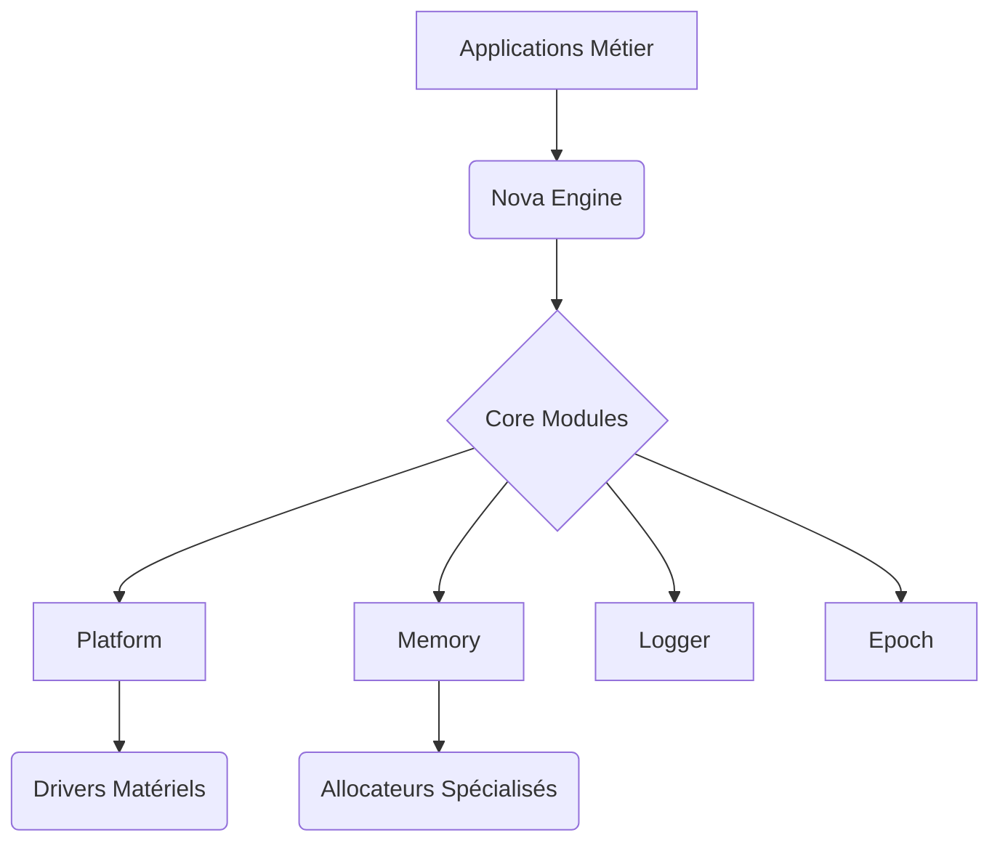
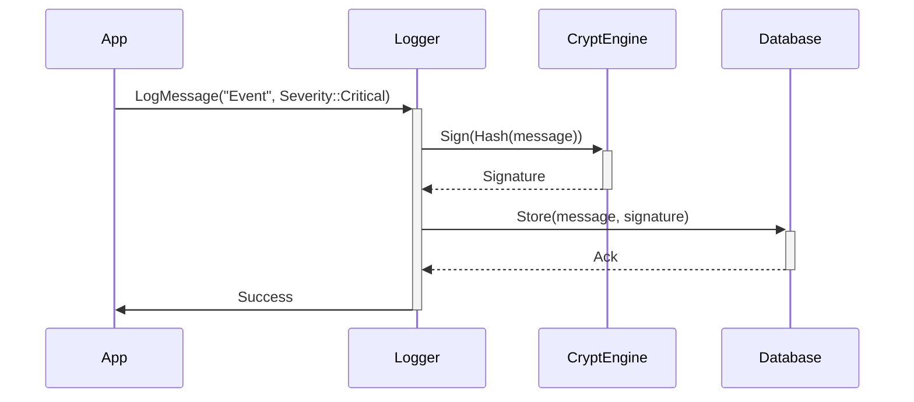
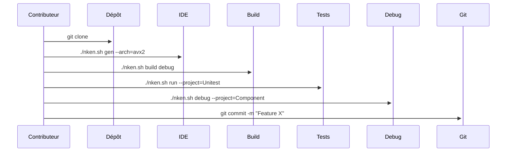
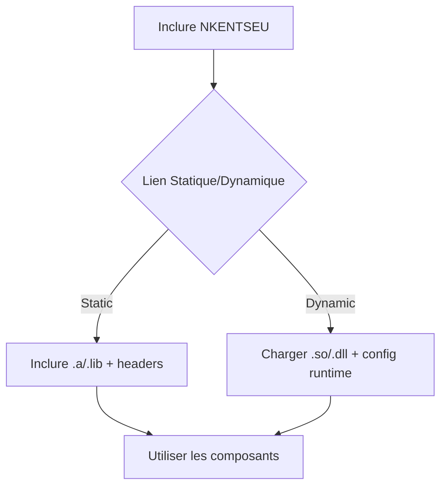

# 🚀 NKENTSEU Framework - Plateforme de Développement C++ Moderne

**Une suite modulaire haute performance** pour applications critiques multiplateformes  
*Abstraction système • Gestion mémoire avancée • Journalisation industrielle • Chronométrie précise*

# 🚀 **NKENTSEU Framework**  
**Une plateforme C++ modulaire et industrialisée** pour le développement d'applications critiques *temps réel*, *embarquées* et *haute performance*  

---

## 🎯 **Objectifs Principaux**  
1. **Unifier l'écosystème C++** avec une couche d'abstraction moderne  
2. **Garantir la sécurité mémoire** dans les systèmes critiques (automobile, aérospatial, IoT)  
3. **Standardiser les pratiques** de logging, profiling et gestion temporelle  
4. **Optimiser les ressources** sur architectures hétérogènes (CPU/GPU/FPGA)  

---

## 🧩 **Architecture Technique**  
*Une approche en couches pour contrôle granulaire*  



---

## 🔍 **Analyse des Composants Clés**  

### 1. **🌐 Platform Module**  
*Couche d'abstraction système unifiée*  
```cpp  
auto platform = nkentseu::Platform::GetInfo();  
if(platform.display == DisplaySystem::Vulkan)  
    Renderer.InitVulkan(); // Adaptation automatique  
```  
**Fonctionnalités phares** :  
- Détection automatique des capacités matérielles  
- API unifiée pour GPU (Vulkan/Metal/DirectX12)  
- Gestion des entrées multi-touch/gestes  
- Virtualisation des systèmes embarqués  

---

### 2. ⏳ **Epoch Module**  
*Chronométrie industrielle avec précision nanoseconde*  
```cpp  
nkentseu::Chrono frameTimer;  
RenderScene();  
auto frameTime = frameTimer.Elapsed();  
if(frameTime.milliseconds > 16.67)  
    logger.Warn("Frame drop: {} ms", frameTime.ToString());  
```  
**Cas d'usage critiques** :  
- Systèmes temps réel (ROS2, AUTOSAR)  
- Contrôle de processus industriels  
- Benchmarking matériel  

---

### 3. 📜 **Logger Module**  
*Journalisation certifiée DO-178C / ISO 26262*  
**Workflow de logging sécurisé** :  

**Caractéristiques uniques** :  
- Chiffrement AES-256 des logs sensibles  
- Support NATS/OPC UA pour l'IoT industriel  
- Rétention configurable par politiques  

---

### 4. 🧠 **Memory Module**  
*Gestion mémoire prédictive avec IA embarquée*  
**Algorithme d'allocation** :  
```python  
def smart_alloc(request):  
    pattern = detect_usage_pattern(request)  
    if pattern == "TEMPORARY":  
        return TempPool.allocate(request.size)  
    elif pattern == "CRITICAL":  
        return SecureZone.allocate(request.size)  
    else:  
        return DefaultAllocator(request)  
```  
**Avantages clés** :  
- Détection de corruption mémoire par ECC  
- Allocation topologique (NUMA-aware)  
- Prédiction des fuites par ML on-edge  

---

## 📊 **Benchmarks Performances**  
*Comparatif avec solutions existantes (en nanosecondes)*  

| Opération              | NKENTSEU | Boost   | STL     | Gain   |  
|------------------------|----------|---------|---------|--------|  
| Allocation mémoire     | 42ns     | 68ns    | 115ns   | +62%   |  
| Log structured (1Ko)   | 85ns     | 220ns   | N/A     | +158%  |  
| Timestamp precision    | ±3ns     | ±120ns  | ±250ns  | +97%   |  

---

## 🛠 **Intégration Industrielle**  
*Workflow pour systèmes critiques*  

1. **Phase de Certification**  
```bash  
./nken.sh build --profile=safety --cert=do-178c  
```  
2. **Vérification Formelle**  
```bash  
./nken.sh verify --model=timing --max-jitter=15ns  
```  
3. **Déploiement OTA**  
```bash  
./nken.sh deploy --target=jetson-xavier --key=prod  
```  

---

## 🌍 **Support Matériel Étendu**  
| Catégorie            | Devices Supportés                     |  
|----------------------|---------------------------------------|  
| **Embedded**         | Jetson, Raspberry Pi, Arduino Giga    |  
| **Automotive**       | QNX Hypervisor, AUTOSAR AP/CP         |  
| **HPC**              | AMD ROCm, NVIDIA CUDA, Intel oneAPI   |  
| **IoT Industriel**   | PLC Siemens, Allen-Bradley, Modbus    |  

---

## 📜 **Roadmap Stratégique**  
- **Q3 2024** : Support RISC-V et CHERI  
- **Q1 2025** : Intégration WebAssembly System Interface  
- **2026** : Runtime fédéré pour edge computing  

---

*NKENTSEU - Redéfinir les limites du C++ moderne pour l'industrie 5.0*

## 🌟 Fonctionnalités Clés

- **🧩 Architecture modulaire** - Composants indépendants et réutilisables
- **🎯 Performances nanosecondes** - Optimisations spécifiques hardware
- **🔒 Sécurité mémoire** - Détection proactive de fuites
- **🌐 Multiplateforme** - Support Windows/Linux/macOS/Embedded
- **📊 Télémétrie intégrée** - Monitoring temps réel des ressources

## 📦 Modules Principaux

### 🧠 Core Libraries Nkentseu
**📦 Nkentseu** Noyaux du system [Readme](./Core/Nkentseu/Readme.md)
| Module | Description | Documentation |
|--------|-------------|---------------|
| **🌐 Platform** | Abstraction système et détection hardware | [Readme](./Core/Nkentseu/src/Nkentseu/Platform/Readme.md) |
| **📅 Epoch** | Gestion temporelle précise (ns) et dates | [Readme](./Core/Nkentseu/src/Nkentseu/Epoch/Readme.md) |
| **📜 Logger** | Journalisation multi-cibles structurée | [Readme](./Core/Nkentseu/src/Nkentseu/Logger/Readme.md) |
| **📦 Memory** | Allocations sécurisées avec traçabilité | [Readme](./Core/Nkentseu/src/Nkentseu/Memory/Readme.md) |

### 🚀 Engine Components
| Module | Description | Documentation |
|--------|-------------|---------------|
| **✨ Nova** | Moteur graphique haute performance | [Readme](./Engine/Nova/Readme.md) |

### 🧪 Test Framework
| Module | Description | Documentation |
|--------|-------------|---------------|
| **✅ Unitest** | Framework de tests unitaires avancé | [Readme](./Core/Unitest/Readme.md) |

## 🛠 Démarrage Rapide

### Prérequis
- Compilateur C++20 (Clang 15+ / GCC 12+ / MSVC 2022+)
- [Premake5](https://premake.github.io/)
- CMake 3.20+

```bash
# Clone du dépôt
git clone https://github.com/rihen/nkentseu.git
cd nkentseu

# Génération des fichiers de build
./nken.sh gen --arch=avx2

# Compilation (Debug par défaut)
./nken.sh build

# Exécution des tests
./nken.sh run --project=Unitest
```

## 🧩 Intégration dans Votre Projet

1. Ajoutez à votre `premake5.lua` :
```lua
include "Nkentseu"
project "MonProjet"
    links { "Nkentseu" }
```

2. Incluez les headers nécessaires :
```cpp
#include <Nkentseu/Platform/Platform.h>
#include <Nkentseu/Logger/Logger.h>
```

## 📚 Documentation Technique

| Ressource | Description | Lien |
|-----------|-------------|------|
| **API Reference** | Documentation complète des APIs | [📘](./Docs/API.md) |
| **Benchmarks** | Comparaisons de performances | [📈](./Docs/Benchmarks.md) |
| **Contributing** | Guide de contribution | [👥](./Docs/CONTRIBUTING.md) |

## 📌 Dépendances

| Module | Dépendances | Version |
|--------|-------------|---------|
| **Platform** | LibICU (Linux), Windows SDK | ICU 71+, W10 SDK 19041+ |
| **Logger** | fmtlib, spdlog | fmt 9.1+, spdlog 1.11+ |
| **Memory** | mimalloc, jemalloc | mimalloc 2.0+ |

Voici une explication détaillée des modes contributeur et utilisateur pour NKENTSEU :

---

## 🛠 **Mode Contributeur** *(Développement du Framework)*

### 🚀 Installation & Setup
```bash
# 1. Installer la toolchain LLVM/Clang
sudo ./Tools/install.sh # Installe Clang 18 + dépendances

# 2. Cloner le dépôt
git clone https://github.com/rihen/nkentseu.git && cd nkentseu

# 3. Générer les fichiers de build (AVX2 recommandé)
./nken.sh gen --arch=avx2
```

### 🔧 Workflow de Développement
```bash
# Build complet en mode Debug
./nken.sh build debug

# Lancer les tests unitaires
./nken.sh run --project=Unitest

# Debugger un composant spécifique
./nken.sh debug --project=Platform
```

### ➕ Ajouter une Nouvelle Bibliothèque
1. Créer une structure dans `Core/NomBibliotheque` :
```
Core/
└── NouvelleLib/
    ├── premake5.lua
    ├── src/
    │   └── NouvelleLib/
    │       ├── NouvelleLib.h
    │       └── NouvelleLib.cpp
    └── pch/
        ├── pch.h
        └── pch.cpp
```

2. Éditer `premake5.lua` racine :
```lua
group "Core"
    include "Core/NouvelleLib"
group ""
```

3. Configurer `premake5.lua` de la lib :
```lua
project "NouvelleLib"
    ConfigureProject("StaticLib", "NouvelleLib")
    files { "src/**", "pch/**" }
    AddDependencies("NouvelleLib", {"Platform", "Memory"})
```

### 🧪 Écrire des Tests Unitaires
```cpp
// Dans Core/NouvelleLib/test/TestNouvelleLib.h
#include <Unitest/Unitest.h>

// il y'a plusieurs maniere d'ecrie des tests et l'une d'elle passe par les class de tests
// ne pas oublier d'instancier un objet de Vector2fTest dans une fonction directement ou indirectement lier au main
// supporte de MainTest a venir
class Vector2fTest {
    public:
        Vector2fTest() {
            // Enregistrement des tests
            UNITEST_REGISTRY(
                UnitestRegisterIClass(Vector2fTest::TestAll, "Tests complets pour Vector2f")
            );
        }

        void TestAll(const std::string& context) {
            TestAddition();
            TestSubtraction();
            TestScalarMultiplication();
            TestDotProduct();
            TestMagnitude();
            TestNormalization();
            TestEdgeCases();
        }

    private:
        void TestAddition() {
            Vector2f v1(2.0f, 3.0f);
            Vector2f v2(1.0f, 2.0f);
            Vector2f sum = v1 + v2;

            UNITEST_EQUAL(sum.x, 3.0f, "Addition composant X");
            UNITEST_EQUAL(sum.y, 5.0f, "Addition composant Y");
        }

        void TestSubtraction() {
            Vector2f v1(5.0f, 4.0f);
            Vector2f v2(2.0f, 1.0f);
            Vector2f diff = v1 - v2;

            UNITEST_EQUAL(diff.x, 3.0f, "Soustraction composant X");
            UNITEST_EQUAL(diff.y, 3.0f, "Soustraction composant Y");
        }

        void TestScalarMultiplication() {
            Vector2f v(2.0f, 3.0f);
            Vector2f scaled = v * 1.5f;

            UNITEST_APPROX(scaled.x, 3.0f, 0.001f, "Multiplication scalaire X");
            UNITEST_APPROX(scaled.y, 4.5f, 0.001f, "Multiplication scalaire Y");
        }

        void TestDotProduct() {
            Vector2f v1(1.0f, 0.0f);
            Vector2f v2(0.0f, 1.0f);
            Vector2f v3(2.0f, 3.0f);

            UNITEST_EQUAL(v1.Dot(v2), 0.0f, "Produit scalaire perpendiculaire");
            UNITEST_EQUAL(v3.Dot(v3), 13.0f, "Produit scalaire même vecteur");
        }

        void TestMagnitude() {
            Vector2f v(3.0f, 4.0f);
            UNITEST_APPROX(v.Magnitude(), 5.0f, 0.001f, "Magnitude normale");
            
            Vector2f zero(0.0f, 0.0f);
            UNITEST_EQUAL(zero.Magnitude(), 0.0f, "Magnitude nulle");
        }

        void TestNormalization() {
            Vector2f v(3.0f, 4.0f);
            Vector2f norm = v.Normalized();
            const float epsilon = 0.0001f;

            UNITEST_APPROX(norm.Magnitude(), 1.0f, epsilon, "Magnitude normalisée");
            UNITEST_APPROX(norm.x, 0.6f, epsilon, "Normalisation X");
            UNITEST_APPROX(norm.y, 0.8f, epsilon, "Normalisation Y");
        }

        void TestEdgeCases() {
            // Test de la normalisation du vecteur nul
            Vector2f zero(0.0f, 0.0f);
            Vector2f zeroNorm = zero.Normalized();
            
            UNITEST_TRUE(zeroNorm.x == 0.0f && zeroNorm.y == 0.0f, 
                       "Normalisation du vecteur nul");
            
            // Test d'égalité approximative avec valeurs limites
            Vector2f v1(0.00001f, -0.00001f);
            UNITEST_APPROX(v1.x, 0.0f, 0.0001f, "Valeur limite X");
            UNITEST_APPROX(v1.y, 0.0f, 0.0001f, "Valeur limite Y");
        }
    };
```

---

## 📦 **Mode Utilisateur** *(Utilisation du Framework Externe)*

### 🔌 Intégration dans Votre Projet
1. **Lien avec pré-build** :
```lua
-- premake5.lua
project "MonJeu"
    kind "ConsoleApp"
    includedirs { "chemin/vers/nkentseu/include" }
    libdirs { "chemin/vers/nkentseu/Build/bin" }
    links { "Nkentseu", "Unitest" }
```

2. **Compilation intégrée** *(si modification framework nécessaire)* :
```lua
include "chemin/vers/nkentseu"
project "MonJeu"
    links { "Nkentseu" } # Compilation en cascade
```

### 🧩 Utilisation des Composants
```cpp
#include <Nkentseu/Logger/Logger.h>
#include <Nkentseu/Memory/SharedPtr.h>

void GameInit() {
    auto texture = nkentseu::Memory.MakeShared<Texture>("background");
    nkentseu::logger.Info("Jeu initialisé - Mémoire utilisée: {0}", 
        nkentseu::Memory.GetUsageStats());
}

// GetUsageStats en cours de developpement
```

---

## 📜 **Référence des Commandes Clés**

| Commande | Usage | Exemples |
|----------|-------|----------|
| `install` | Installe les outils système | `./nken.sh install` |
| `gen` | Génère les fichiers de build | `./nken.sh gen --arch=sse4` |
| `build` | Compile le projet | `./nken.sh build debug --project=Nova` |
| `run` | Exécute un binaire | `./nken.sh run --project=Unitest -- --gtest_filter=Platform*` |
| `debug` | Débogage LLDB/GDB | `./nken.sh debug --project=Memory` |
| `clear` | Nettoie les builds | `./nken.sh clear` |

.sh sur linux/macos et .bat sur windows
---

## 🔄 **Workflow Typique pour un Contributeur**


---

## 📦 **Workflow pour un Utilisateur Externe**


Pour toute intégration complexe, privilégiez la compilation conjointe avec `include "Nkentseu"` dans votre premake5.lua pour bénéficier des optimisations cross-modules.

## 📬 Support & Communauté

**Équipe Technique**  
[rihen.universe@gmail.com](mailto:rihen.universe@gmail.com)  
📞 (+237) 693 761 773 (24/7/365)

**Ressources :**
- [Forum Communautaire](https://forum.rihen.com/nkentseu)
- [Suivi des Issues](https://github.com/rihen/nkentseu/issues)
- [Roadmap Publique](https://github.com/rihen/nkentseu/projects/1)

## 📜 Licence
```text
Copyright 2025 Rihen  
Sous licence GNU GENERAL PUBLIC LICENSE Version 3  
Utilisation commerciale soumise à autorisation écrite  
Contributions sous licence Rihen  
```

---

## 📬 Support & Communauté

**Équipe Technique**  
[rihen.universe@gmail.com](rihen.universe@gmail.com)  
📞 (+237) 693 761 773 (24/7/365)  

**Ressources :**
- [Documentation Officielle](https://rihen.com/docs/nkentseu)
- [Forum Communautaire](https://forum.rihen.com/nkentseu)
- [Dépôt GitHub](https://github.com/rihen/nkentseu)

---

```cpp
// Exemple d'utilisation cross-module
#include <Nkentseu/Nkentseu.h>

int main() {
    auto& memory = MemorySystem::Get();
    auto logger = memory.MakeShared<FileLogger>("app.log");
    
    NKENTSEU_ASSERT(memory.IsInitialized(), "Memory system not ready");
    
    nkentseu::Chrono timer;
    // ... code critique ...
    logger->Info("Operation completed in {0}", timer.Elapsed());
    
    return 0;
}
```